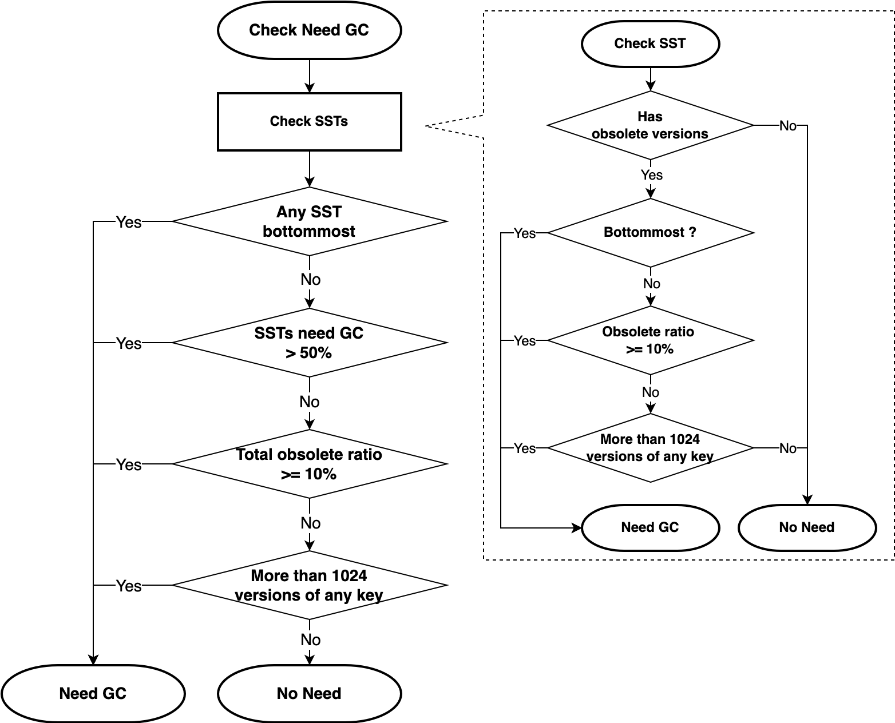
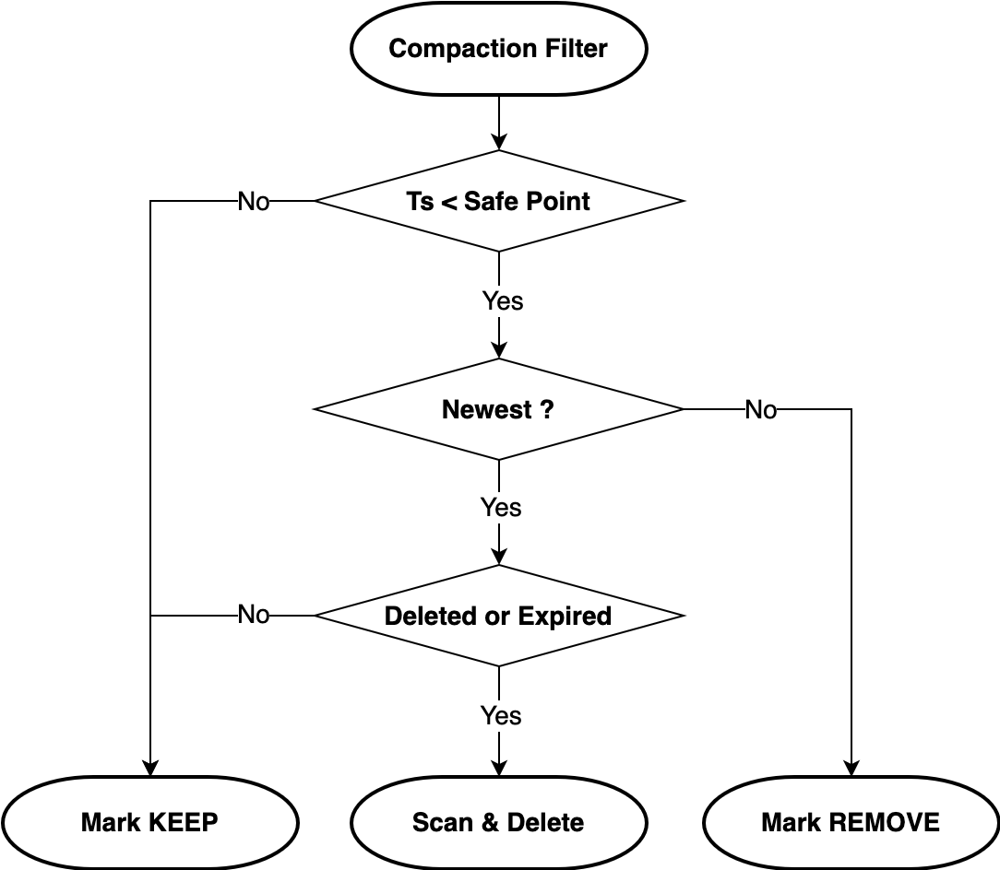

# TiKV API V2

## Motivation

`API V2` is a set of breaking changes that aims to solve serval issues with current RawKV (hereafter referred to as `API V1`):

1. RawKV is not safe to use along with TxnKV & TiDB. If it get solved, the three different modes can be used in the same cluster, and reduce cost of resource and maintenance. It even makes it possible that TiDB can support RawKV as the table's storage engine, and enrich TiDB's use cases.
2. RawKV TTL is controlled by TiKV configuration. Switching the configuration will cause data corruption in silence.
3. Key and value of RawKV are just raw bytes, therefore it's hard to add more metadata afterward to support more features, such as keyspace to support multi-tenant, or timestamp to support [Change Data Capture].

## Detailed Design

### New key-value codec

This RFC introduces a new key encoding to RawKV and TxnKV, and a new value encoding to RawKV, which allow RawKV to be used along with TxnKV and being flexible to add more fields to value.

Since API V2 changed the storage encoding, it will be not compatible to switch between `API V1` and `API V2` while there are non-TiDB data in TiKV. TiDB data is specially treated in order to not be affected by this change.

#### Key Encoding

Once `API V2` is enabled, keys will start with either:

1. `m` and `t`: TiDB keys.
2. `x`: TxnKV keys.
3. `r`: RawKV keys.

`x`, `r` are mode prefixes that indicates which mode the key is belonging to. After mode prefix is 3 bytes for keyspace. So in API V2, RawKV & TxnKV keys will be encoded as `MCE(mode-prefix + keyspace + user-key) + timestamp`. `MCE` is abbreviation of [Memory Comparable Encoding], which is necessary to keep the encoded keys having the same order with user keys.

`Keyspace` is fixed-length of 3 bytes in network byte order, and will be introduced in another RFC.

`Timestamp` in RawKV entries are necessary to implement [Change Data Capture] feature, which will indicate what and when data is changed.

##### Timestamp requirement

Among requests of a single key, the timestamp must be monotonic with the sequence of data flushed to disk in TiKV.

In general, if request `A` [Happened Before] `B`, then `Timestamp(A)` < `Timestamp(B)`. As to RawKV, we provide [Causal Consistency] by keeping order of the timestamp the same as sequence of data flush to disk.

At the same time, as RawKV doesn't provide cross-rows transaction and snapshot isolation, we allow concurrent updates to different keys, which means that the timestamp order of two different keys would not be consistent with data flush, to improve efficiency.

##### Timestamp Generation

Timestamp is generated by PD (i.e. TSO), the same as TiDB & TxnKV. But differently, TSO is acquired by TiKV internally, to get a better overall performance and client compatibility.

To reduce latency and improve availability, TiKV will prefetch and cache a number of TSO locally. User can specify how long the TSO cache is required to tolerate fault of PD, then TiKV will calculate the size of batch according to recent QPS.

Note that TSO cache brings another issue. If subsequent writes of a single key happen in another store of TiKV cluster (caused by leader transfer), the TSO cache of another store must be renewed to ensure that it's larger than the original store. TiKV observes events of `leader transfer` and then flushes the cache. Another event should be observed is `region merge`, as the leader of merged region would be on another store as to the region being merged from.

In current implementation, the flush of TSO cache is asynchronous to avoid blocking leader transfer and region merge. Clients will get an `MaxTimestampNotSynced` error until the flush is done.

*The alternative of timestamp generation is `HLC` ([Hybrid Logical Clock]). The pros of `HLC` is being independent to availability of PD, but the cons is that it depends on local clock and [NTP], and it's also not easy to make it right (refer to [strict monotonicity](https://github.com/cockroachdb/cockroach/blob/13c5a25238ce75cfb7ff151d620e82aa44c72e27/pkg/util/hlc/doc.go#L150) in CockroachDB). All things considered, as PD is designed to be highly available, and fault of PD will affect not only TSO but also other critical components (e.g, region metadata), we prefer to utilize TSO as timestamp.*

##### Disadvantages

Encoding key with timestamp make RawKV having multiple versions (see [MVCC]) for every entry. So mainly there would be two disadvantages:

1. **Regression of read performance**. The implementation of read operations change from `Get` to `Seek`. However, by using [Prefix Seek] & [Prefix Bloom Filter] of RocksDB, and reuse fully optimized codes of transactional operations (which also process [MVCC] data) of TiKV, the regression of QPS & P99 latency is less than 3% according to benchmark.
2. **Extra storage space**. Obsolete versions and (logically) deleted entries will occupy extra space. So garbage collection is required. Refer to [Garbage Collection](#garbage-collection) section for detail.

#### RawKV Value Encoding

The value of RawKV `API V2` by now can be either:

1. `{data}{0x0}`, for values without TTL
2. `{data}{TTL expire timestamp}{0x1}`, for values with TTL
3. `{0x1}`, for values deleted

The last byte of value is used as meta flags. Bit `0` of flag is for TTL, if it's set, the `8` bytes just before meta flags is the TTL expire timestamp. Bit `1` is for deleted mark, if it's set, the entries is logically deleted (used for [Change Data Capture]).

Extra fields in future can utilize other bits of meta flags, and will be inserted between user value & meta flags in reverse order. The most significant bit of meta flags is supposed to be used for extended meta flags if there are more than 7 fields.

`{user value}{field of bit n}...{extended meta flags}...{field of bit 2}{field of bit 0 (TTL)}{meta flags}`

### How to safely enable API V2

#### Upgrade from `API V1` to `API V2`

1. Upgrade TiKV, TiDB, and PD to the version that supports `API V2`.
2. Ensure that all the keys in TiKV are written by TiDB, which are prefixed with `m` or `t`. Any other data should be migrated out, or else the step 3 will fail.
3. Enable `API V2` in TiKV config file and restart TiKV (user should also take the responsibility to enable `API V2` for all TiKV clients excluding TiDB).

#### Downgrade from `API V2` to `API V1`

1. Ensure that all the keys in TiKV are written by TiDB, which are prefixed with `m` or `t`. Any other data should be migrated out.
2. Disable `API V2` in TiKV config file and restart TiKV (user should also take the responsibility to enable `API V1` for all TiKV clients excluding TiDB).

#### Data migration

A backup and restore tool would be provided to export data from TiKV cluster of `API V1`, and convert to `API V2` encoding. Then import the backup data into another TiKV cluster of `API V2`.

## Implementation Details

### kvproto

```proto
// kvrpcpb.proto

message Context {
    // ... omited other fields

    // API version implies the encode of the key and value.
    APIVersion api_version = 21;
}

// The API version the server and the client is using.
// See more details in https://github.com/tikv/rfcs/blob/master/text/0069-api-v2.md.
enum APIVersion {
    V1 = 0;
    V1TTL = 1;
    V2 = 2;
}
```

```proto
// raft_serverpb.proto

message StoreIdent {
    // ... omited other fields
    
    kvrpcpb.APIVersion api_version = 3;
}
```

```proto
// brpb.proto

message BackupMeta {
     // ... omited other fields

    kvrpcpb.APIVersion api_version = 18;
}

message BackupResponse {
    // ... omited other fields
    
    kvrpcpb.APIVersion api_version = 5;
}
```

### TiKV Server

In TiKV config file, add a new configuration `storage.api-version`.

If the API version in `StoreIdent` mismatches with `storage.api-version` in the config, it means that the user is switching the API version, therefore TiKV will check if there is any non-TiDB data in storage, and eventually save the new API version in `StoreIdent`.

If `storage.api-version=2`:

- Use the new value encoding in `RawStore` and `sst_importer`.

- Only allow RawKV to access `default` CF.

- If the request's context has `api-version=1`:
  - Reject the request unless it's a TxnKV request and the keys starting with `m` or `t`.

- If the request's context has `api-version=2`:
  - Only allow the key that has RawKV prefix for RawKV requests.
  - Only allow the key that has TxnKV prefix for TxnKV requests.

If `storage.api-version=1` & `storage.enable-ttl=true`:

- Reject all requests with `api-version=2` in the context.
- Reject all transactional requests otherwise the raw TTL encoding in V1TTL will corrupt transaction data.

If `storage.api-version=1` & `storage.enable-ttl=false`:

- Reject all requests with `api-version=2` in the context.

### TiKV Client

Provide two modes for users:

- V2:
  - Prepend `x{keyspace}` before TxnKV keys or prepend `r{keyspace}` before RawKV keys.
  - `Keyspace` is optional and defaults to `0` for backward compatible
  - Set `api_version=2` in `kvrpcpb.Context`.
  - Disallow specifying `cf` in `RawClient`.

- V1:
  - Set `api_version=1` in `kvrpcpb.Context`.
  - Besides above, behaves just like current client.

Listed below is the compatibility matrix:

|                       | V1 Server | V1TTL Server | V2 Server |
| --------------------- | --------- | ------------ | --------- |
| V1 RawClient          | Raw       | Raw          | Error     |
| V1 RawClient with TTL | Error     | Raw          | Error     |
| V1 TxnClient          | Txn       | Error        | Error     |
| V1 TiDB               | TiDB Data | Error        | TiDB Data |
| V2 RawClient          | Error     | Error        | Raw       |
| V2 TxnClient          | Error     | Error        | Txn       |

### Garbage Collection

Garbage Collection (`GC` for short) is necessary for recycling the space from:

1. Obsolete versions of [MVCC]
2. TTL expired entires
3. (Logically) deleted entries

The **obsolete versions** are those **NOT** the newest of a key, and older than `GC Safe Point`.

`GC Safe Point` is a TSO indicating that versions older than which is safe to be removed. It is advanced by TiDB GC leader, which will keep versions for a life time defaults to 10 minutes. At the same time, services such as [TiDB BR] & [TiCDC] can setup a `Service Safe Point` preventing `GC Safe Point` to advance, and keep more versions to meet service requirement (e.g, [TiDB BR] requires to keep all versions after `backup timestamp` for snapshot consistence). Please refer to [GC Overview] & [complete behavior of TiCDC GC safe point](https://docs.pingcap.com/tidb/dev/ticdc-faq#what-is-the-complete-behavior-of-ticdc-garbage-collection-gc-safepoint) for more details.

There are two garbage collectors existing in TiKV. One for transactional data, which utilizes [Compaction Filter] of RocksDB to drop obsolete versions during compaction, and schedules background tasks to physically remove deleted entires. Another one for RawKV data with TTL, which also utilizes [Compaction Filter] to drop TTL expired entries.

`GC` of RawKV is quite similar with transactional data. First of all, check whether it's necessary to run `GC`:



In the above diagram:

- For each [SST] in a compaction procedure, check [Table Properties] collected by customized collector. A [SST] will be `GC` when:
  - There would be obsolete versions (`min_ts` *(minimum timestamp)* of [Table Properties] < `GC Safe Point`. Remind that newest version of a key is **NOT** an obsolete version). And,
  - Any of following conditions is matched:
    - The [SST] is at the bottommost level (as deleted & expired entries will only be recycled at bottommost level. See below). Or,
    - More than a ratio (defaults to `10%`) of all versions are obsolete. Or,
    - More than `1024` versions of any single key.
- Then, `GC` will be invoked when:
  - The compaction is at bottommost level, or
  - More than half of the [SST] files in the compaction procedure need `GC`, or
  - Sum of [Table Properties] of all [SST] meets the same condition as for single [SST].

Then, in [Compaction Filter]:

- For entries with timestamp >= `GC Safe Point`, mark as `Keep`.
- For entries with timestamp < `GC Safe Point` and **NOT** the newest one of a key, mark as `Remove`. Then RocksDB will filter them out during compaction.
- For entries: 1. with timestamp < `GC Safe Point`, 2. they **ARE** the newest one of a key (in current [SST]. It's too expensive to check for the whole LSM tree), and 3. it's deleted or expired: schedules a background task to scan all versions older than it (of the same key), and remove all of them by issuing a `Delete` to RocksDB.



More about `GC` of deleted/expired entries:

- The reason for recycling by scan & delete other than mark as `Remove` is that: Filter just the newest one will cause user getting older versions, and lead to wrong result.
- The reason for recycling only at bottommost level: Deletion is implemented by RocksDB as inserting `Tombstone` records at the top of LSM tree, rather than remove them immediately. So if deletes the versions not at bottommost level, it's likely to see them more times in another compaction procedures later on, and issue more deletes. That would lead to not recycle but occupy more space, and more `GC` overhead.

### Backup and Restore

Due to the significant change on storage format, only if the existing TiKV cluster is empty or storing only `TiDB` data, users can enable or disable API v2 smoothly. In other scenario, we need implement one tool to migrate data, which is called [TiKV-BR].  

[TiKV-BR] forks from [TiDB BR] and need some improvements:
- Storage data conversion from `API V1`(with or without [TTL]) to `API V2`.
- Backup supports return `backup-ts` in `API V2` TiKV cluster. [RawKV CDC] can use `backup-ts` as `start-ts` for replication tasks.

#### API Version Conversion

To support API version conversion, a parameter `dst-api-version` is introduced in [TiKV-BR] and pass it to TiKV stores in [`BackupRequest`].
During the backup process, TiKV stores scan on all raw key-value entries and convert from current `api-version` to `dst-api-version` if they are different, then write the converted data to [SST] files. Restoration does not need the rewriting and conversion, which can speed up the restoration process.

#### Backup Ts

`backup-ts` only takes effect in the `API V2` cluster, which is defined as the timestamp that all data written before which have been backed up.  
As RawKV uses pre-fetches `TSO` for writing, the latest `TSO` from PD does not satisfy the `backup-ts` requirements obviously.  

The process to get `backup-ts` is as following:
1. Get current `TSO` in [TiKV-BR] at the beginning of backup.
2. Flush cached `TSO` in every TiKV store before scanning process during backup, to make sure that all writes afterward will have larger timestamps.
3. Subtract `safe-interval` from current `TSO`.

The third step is introduced because there would be **inflight** RawKV entries with timestamp before the current `TSO`. The `safe-interval` is a safe enough time duration that during which **inflight** writes should have finished. This is an empirical value and defaults to 1 minute, which is safe enough even in a high-pressure system.

Besides, this process can be optimized after we implement `safe-ts` for RawKV in stale read scenario, which is a timestamp that all RawKV writes before this timestamp can be seen **safely**.

### Change Data Capture

See [RawKV Change Data Capture].

### tikv-ctl

Read `api_version` in kvdb and decode data using the corresponding version.

### TiDB

Upgrade to the latest TiKV Go Client and use `V1` mode.

## Unresolved questions

*TBD*

[Change Data Capture]: https://en.wikipedia.org/wiki/Change_data_capture
[Memory Comparable Encoding]: https://github.com/facebook/mysql-5.6/wiki/MyRocks-record-format#memcomparable-format
[Causal Consistency]: https://en.wikipedia.org/wiki/Causal_consistency
[Happened Before]: https://en.wikipedia.org/wiki/Happened-before
[Hybrid Logical Clock]: https://cse.buffalo.edu/tech-reports/2014-04.pdf
[NTP]: https://en.wikipedia.org/wiki/Network_Time_Protocol
[MVCC]: https://en.wikipedia.org/wiki/Multiversion_concurrency_control
[Prefix Seek]: https://github.com/facebook/rocksdb/wiki/Prefix-Seek
[Prefix Bloom Filter]: https://github.com/facebook/rocksdb/wiki/Prefix-Seek#configure-prefix-bloom-filter
[Compaction Filter]: https://github.com/facebook/rocksdb/wiki/Compaction-Filter
[Table Properties]: https://github.com/facebook/rocksdb/blob/main/include/rocksdb/table_properties.h
[SST]: https://github.com/facebook/rocksdb/wiki/A-Tutorial-of-RocksDB-SST-formats
[TiDB BR]: https://docs.pingcap.com/tidb/stable/backup-and-restore-overview
[TiCDC]: https://docs.pingcap.com/tidb/stable/ticdc-overview
[GC Overview]: https://docs.pingcap.com/tidb/dev/garbage-collection-overview#gc-overview
[TiKV-BR]: https://github.com/tikv/migration/tree/main/br
[TTL]: https://docs.pingcap.com/zh/tidb/dev/tikv-configuration-file#enable-ttl
[`BackupRequest`]: https://github.com/pingcap/kvproto/blob/3debb6820e46da7a8f310e3f081222183cdd8030/proto/brpb.proto#L170
[creating change feed]: https://tikv.org/docs/dev/concepts/explore-tikv-features/cdc/cdc/#manage-replication-tasks-changefeed
[RawKV Change Data Capture]: ./0083-rawkv-change-data-capture.md
[RawKV CDC]: ./0083-rawkv-change-data-capture.md
