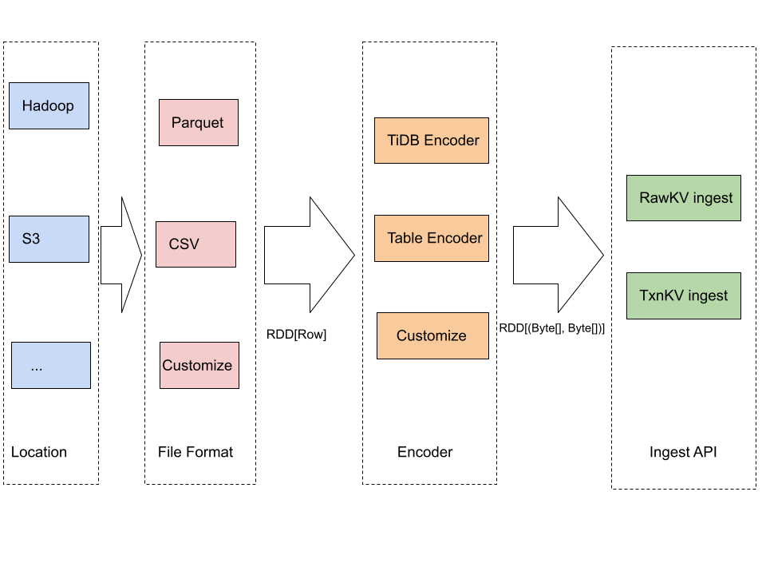

# RFC: Online Bulk Load for RawKV

- RFC PR: https://github.com/tikv/rfcs/pull/72
- Tracking Issue: https://github.com/tikv/tikv/issues/10563
- [Proposal: TiKV Online Bulk Load (Chinese)](https://docs.google.com/document/d/1JggGwmOIMqinz_Q7QkIDHzwS--K_BgJopaxrB8Pzpaw/edit#)

## Summary

Let RawKV support Online Bulk Load.

## Motivation

In the use case of `Feature Store`, everyday machine learning jobs will train a
large amount of data that needs to load to TiKV for online serving.


In order to satisfy this scenario, TiKV needs to provide `online bulk load`,
which should meet the following requirements:

1. the loading process should be as fast as possible,
2. the impact to the online serving (P99 latency) should be under control,
3. the loading speed can be improved in a linear way by adding more tikv instances,
4. the loading framework should be able to process Big Data (500GB ~ 5TB) in a short period (from minutes to several hours).

## Detailed design

The solution proposed in this RFC is as follows:

1. read and convert the source file to key-value pairs, which can be done via [Apache Spark](https://spark.apache.org/).
2. calculate the region boundaries by sampling the generated key-value pairs, split and scatter new TiKV regions in advance to reduce bulk load time and avoid hotspot issues.
3. repartition and sort the key-value pairs in each RDD according to the boundaries of the new regions, send the sorted key-value pairs in each RDD to TiKV servers to generate SST files for each region via the [ImportSST.RawWrite](#proto) API.
4. ingest the generated SST files via the [ImportSST.MultiIngest](https://github.com/pingcap/kvproto/blob/release-5.0/proto/import_sstpb.proto#L53) API.


###  Why `split region and scatter`

There may be a situation that all the data to load belongs to one Region. In such case only one tikv-server instance will be used to process the bulk load requests. Before doing bulk load, we need to sample the Key Value pairs, calculate the region split points, and call `split region and scatter` API, so that most of the tikv-server instances can be used to process the bulk load requests.

### Proto

```
service ImportSST {
  rpc RawWrite(stream RawWriteRequest) returns (RawWriteResponse) {}
}

message RawWriteBatch {
    uint64 ttl = 1;
    repeated Pair pairs = 2;
}

message RawWriteRequest {
    oneof chunk {
        SSTMeta meta = 1;
        RawWriteBatch batch = 2;
    }
}

message RawWriteResponse {
    Error error = 1;
    repeated SSTMeta metas = 2;
}
```

### Rate Limit

We want to control the impact to the online serving (P99 latency) during the bulk load, so `Rate Limit` is an important component.

#### config import.num-threads

First of all, users can config the thread number of the import module, which is already implemented.

```
[import]
## Number of threads to handle RPC requests.
# num-threads = 8
```

#### config storage.io-rate-limit

[storage.io-rate-limit](https://docs.pingcap.com/tidb/stable/tikv-configuration-file#storageio-rate-limit) limits the maximum I/O bytes that a server can write to or read from the disk.

Users can use `io-rate-limit` to limit Disk Write of the `import` module:

- config storage.io-rate-limit.max-bytes-per-sec
- config storage.io-rate-limit.import-priority = "low"


If the total disk write < max-bytes-per-sec, the `import` module will not be limited.
If the total disk write >= max-bytes-per-sec, the `import` module will be limited.

#### config rocksdb.rate-bytes-per-sec

[rocksdb.rate-bytes-per-sec](https://docs.pingcap.com/tidb/stable/tikv-configuration-file#rate-bytes-per-sec): The maximum rate permitted by RocksDB's compaction rate limiter.

Users can use `rocksdb.rate-bytes-per-sec` to limit RocksDB's compaction rate, so that the impact to online serving can be controlled.

### How to measure the performance impact to the online services

One target of the bulk load proposal is that the impact to the online serving (P99 latency) should be under control. The performance impact to the online services can be mesasured as follows:

1. Run [YCSB Workload B: Read mostly workload](https://tikv.org/docs/5.1/deploy/performance/instructions/#step-3-run-a-ycsb-workload) to simulate the business logic similar to `Feature Store Online Serving`.
2. Measure the lagency (P99, AVG) on the client side or server side (on TiKV Grafana).
3. Run the bulk load program to load a large amount of data.
4. Measure the lagency during Step 3.
5. Compare the results of Setp 2 and Step 4.

### Checksum

#### Check on server side using RawChecksum

[RawChecksum](https://github.com/pingcap/kvproto/blob/317f69fb54b44619271df82ec163764032184a85/proto/tikvpb.proto#L54) can be used if the following condition is satisfied:

- there is no old data in the key range to be loaded, or
- all the old data in the key range to be loaded is updated by the bulk load

#### Check on client side using BatchGet

If the `RawChecksum` condition is not satisfied, users can do checksum on client side as follows:

1. Calculate all the Key-Value pairs.
2. Using `BatchGet` to fetch the current values from TiKV.
3. Compare the Values from Step 1 and Step 2.

### Why Spark

The loading framework should be able to process Big Data (500GB ~ 5TB), so we need to use a distributed calculation engine. Spark is chosen because:

1. Spark is widely used in major companies,
2. Spark is very good at doing this kind of job.

### Pluggable API

Every company’s infrastructure is different. In order that users with different infrastructures can use the bulk load framework, we propose a pluggable API as follows.



We provide 3 components:

1. Data Location & File Format: Spark itself covers almost all the cases. Users can also implement their own [Data Source Reader](https://spark.apache.org/docs/2.3.0/api/java/index.html?org/apache/spark/sql/sources/v2/DataSourceV2.html).
2. Encoder: encodes a Row to a Key-Value pair. Users can implement the encoder by themself or choose from implemented ones. Users can implement their own encoder by implementing this function `(byte[], byte[]) encode(row: Row)`.
3. Ingest API: provide RawKV and TxnKV ingest API as default. Users do not need to implement their own version.

There are some usecases:

1. Load parquet from S3 to RawKV: Location=S3, FileFormat=Parquet, Encoder=TableEncoder, IngestAPI=RawKV
2. Load CSV from HDFS to TxnKV: Location=HDFS, FileFormat=CSV, Encoder=TiDBEncoder, IngestAPI=TxnKV

### Import mode & pause merge checker

When ingesting, TiKV should be switched to import mode. Also, merge the empty regions split by Spark should be prevented. To achieve this, a PD REST API to pause checkers (including merge checker) should be added. Pause-checker API should be called periodically to keep checker in paused status.

| URL | body | |
|---|:---:|---|
| POST /pd/api/v1/checker/{name} | `{ "delay": <seconds> }` | Pause or resume a checker |
| GET /pd/api/v1/checker/{name} | -- | Check if a checker is paused |

## Drawbacks

Learning spark has a certain cost.

## Others

A new repository is required to hold the spark-related codes. I propose it be named `migration`.

## Future improvements

Sometimes only part of TiKV are doing importing job. For example, we have two keyspace and want one keeps serving while other is importing.
To minimize the affect from import mode and the paused merge checker, two strategy can be applied:

1. The import mode can be changed to region-wise, so that other regions remains unaffected.
2. A more fine-grained API to let PD pause checker skip specific regions.
