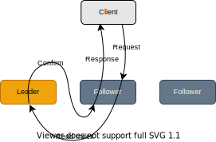
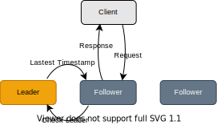

# RawKV Stale Read

## Summary

Allow eventually consistency on RawKV.

## Motivation

Eventually consistency is acceptable in some scenarios when using RawKV. In this case, RawKV is allowed to break linear consistency and therefore improve the cluster-wise throughput.

## Detailed Design

At the time when this RFC is written, TiKV supports two similar features:

1. Follower read for both RawKV and TxnKV.

    Follower read (aka. replica read) allows reading from the followers. To achieve that without breaking linear consistency guarantee, the follower will send a special request (called read-index) to the leader, to which the leader will not respond the data, but instead confirm the data on the follower is up-to-date, and then the follower is safe to get data from the local storage and respond it to the client. This feature helps distribute the read stress on the leader but increases the read latency.

    <p align="center">
        
    </p>

2. Stale read for TxnKV only.

    Stale read on TxnKV allows to read outdated (aka. stale) data from the followers but still keeping TxnKV's snapshot isolation. Because the client tells the follower the timestamp of the stale snapshot it wants to read on (rather than read-the-latest), the follower can decide whether it contains data versions that are fresh enough and thus must contain the stale snapshot so that the follower doesn't have to send read-index to the leader.

    <p align="center">
        
    </p>

This RFC proposes stale read on RawKV which allows reading stale data from the followers. Unlike the stale read on TxnKV, the stale read on RawKV breaks its original linear consistency guarantee -- downgrades to eventually consistency. This is because the keys in RawKV don't have versions, thus the client can't tell TiKV which accurately old data to read, instead, TiKV only guarantees that the stale data read from followers are written before (read committed).

To achieve this, the follower will read the local storage directly without any coordination with the leader.

Note that, from the point of view of the client, the freshness of data may regress since the client may choose different followers to read from time by time.

Surprisingly, the leader can also stale read and in this case, the leader can read locally without a lease.

<p align="center">
    
</p>

### Implementation details

1. In kvproto, add `direct_read` to `RaftRequestHeader`:

    ```diff
        // raft_cmdpb.proto
        message RaftRequestHeader {
            ...
            bool replica_read = 8;
    +       bool direct_read = 9;
            ...
        }
    ```

2. In TiKV, set `direct_read=true` for RawKV requests if `kvrpcpb.Context.stale_read=true`. Force raftstore to read with `RequestPolicy::ReadLocal` if `direct_read=true`.

3. (TBD) LocalReader should also handle `direct_read=true` so that the read request doesn't go into the raftstore.

4. (TBD) Client API interface; follower selection algorithm.
