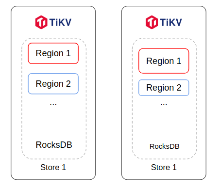
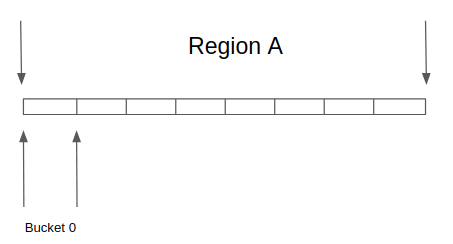

# Dynamic size region

- RFC PR: https://github.com/tikv/rfcs/pull/0082
- Tracking Issue: https://github.com/tikv/tikv/issues/11515

## Summary

Make the size of a region dynamic, and only set a upper limit.

This is the first step that we try to support PiB scale cluster.

## Motivation

We have observed a lot of regressions when the count of regions increases. The major drawback
comes from three aspects:

1. Transactions need to access more regions, which lead to too many RPCs and have high latency;
2. A node needs to drive more regions, which can have high resource usages and hurt performance;
3. Tools and service like CDC/BR/GC need to loop over all regions, which is slow.

We have hibernate raft (#23) to get around the most significant problem 2. But it's not always
working as expected:

- Workload with random access can still activate a lot of regions;
- Hibernated region needs extra time to renew its lease, which lead to high tail latency;
- It complicates the design of CDC/BR, which requires access all replicas instead of just leader now;
- GC will still wake up all regions and cause periodical high usage.

There are two source of region creations: size/keys split and table split. Table split is disabled by
default in TiKV. Even if it splits a lot of regions, small one will be merged later.

Size/keys split contributes the most count of regions. The current size of a region is 96MiB by default,
and the key count is 960,000. They are set based on an assumption that region is the concurrent unit of
requests. Too large can lead to smaller concurrency and high latency. Since keys is related to the size,
we only discuss region size here.

## Detailed design

To reduce the count of regions, we can set the size of region to a larger value. More precisely, instead
of 96MiB, we set the max region size to 10GiB (before compression). To get around the problem of
concurrency, we introduce new concept bucket that is smaller ranges within a region. To make hotspot be
recoginized and scheduled quickly, we choose the make the size of a region dynamic.



### Dynamic size

The hotter a region is, the smaller its size becomes. To make it simplified, we choose 512MiB for hot regions
and 10GiB for cold regions. So there are two types of split, hotspot split and general size split. Hotspot
split is triggered by PD. General size split is triggered by TiKV itself.

10GiB is just an example, it's allowed to change to a bigger or smaller value.

### Bucket

A region is split into several buckets logically. We will collect query stats by buckets and report the bucket
to PD. For hotspot regions, buckets are split by scan. For cold regions, buckets are split by approximate
range size. Every bucket should have the size about 128MiB. Their ranges and stats are all reported to PD. PD
can detect hot buckets from all regions and decide whether need to split new hotspots and schedules them to
balance.



A new bucket metadata will be added to kvproto:
```
message Buckets {
    uint64 region_id = 1;
    uint64 version = 2; // A hint indicate if keys have changed.
    repeated bytes keys = 3;
    repeated uint64 read = 4;
    repeated uint64 write = 5;
    Duration period = 6; // The period that stats are collected with in.
}
```

When the metadata is queried by client, PD may erase the read/write/period field in response.

### Read and Write

Since regions’ sizes become dynamic, region count in a single instance is not a problem any more.
Hibernate regions can be deprecated, and lease renew by heartbeats can be enabled by default for
all regions. This can bring significant improvement for read tail latency.

After the region becomes larger, the chance to hit 1PC becomes higher. And the RPC count in a
transaction can also be reduced. However, the hotspot chance is also increased. For writes, we rely
on PD to split the hotspot in time and increase concurrency. In addition, we can also use unorder
apply to make single region apply logs faster. Since unorder apply is a standalone feature, I’m not
going into details here.

For read hotspots, split should be triggered by PD, which can utilize the global statistics from all
regions and nodes. For normal read requests, TiKV will need to split its range into smaller buckets
according to statics to increase concurrency. When TiKV client wants to do a scan, it sends the RPC
once, and TiKV will split the requests into smaller concurrent jobs.

In the past design, follower read has also been discussed to offload works from leader. But client
can’t predict the progress of a follower, so latency can also become unpredictable. It’s more
controllable to let PD split hotspots and schedule to get balance.

Now that a region can be in 10GiB, a full scan can make the response exceed the limit of gRPC,
which is 4GiB. So instead of unary, we need to use server streaming RPC to return the response as
stream. The stream can set a limit on memory or count to avoid too many pending responses
exhausting memory. If follower read is enabled in client side, client can use buckets from PD to
split requests and balance loads across leader and followers.

After a region becomes larger, it needs to be warmed up before serving requests. There are two
common cases:

- In the very beginning, writes will only happen in a single region, the problem can be solved by
    presplit + scatter.
- Because followers don’t serve read, so their data is usually not in cache. After transferring
    the leader, serving a range scan can trigger at most 10GiB IO. To warm it up, we can extend
    the existing pre transfer leader mechanism. Leader will send its bucket statics to follower
    in pre transfer leader, follower can do a pre scan for hot buckets before accepting
    transferring leader.

### Flow report

Buckets statistics are reported in a standalone stream. They will be reported more frequently
than original region heartbeats, which is 60s. The new stream is expected to be reported every
10 seconds when have changes.

PD will maintain top N hotspot buckets and split all of those buckets that exceed P of
all throughput. N and P should be configurable, I suggest to set it to 300 and 1% respectively
first. The algorithm is just one possible solution and subject to change for evaluation.

### Replication

A large region can take minutes to be replicated, PD should make cost estimation on actual size
instead of fixed value. To avoid logs being truncated during sending a snapshot, we should set
the log gc limit based on the actual size too. Raft engine should be GA before dynamic size
region, so we don't need to worry about the extra write amplifications.

To avoid ingesting a large snapshot cause large compaction, we need to split the snapshot into
several smaller files. Each snapshot files should not be larger than 128MiB.

There are ways to optimize the replications, sending a sub-LSM tree for example. But these designs
may be complicated. And we rely on further designs like separating LSM tree to optimize the cost
for all.

### Compatibility

As buckets don't modify existing metadata, so it's backward compatible. When upgrading from small
regions, PD may trigger a lot of merge to get a large region size. This procedure should be made
at slow pace to avoid introducing spike to online service. When dowgrading from dynamic regions,
TiKV may trigger a lot of split at start. Split is lightweight than merge and very fast, we may not
need to take extra care.

Snapshot is split into mulitple files in dynamic regions, which is different from the past. But it
seems fine for old version to apply the multiple snapshot files for one CF. We need more tests to
verify the behavior.

## Drawbacks

Increasing the size only may not have significant improvement on all problems, it can introduce
higher replication cost than before.

## Alternatives

For the problems on cost of too many regions, we can also optimize TiKV itself to make it run
faster and capable to handle more regions. But the dynamic design make it possible to adjust
current architecture and introduce more significant changes in the future.

## Questions

1. How about always spliting request in TiKV client no matter whether follower read is enabled?

This can make design and implement simple, but we have seen a lot of cases that too many RPC
requests can slow down TiKV client as too many gorountines. We may need further evaluation to
decide whether always enable client side request split.
