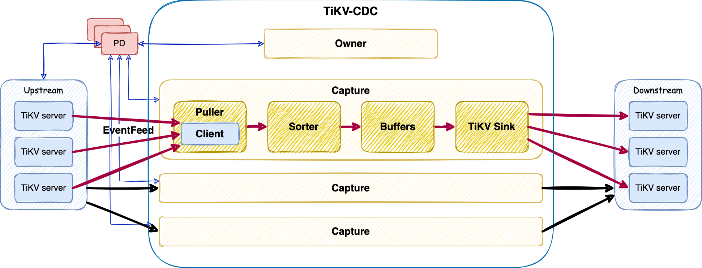

# RawKV Change Data Capture

- RFC PR: https://github.com/tikv/rfcs/pull/86
- Tracking Issue: https://github.com/tikv/tikv/issues/11965

## Summary

This proposal introduces the technical design of **RawKV Change Data Capture** (abbr. **RawKV CDC**).

## Motivation

Customers are deploying TiKV clusters as non-transactional key-value (**RawKV**) storage for application router or other scenarios. When **RawKV** being more and more widely adopted, [Change Data Capture] become a necessary feature to meet the high availability requirement of industries (*e.g.* banking and finance, to deploy disaster recovery clusters).

*(Now we will focus on the scenario of **Cross Cluster Replication**, i.e. replication between main and recovery TiKV clusters. Design for other scenarios will be supplemented later.)*

In this proposal we introduces **TiKV-CDC**, a new component for **RawKV CDC**, which captures changed data from upstream/main TiKV cluster, and replicates to downstream/recovery TiKV cluster in real time.

## Key Challenges & Solutions

### Capturing Change

Timestamp is necessary for indicating which and when data is changed. So **RawKV CDC** will base on [TiKV API V2], which encodes timestamp with key.

### Consistency and Resolved Timestamp

Data in downstream cluster is expected to be consistent with upstream cluster. To be consistent:

**1st**, as **RawKV** does not provide transaction semantic, **RawKV CDC** will not guarantee the order of writes for different keys between upstream and downstream cluster.

**2nd**, [TiKV API V2] provides causality consistence, that if two writes (of the same key) `A` [Happened Before] `B`, then `Timestamp(A)` < `Timestamp(B)`. **RawKV CDC** guarantee the same causality consistence as well.

**3rd**, [TiKV API V2] does not guarantee that a **RawKV** entry with smaller timestamp must be observed first. So **TiKV-CDC** will sort entires by timestamp before send to downstream.

But how **TiKV-CDC** knows it will not receive any even earlier entry from TiKV after the previous batch of data had been sent to downstream ? So we need **Resolved Timestamp** (abbr. **resolved-ts**). **Resolved-ts** is similar to [Watermark], by which TiKV indicating that all entries earlier have been observed. When **TiKV-CDC** receives a `resolved-ts`, all sorted entries with `timestamp <= resolved-ts` are safe to write to downstream.

**Resolved-ts** is generated by every leader of subscribed regions of TiKV in every `1` second by default. To calculate the **resolved-ts**, leaders will trace all **RawKV** entries "inflight", *i.e.* the entries have been in the write procedure (mainly includes scheduling, Raft propose/commit/apply, *etc.*), but not yet been observed. If there are some "inflight" entries, **resolved-ts** should be smaller than the minimum timestamp of them. Otherwise, **resolved-ts** equals to current TSO. On **TiKV-CDC** side, **resolved-ts** of a replication task is the minimum **resolved-ts** of all the regions it subscribes.

**4th**, for easier implementation and better performance, **RawKV CDC** will only provide [Eventual Consistency] and [At-Least-Once] delivery.

### Availability and Scalability

**TiKV-CDC** is designed to be an architecture with single **Owner** and multiple workers (named as **Capture**).

**Owner** is in charge of user interface, **Captures** management, and replication tasks dispatching. **Captures** are responsible for the data processing of replication tasks.

**Owner** is elected using [ETCD]. **Owner** and **Captures** are stateless, all metadata (mainly including tasks parameters and states) is stored in [ETCD]. So the availability and scalability are archived depending on [ETCD]. As size of metadata is small and update frequency is low, [ETCD] should be able to handle the workload.

For availability, we utilize a **Checkpoint** mechanism. **Checkpoint** is the latest **resolved-ts** that has been written to downstream successfully, and persist in [ETCD]. When **TiKV-CDC** cluster starts after planned or unexpected stop, replication tasks will resume from the **Checkpoint**.

**Checkpoint** will be affected by **Garbage Collection**. **Checkpoint** requires that all versions since **Checkpoint** are kept, otherwise **TiKV-CDC** would miss some changes. So **TiKV-CDC** will set a **Service Safe Point** on timestamp the same as **Checkpoint**, with **TTL** defaults to `24` hours. The **TTL** means that **TiKV-CDC** and replicate tasks should be resumed in no more than **TTL**, otherwise the **Checkpoint** will be invalid.

Finally, in this proposal, one replication task will be processed in only one **Capture**, to make it right more easily. Splitting a task to sub-tasks will get better performance and scalability, but we must be caution to avoid any overlap or hole among sub-tasks, otherwise the correctness will be violated. Sub-tasks will be considered later.

### Recovery Point Objective

Customers require that [Recovery Point Objective] (abbr. **RPO**) should be no more than tens of seconds. In **RawKV CDC**, [RPO] is measured by the **Checkpoint Lag** metric, the interval between **Checkpoint** and **TSO** at the time.

Main factors affecting **Checkpoint Lag** includes:

- TiKV internal:
  - **Resolved-ts Lag**: the interval between **resolved-ts** and **TSO**. Which approximately equals to the longest duration of all RawKV writes at that moment. In most circumstances, it should be no more than several seconds.
- Data transmission on network:
  - **Network latency** cross cities would be `30` milliseconds or even more. But as we are using the high-performance [gRPC] as underlying implementation of networking, and writing to downstream by batch, we don't concern with network latency now.
- **TiKV-CDC** internal:
  - **Sorter** would be the bottleneck, as it 1) process data from all regions, 2) holds too many data if **resolved-ts** or downstream is blocked, 3) sorts data in disks when data is too big to fit in memory.
  - This issue will be even more severe on initial replication. In this scenario **Sorer** must hold all existing data from starting point of replication task to current before send to downstream.
  - To address this issue, we provide an alternative: using [TiKV-BR] to complete the initial replication. [TiKV-BR] backup and restore data fully utilizing power of the whole TiKV cluster, and don't need the sorting, so is much more efficient.

## Detailed Design

### TiKV

#### Resolved-ts

We will use [memory locks] to trace the "inflight" RawKV writes: acquire a lock before scheduling the writes, and release the lock after (asynchronously) send response to client.

Then, CDC worker in TiKV is able to get the **resolved-ts** as `min(timestamp)-1` of all locks. If there is no lock, use current TSO as **resolved-ts**.

Note that the locks must be acquired before getting timestamp for writes. Otherwise, as the following diagram shown, if we acquire the lock after getting timestamp for write, there is a chance that CDC workers will get a minimum timestamp *("Get Minimum TS from Locks")* larger than the timestamp from "Get TS", as it happens after "Get TS" but before "Lock with TS", and violate the constraint of **resolved-ts**.

*"Lock before Get TS for write" of above diagram shows that:*

*Scene 1: If "Get Minimum TS from Locks" happens **before** "Lock with TS(1)", then **resolved-ts** must be earlier than "TS(2)".*

*Scene 2: If "Get Minimum TS from Locks" happens **after** "Lock with TS(1)", then **resolved-ts** must be earlier than "TS(1)", as well as "TS(2)". As **resolved-ts** must be smaller than `min(timestamp)` of all locks.*

#### Other changes

**RawKV CDC** shares codes of [CDC component] in TiKV with [TiCDC]. Major differences include:

- Add `kv_api` parameter to request of `EventFeed` interface to indicate whether it's a **RawKV** replication.
- Use another scanner for incremental scan, as the **RawKV** stores data in `default-cf` only.
- Distinguish **TiKV-CDC** downstream from [TiCDC], and send corresponding **RawKV** or **TiDB** data respectively. As it's possible that **TiKV-CDC** and [TiCDC] both subscribe to the same region.

### TiKV-CDC

**TiKV-CDC** forks from [TiCDC] as they have similar architecture. Main changes include:

- Core Data Model
  - Add **Key Span**, a continuous key range.
  - Add **Key Span Changefeed**, which is a replication task for a specified **Key Span**.
  - Add **Key Span Task**, which is defined as a **Key Span** being processing on a **Capture**.
- Scheduler
  - Add a new scheduler which dispatch **Changefeed** to **Capture**s.
  - As mentioned above, we don't split **Changefeed** to sub-range now. To work around, users can split to multiple **Changefeeds** manually by specifying the `start-key` & `end-key` arguments on creating **Changefeed**.
  - Rebalance runs periodically to schedule **Changefeeds** from busy **Captures** to less busy ones. The "busy" is measured as number of **Tasks**.
- Data pipeline
  - Process **RawKV** entries.
  - Remove tables and other RDB metadata.
  - Remove transactional codes.
- Sink
  - A new **TiKV sink** to write data into downstream TiKV by `batch_raw_put` & `batch_raw_delete` interface.
- Deployment
  - TiUP & K8S operator supports **TiKV-CDC**.

## Drawbacks

- P99 duration of **RawKV** writes slightly regress mainly because of the acquiring memory locks. According to benchmark, the regression would be less than `3%`.

## Alternatives

- **Replication by Raft**: Deploying downstream cluster as **[Raft] Learner** of upstream cluster. But this solution doesn't provide enough isolation between upstream and downstream cluster, and it is not acceptable by some customers.
- Using [P2P] protocol for internal communication of **TiKV-CDC**: To eliminate external dependency of [ETCD]. This design is more complicated, and will be considered later.

## Unresolved questions

*TBD*.

[TiKV API V2]: ./0069-api-v2.md
[Eventual Consistency]: https://en.wikipedia.org/wiki/Eventual_consistency
[At-Least-Once]: https://www.cloudcomputingpatterns.org/at_least_once_delivery/
[RPO]: https://en.wikipedia.org/wiki/Disaster_recovery#Recovery_Point_Objective
[Recovery Point Objective]: https://en.wikipedia.org/wiki/Disaster_recovery#Recovery_Point_Objective
[TiCDC]: https://github.com/pingcap/tiflow/blob/master/README_TiCDC.md
[Change Data Capture]: https://en.wikipedia.org/wiki/Change_data_capture
[Happened Before]: https://en.wikipedia.org/wiki/Happened-before
[Watermark]: https://www.oreilly.com/radar/the-world-beyond-batch-streaming-102/
[ETCD]: https://etcd.io
[gRPC]: https://grpc.io
[Memory locks]: https://github.com/tikv/tikv/tree/master/components/concurrency_manager
[CDC component]: https://github.com/tikv/tikv/tree/master/components/cdc
[P2P]: https://github.com/pingcap/tiflow/tree/master/pkg/p2p
[TiKV-BR]: https://github.com/tikv/migration/tree/main/br
[Raft]: https://raft.github.io
