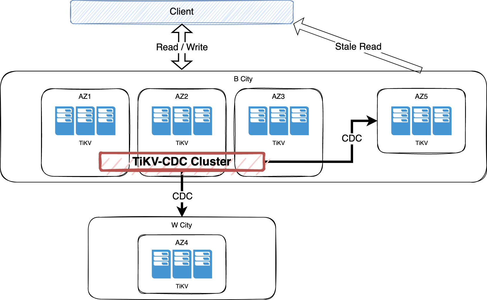

# RawKV Change Data Capture

- RFC PR: https://github.com/tikv/rfcs/pull/86
- Tracking Issue: https://github.com/tikv/tikv/issues/11965

## Summary

This proposal introduces the technical design of **RawKV Change Data Capture** (abbr. **RawKV CDC**).

## Motivation

Customers are deploying TiKV clusters as non-transactional Key-Value (RawKV) storage for application router or other scenarios. As RawKV is more and more widely adopted, **RawKV CDC** become a necessary feature to meet the high availability requirement of industries (e.g, banking and finance, to deploy disaster recovery clusters).

*(Now we will focus on the scenario of **Cross Cluster Replication**, i.e. replication between main and recovery TiKV clusters. Design for other scenarios will be supplemented later)*

In this proposal, we introduces a component called **TiKV-CDC**, which captures changed data from upstream/main TiKV cluster, and replicates to downstream/recovery TiKV cluster in real time.



## Key Challenges & Solutions

### Capturing Change

Timestamp is necessary for indicating which and when data is changed. So **RawKV CDC** will base on [TiKV API V2], which encodes timestamp with key.

### Consistency and Resolved Timestamp

Data in downstream cluster is expected to be consistent with upstream cluster.

First, As RawKV do not provide transaction semantic itself, **RawKV** will not guarantee the order of writes for different keys between upstream and downstream cluster.

Second, [TiKV API V2] provides causality consistence, that if two writes (of the same key) `A` [Happened Before] `B`, then `Timestamp(A)` < `Timestamp(B)`. **RawKV CDC** guarantee the same causality consistence as well.

Third, [TiKV API V2] does not guarantee that the RawKV entry with smaller timestamp must be written to storage and observed first. So in [TiKV-CDC], entires will be sorted by timestamp before send to downstream.

But how [TiKV-CDC] knows TiKV will not send any even earlier entry later ? So we need **Resolved Timestamp** (abbr. **resolved-ts**). **Resolved-ts** is similar to [Watermark], by which TiKV indicating that all entries earlier have been sent to [TiKV-CDC]. When [TiKV-CDC] receives a `resolved-ts`, all sorted entries with `timestamp <= resolved-ts` are safe to write to downstream.

**Resolved-ts** is generated by every leader of subscribed region of TiKV in every 1 second by default. To calculate the **resolved-ts**, leaders of subscribed regions will trace all RawKV entries "inflight", i.e, the entries has been in the write procedure (mainly includes scheduling, Raft propose/commit/apply, etc.), but not yet be observed. If there are some "inflight" entries, **resolved-ts** is the minimum timestamp of them. Otherwise, **resolved-ts** equals to current TSO. On [TiKV-CDC] side, **resolved-ts** of a replication task is the minimum **resolved-ts** of all the regions it subscribes.

At last, for easier implementation and better performance, **RawKV CDC** will only provide [Eventual Consistency] and [At-Least-Once] delivery.

### Availability and Scalability

[TiKV-CDC] is designed to be an architecture with single **Owner** and multiple workers (named as **Capture**). **Owner** is in charge of user interface, **Captures** management, and replication tasks dispatching. **Captures** are responsible for the processing of replication tasks.

**Owner** is elected using [ETCD]. **Owner** and **Captures** are stateless, all metadata (mainly including tasks parameters and states) is stored in [ETCD]. So the availability and scalability are archived depending on [ETCD]. As size of metadata is small and update frequency is low, [ETCD] should be able to handle the workload.

We also utilize a **Checkpoint** mechanism to ensue availability. **Checkpoint** is the latest **resolved-ts** that has been written to downstream successfully, and persist in [ETCD]. When [TiKV-CDC] cluster starts after planned or unexpected stop, replication tasks will resume from the **Checkpoint**.

Besides, **Garbage Collection** of [TiKV API V2] will interact with **Checkpoint**. **Checkpoint** requires that all versions since **Checkpoint** are kept, otherwise [TiKV-CDC] would miss some changes. So [TiKV-CDC] will set a **service safe point** on timestamp the same as **Checkpoint**, with **TTL** defaults to 24 hours. The **TTL** means that [TiKV-CDC] and replicate tasks should be resumed in no more that **TTL**, otherwise the **Checkpoint** will be invalid.

Finally, in this proposal, one replication task will be processed in only one **Capture**, to make it right more easily. Splitting a task to sub-tasks will get better performance and scalability, but we must be caution to avoid any overlap or hole among sub-tasks, otherwise the correctness will be violated. Splitting to sub-tasks will be considered later.

### Recovery Point Objective

Customers require that [Recovery Point Objective] (abbr. **RPO**) should be no more than tens of seconds. In **RawKV CDC**, [RPO] is defined as the **Checkpoint Lag**, i.e. the interval between the **Checkpoint** and current **TSO**.

Main factors affecting the **Checkpoint Lag** includes:

- **Resolved-ts Lag**: the interval between latest **resolved-ts* and current TSO.
- Data transmission between upstream and downstream cluster.
- Performance of **Sorter** of [TiKV-CDC].

consist of duration in TiKV, TiKV-CDC *(see below)*, and network latency. As the first two can be improved by code optimization and scale-out, we will focus on the last in design.

A typical ping latency of cross city network will be more than 30 milliseconds, which is much higher than IDC internal network. We should use appropriate concurrency and batch size to spread out the latency to each data entries, at the same time limit transmission rate to avoid package loss.

In this proposal, we provide a **TiKV Sink** with configurable concurrency, batch size, and back-off parameters, to be adapted to different network environments.

## Detailed Design

### 1. Utilize TiKV-BR & TiKV-CDC as Data Replication Component

**TiKV-BR**, a fork of [TiDB BR], is the tool for backup and restoration of TiKV. We utilize **TIKV-BR** to accomplish data initialization of downstream cluster.

**TiKV-CDC**, a fork of [TiCDC], is the tool for replicating incremental data of TiKV, which gets change data from TiKV's observer component, with high performance, high available, and scalable.

Besides, **TiKV-CDC** can also provide the ability to connect to other components, e.g. Message Queues, which will help TiKV integrate with customers' data systems, and further extend the applicable scenarios of TiKV.


### 2. Consistency

[TiKV API V2] ensures that if two writes (of the same key) `A` [Happened Before] `B`, then `Timestamp(A)` < `Timestamp(B)`.

As a kind of [Change Data Capture], timestamp (or version) is necessary to indicate which and when data is changed.

#### 2.1 Requirement

Among requests of a key, the timestamp must be monotonic with the sequence of data flushed to disk in TiKV.

In general, if request `a` ["happened before"](https://en.wikipedia.org/wiki/Happened-before) `b`, then `Timestamp(a) < Timestamp(b)`. As to RawKV CDC, we provide [Causal Consistency](https://en.wikipedia.org/wiki/Causal_consistency) by keeping order of the timestamp the same as sequence of data flush to disk in TiKV. Downstream systems apply data according to the timestamp order, will always lead to the consistent result.

At the same time, as RawKV doesn't provide cross-rows transaction and snapshot isolation, we treat requests of different keys as concurrent, which means that the sequence of two different keys would be inconsistent in replication, to improve efficiency.

#### 2.2 Timestamp Generation

Timestamp is generated by TiKV internally, to get a better overall performance and client compatibility.

We use [HLC](https://cse.buffalo.edu/tech-reports/2014-04.pdf) to generate timestamp, which not only is easy to use (by being closed to real world time), but also can capture causality.

Timestamp is 64 bits, composed of physical part with 46 bits, and logical part with 18 bits. 18 bits are large enough for logical part, and it is just the same as [TSO](https://github.com/tikv/pd/blob/master/server/tso/tso.go) of [PD](https://github.com/tikv/pd), as well as other timestamps (e.g. `start_ts` and `commit_ts`) in TiKV, which will help to reuse logics on different kinds of timestamps. 

##### 2.2.1 Physical Part of Timestamp

Physical part of HLC is acquired from TSO of [PD](https://github.com/tikv/pd).

In other HLC systems, the physical part is extracted from local system clock, and depends on the stabilization of the local system clock. So in most cases, the [NTP](https://en.wikipedia.org/wiki/Network_Time_Protocol) is necessary, along with some other procedures to ensure correctness (e.g.  [strict monotonicity](https://github.com/cockroachdb/cockroach/blob/13c5a25238ce75cfb7ff151d620e82aa44c72e27/pkg/util/hlc/doc.go#L150) in CockroachDB). As we tend to be free from NTP, we use TSO as the source of physical time.

TSO is a global monotonically increasing timestamp, with high performance and high available, fully meets the requirements for HLC.

Physical part is refreshed by repeatedly acquiring TSO in a period defaults to `500ms`, to keep it being closed the real world time. The period is configurable, shorter period will get more accurate metrics of CDC (e.g. *RPO*), but more pressures on PD.

On startup, physical part must be initialized by a successful TSO, to ensure that HLC is larger than last running. RawKV write operations will fail if the initialization has not been completed. (TiKV also can't startup when PD is out of service).

After successful initialization, HLC can tolerate fault of TSO. Even if some or all TiKV cannot connect to PD, the read and write operations are normal. But meanwhile, time-related metrics such as *RPO* is not reasonable, because the physical part of timestamp is at a standstill. It is also worth noting that as TiKV-CDC being highly dependent to PD (for cluster and task management, checkpoint, etc.), the replication will pause.

##### 2.2.2 Logical Part of Timestamp

According to [principle](https://cse.buffalo.edu/tech-reports/2014-04.pdf) of HLC, logical part (i.e. `logical clock` in paper) is a counter, increased when a write operation happens after another, to indicate the causality.

TiKV is a distributed system, as a result in every store we maintain an instance of the counter. As it is only required to keep causality among requests of every key (see [2.1 Requirement](#21-requirement)), every key exists in only one region, and only one peer (the leader) in the region can write, so it's safe to generate timestamps locally in each store, in most cases.

The exception happens when leader transfer. The diagram below is an example:


*(**LC**: Logical Clock of store, **lc**: logical clock with PUT operation)*

Suppose the leader of a region was on store 1 at the beginning. When the first PUT happened, it got a **lc** as 10, and **LC** of store 1 was advanced to 11. When the leader was transfered to store 2, we should also take the **LC** of store 1 to store 2 (as **LC** of store 2 is smaller), otherwise the second PUT would get a **lc** as 8, which is smaller than previous PUT operation, and violate the causality.

This logic will be implemented in TiKV observer component to avoid interfering with main procedure of leader transfer: every peer observes the raft message applied and keeps the maximum timestamp of the region (called `Region-Max-TS`). On becoming leader, the peer advances the HLC of its store to be no less than `Region-Max-TS` . 

Besides, other region changes will be handled as following:

* On region merge: The `Region-Max-TS` of the region is the max of the two original regions.

* On region split: The `Region-Max-TS` of the new region is copied from the original one.

#### 2.3 Resolved Timestamp

*Resolved Timestamp* (or `resolved-ts`) is generated by TiKV, to indicate the largest timestamp of a replication task that all events before the timestamp have been replicated, to help downstream avoid getting partial data. Downstream streaming system can also use `resolved-ts` as [*watermark*](https://www.oreilly.com/radar/the-world-beyond-batch-streaming-102/).

In implementation, we notify `resolved-ts` event generation that the minimum timestamp of data that on the way from *proposed* to *applied* (by [`resolver.track_lock`](https://github.com/tikv/tikv/blob/v5.0.4-20211201/components/resolved_ts/src/resolver.rs#L47-L57)), to synchronize the write and `resolved-ts` routines.


### 3. Deletion

To make deletions be captured as change data, we turn physical deletion to logical deletion, i.e., set a *deleted* flag, other than physically delete the entry.

The *garbage collection* of deleted data is implemented by setting TTL to a *lifetime* defaults to 24 hours. After the *lifetime* expired, the deleted data will be physically deleted by [compaction filter](https://github.com/facebook/rocksdb/wiki/Compaction-Filter). The *lifetime*, meanwhile, is the earlier start timestamp of **TiKV-CDC** replication task, which will ensure that the replication will not miss some deletion events. Shorter *lifetime* will save some storage, but shorten the duration **TiKV-CDC** replication task can pause. Replication before *lifetime* can only be archived by a full backup & restore using **TiKV-BR**.

### 4. Encoding

Timestamp & deleted flag are encoded as following:

```
r{user key}{MCE Padding}{^timestamp:u64}: {user value}{expire ts}{meta flags}
```

*(Deleted flag is a bit of meta flags in value)*

* Encoding based on TiKV API version [V2](https://github.com/tikv/rfcs/blob/master/text/0069-api-v2.md). *(As there is no flag or meta fields, it is not possible to encode the two necessary fields for CDC in older API version.)*
* Timestamp encoded into key will be beneficial to the following, comparing with encoded into value:
  * More effective catch up, as we can get scope of change data without read & decode all values.
  * [PiTR](https://en.wikipedia.org/wiki/Point-in-time_recovery) is available.
  * Less code complexity, as data structure of RawKV & TxnKV are the same.
* And with the following acceptable loss:
  * More read latency in tens of microseconds *(to be further verified)*.
  * A little more write overhead caused by [MCE Padding](https://github.com/facebook/mysql-5.6/wiki/MyRocks-record-format#memcomparable-format).
  * An extra Garbage Collection is required (used with TxnKV).
  * Possible more space occupied (related to update pattern).

### 5. Incremental Scan

On replication task resumed after paused, we scan *KVDB* to get the change data during pause by extracting timestamp encoded in key. The scan will be heavy as we actually scan all the keys, so we should avoid scanning as possible, and limit scan rate.

*Incremental Scan in SQL / TxnKV scenario scans write_cf to get change data scope, which is much cheaper. So an alternative to reduce cost for RawKV is writing timestamp to write_cf other than encoded in key, but will introduce an additional write for each put request. We tend to the lower delay of writing now.*

### 6. TiKV-CDC

**TiKV-CDC** is a fork of TiCDC. The following modifications will be applied:

* Owner:
  
  * A new type of [*changefeed*](https://docs.pingcap.com/tidb/stable/manage-ticdc#manage-replication-tasks-changefeed) which is specified by key range.
  
  * A new type of **task** which is specified as a **sub-range** of the whole key range, and is handled by a *KV Processor* on a [*Capture*](https://docs.pingcap.com/tidb/stable/ticdc-overview#ticdc-architecture).

* Scheduler: A new scheduler which splits the whole key range of *changefeed* into *sub-ranges*, and distributes to *captures*.
  
  * For simplicity, we split whole key range into fixed number of parts, which can be specified by *changefeed* argument, and defaults to **2**. As we sink data to downstream TiKV by **batch put** and bottleneck of replication should not be on TiKV-CDC, a parallel of **2** will be enough.
  
  * Key range splitting is align with boundary of Regions. For simplicity, each *sub-range* contains almost equal number of Regions.
  
  * *Rebalance* can only be performed by *tikv-cdc cli*. As *rebalance* will trigger *incremental scan* and impact performance of TiKV, it is not running automatically. We need more information to determine the best moment for *rebalance* by TiKV-CDC itself in the future.

* Capture: Accepts key-range tasks, and creates *KV Processors* to handle them.

* Processor:
  
  * A new *KV Processor* which accepts key-range tasks, and processes key-value data

* Sink:
  
  * A new *TiKV sink* to batch put data into downstream TiKV cluster, with configurable concurrency, batch size, and backoff parameters.

## Prototype

We have developed a [prototype](https://github.com/pingyu/tikv/issues/1) to verify feasibility of this proposal. All of the correctness validation cases are passed. And the benchmark results are as follows:

| Case                          | gPRC P99 Duration (ms) | gPRC Avg Duration (ms) |
|:-----------------------------:|:----------------------:|:----------------------:|
| Rawkv-cdc 600 threads raw_put | 15.3                   | 5.9                    |
| Baseline 600 threads raw_put  | 14.9                   | 5.2                    |
| Diff                          | -2.7%                  | -13.5%                 |
| Rawkv-cdc 600 threads raw_get | 0.6778                 | 0.0996                 |
| Baseline 600 threads raw_get  | 0.7007                 | 0.108                  |
| Diff                          | 3.3%                   | 7.8%                   |

*(Environment: Kingsoft Cloud, 32C 64GB, 500GB local SSD, Main: 1 KV + 1 PD + 1 TiCDC, Recovery: 1 KV + 1 PD, YCSB)*

We also developed a prototype to verify the performance impact of encoding timestamp in key. And the benchmark results are as following:

| Case                          | gRPC p99 duration (ms) | gRPC Avg Duration (ms) |
|:-----------------------------:|:----------------------:|:----------------------:|
| Rawkv-cdc 600 threads raw_put | 31                     | 8.8                    |
| Baseline 600 threads raw_put  | 31                     | 8.7                    |
| Diff                          | 0%                     | -0.1%                  |
| Rawkv-cdc 600 threads raw_get | 1.3                    | 0.31                   |
| Baseline 600 threads raw_get  | 1.2                    | 0.31                   |
| Diff                          | -8.3%                  | 0%                     |

*(Environment: Kingsoft Cloud, 32C 64GB, 500GB local SSD, Main: 1 KV + 1 PD YCSB, 10kw key-value pairs, block cache hit 80% with 100% index and 34.8% data)*

Regarding the gains mentioned in [4. encoding](#4-encoding), the performance impact is acceptable, so the proposal of encoding timestamp in key is choosen.

## Drawbacks

- Longer duration of `raw_put` *(about 2.7% for P99 in prototype so far)*

- Bigger storage *(more 9 bytes for every entry)*

## Alternatives

- Replication by Raft, i.e. deploying downstream cluster as *Raft Learner* of upstream cluster. This solution doesn't provide enough isolation between main and downstream cluster, and is not acceptable by some customers.
- A new component replicated from main TiKV as *Raft Learner*. *TBD*.

## Unresolved questions

*TBD*.

[TiKV API V2]: ./0069-api-v2.md
[Eventual Consistency]: https://en.wikipedia.org/wiki/Eventual_consistency
[At-Least-Once]: https://www.cloudcomputingpatterns.org/at_least_once_delivery/
[RPO]: https://en.wikipedia.org/wiki/Disaster_recovery#Recovery_Point_Objective
[Recovery Point Objective]: https://en.wikipedia.org/wiki/Disaster_recovery#Recovery_Point_Objective
[TiDB BR]: https://github.com/pingcap/tidb/tree/master/br
[TiCDC]: https://github.com/pingcap/tiflow/blob/master/README_TiCDC.md
[Change Data Capture]: https://en.wikipedia.org/wiki/Change_data_capture
[Happened Before]: https://en.wikipedia.org/wiki/Happened-before
[Resolved-ts]: #resolved-timestamp
[TiKV-CDC]: #6-tikv-cdc
[Watermark]: https://www.oreilly.com/radar/the-world-beyond-batch-streaming-102/
[ETCD]: https://etcd.io
