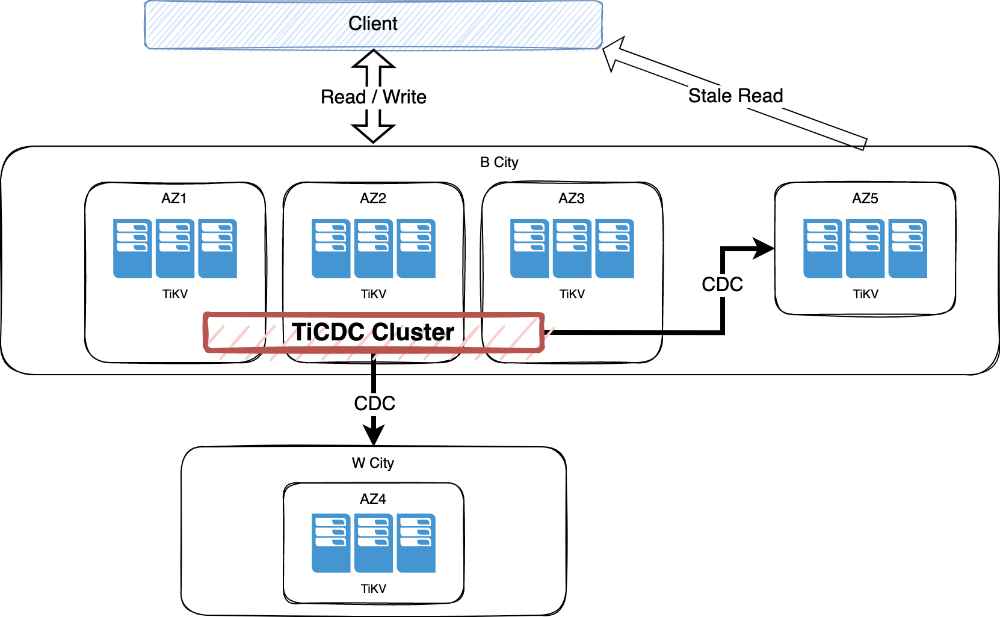

# RawKV Cross Cluster Replication

- RFC PR: https://github.com/tikv/rfcs/pull/86
- Tracking Issue: https://github.com/tikv/repo/issues/0000

## Summary

This proposal introduces the technical design of RawKV Cross Cluster Replication.

## Motivation

Customers are deploying TiKV clusters as non-transaction Key-Value (RawKV) storage. But the lack of *Cross Cluster Replication* is a obstacle to deploy disaster recovery clusters for providing more highly available services.

The ability of cross cluster replication will help TiKV be more adoptable to industries such as Banking and Finance.

## Detailed Design

### 1. Utilize BR & TiCDC as Data Replication Component

[BR](https://docs.pingcap.com/tidb/stable/backup-and-restore-tool) is the tool for backup and restoration of TiDB. We utilize BR to accomplish data initialization of recovery cluster. BR is also the key role for backward compatibility, while old data without *timestamp (see below)* can not be replicated in a incremental manner.

[TiCDC](https://docs.pingcap.com/tidb/stable/ticdc-overview) is the tool for replicating incremental data of TiDB. As TiCDC captures change data from MVCC tier of TiKV, the replication of RawKV data has a lot in common with TiDB data. So utilizing TiCDC as data replication component will significantly reduce the workloads, by reusing features such as task management, metrics, high available, load balancing, etc.

Besides, TiCDC can also provide the ability to connect to other components, e.g. Message Queues, which will help TiKV integrate with customers' data systems, and further extend the applicable scenarios of TiKV.



### 2. Add Timestamp to Data

As a kind of [Change Data Capture](https://en.wikipedia.org/wiki/Change_data_capture), timestamp (or version) is necessary to indicate which data is changed. While RawKV doesn't have such a thing before, we need to add timestamp to the RawKV data.

#### 2.1 Requirement

Among requests of a key, *Order of Timestamp* must be consistent with sequence of data flush to disk in TiKV.

In general, if request `a` ["happened before"](https://en.wikipedia.org/wiki/Happened-before) `b`, then `Timestamp(a) < Timestamp(b)`. As to cross cluster replication, we provide [Causal Consistency](https://en.wikipedia.org/wiki/Causal_consistency) by keeping order of the timestamp the same as sequence of data flush to disk in TiKV. Downstream systems apply data according to the timestamp order, will always lead to the consistent result.

At the same time, as RawKV doesn't provide cross-rows transaction and snapshot isolation, we treat requests of different keys as concurrent, to reduce complexity and improve performance.

#### 2.2 Timestamp Generation

Timestamp is generated by TiKV internally, to get a better overall performance and client compatibility.

We use [HLC](https://cse.buffalo.edu/tech-reports/2014-04.pdf) method to generate timestamp, which not only is easy to use (by being closed to real world time), but also can capture causality.

##### 2.2.1 Physical Time of Timestamp

Physical time of HLC is acquired from TSO of [PD](https://github.com/tikv/pd).

TSO is a global monotonically increasing timestamp, which help the generation of timestamp be independent to local clock of machine, and be immune to issues such as reverse between machine reboot.

Physical time is refreshed by repeatedly acquiring TSO in a period of `500ms`, to keep it be closed the real world time. And it can tolerate fault of TSO no longer than `30s`, to keep time-related metrics such as RPO reasonable.

Besides, on startup, physical time must be initialized by a successful TSO.

##### 2.2.2 Logical Time of Timestamp

Logical time is advanced on every write request.

Moreover, logical time is advanced on *Leader Transfer*. As TiKV a distributed system, every store in TiKV cluster has a instance of timestamp generator. As every key is existed in only one region and only one peer (the leader) in a region can write, it's safe to generate timestamp locally in each store, except for leader transfer.

On leader transfer, the timestamp generated by other store would be bigger than the store where new leader located, which will violate the causal consistency requirement. We solve this by this method: Every peer observes raft message applied, and keep the maximum timestamp of the region (called `Region-Max-TS`). On become leader, this peer advances timestamp generator of store to be bigger than `Region-Max-TS`. 

Besides, other region changes should be carefully handled:

* On region merge: The `Region-Max-TS` of the region is the bigger one of the original two regions.

* On region split: The `Region-Max-TS` of the new region is copied from the original one.

#### 2.3 Resolved Timestamp

TiCDC using *Resolved Timestamp* (or `resolved-ts`) to indicate the largest transaction timestamp of the replication task, to help downstream avoid getting partial data of a transaction. Downstream streaming system can also use `resolved-ts` as [*watermark*](https://www.oreilly.com/radar/the-world-beyond-batch-streaming-102/).

As no transaction support, in RawKV scenario we don't need scanning locks in *lock_cf*. But we should notify `resolved-ts` event generation that the minimum timestamp of data that on the way from *proposed* to *applied* (by [`resolver.track_lock`](https://github.com/tikv/tikv/blob/v5.0.4-20211201/components/resolved_ts/src/resolver.rs#L47-L57)).

### 3. Deletion

To make deletions be captured as change data, we turn physical deletion to logical deletion, i.e., set a *deleted* flag, other than physically delete the entry.

The *garbage collection* of deleted data is implemented by setting TTL to 25 hours after, and *GC-ed* by compaction filter. At the same time, start timestamp (or `start-ts`) of TiCDC replication task should not be earlier than 24 hours before.

### 4. Encoding

For [V1 storage](https://github.com/tikv/rfcs/blob/master/text/0069-api-v2.md) with TTL enabled, we encode timestamp & flag (for deleted bit) as *extended meta* between user value and TTL field. The most significant bit of TTL fields is used to indicate the existence of *extended meta*.

```
{user key}: {user value}{timestamp:u64}{flag:u8}{ttl:u64}
```

For V2 storage, we append timestamp to user key, to provide [PiTR](https://en.wikipedia.org/wiki/Point-in-time_recovery).

```
r{keyspace id}{user key}{MCE Padding}{^timestamp:u64}: {user value}
```

*(For V1 storage with TTL DISABLED, we cannot provide cross cluster replication, as there is no extra field to encode timestamp into).*

## Prototype

We have developed a [prototype](https://github.com/pingyu/tikv/issues/1) to verify feasibility of this proposal. All of the correctness validation cases are passed. And the benchmark results are as follows:

| raw_put               | gPRC P99 Duration (ms) | gPRC Avg Duration (ms) |
|:---------------------:|:----------------------:|:----------------------:|
| Rawkv-cdc 200 threads | 15.5                   | 3.5                    |
| Baseline 200 threads  | 13.3                   | 2.8                    |
| Diff                  | -16.5%                 | -25.0%                 |
| Rawkv-cdc 600 threads | 30.8                   | 8.4                    |
| Baseline 600 threads  | 26.4                   | 6.4                    |
| Diff                  | -16.7%                 | -31.3%                 |

*(Environment: 40C 125GB, 1.6TB NVMe, Main: 1 KV + 1 PD + 1 TiCDC, Recovery: 1 KV + 1 PD, YCSB workloada)*

*(TODO: Further improve performance)*

## Drawbacks

- Longer duration of `raw_put` *(about 16.7% in prototype so far)*

- Bigger storage *(more 9 bytes for every entry)*

## Alternatives

- Replication by Raft, i.e. deploying recovery cluster as *Raft Learner* of main cluster. This solution doesn't provide enough isolation between main and recovery cluster, and is not acceptable by some customers.
- A new component replicated from main TiKV as *Raft Learner*. *TBD*.

## Unresolved questions

*TBD*.
