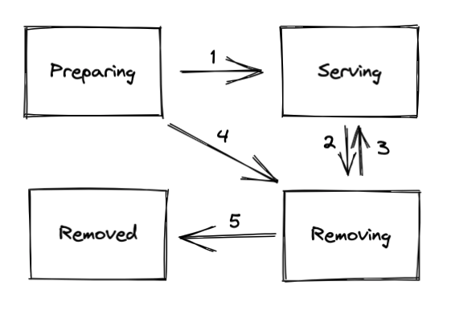

# PD HTTP API V2

## Motivation

The V2 API aims to provide a standard RESTful API for PD. The current HTTP API doesn't follow the RESTful API conventions. We have summarized some problems of the current status:

- mixed-use of `_` and `-` in the path
- some methods are not accurate, e.g., we do not distinguish between PUT and POST
- the resource should use a noun    
- query parameter should not occur in the path
- mixed-use of singular and plural nouns

Besides the above problems, we are going to refine some internal structures and reduce some unnecessary APIs which are never been used before.

## Detailed Design

We can use gin as our HTTP web framework in the V2 API, which is more popular and has a better ecosystem.

Here is a basic example for stores:

```go
router := gin.New()
router.Use(middlewares.Redirector())
root := router.Group(apiV2Prefix)
meta := root.Group("meta")
meta.Use(middlewares.BootstrapChecker())
meta.GET("/stores", handlers.GetStores())
meta.GET("/stores/:id", handlers.GetStoreByID())
meta.DELETE("/stores/:id", handlers.DeleteStoreByID())
meta.PATCH("/stores/:id", handlers.UpdateStoreByID())
```

### Middleware

We can easily add the middleware through the `Use` function and the middleware we defined only needs to return [gin.HandlerFunc](https://github.com/gin-gonic/gin/blob/v1.7.7/gin.go#L34). This also can be applied in a specified API group. Gin has provided many [ready-made middleware](https://github.com/gin-contrib) which is convenient.

### Path definition

#### Resource

Since the key abstraction of information in RESTful API is a resource, it can be any non-virtual object. We use plural form to represent a set of objects, e.g., `/pd/api/v2/stores` and use the plural form with a unique field to represent a singular object, e.g., `/pd/api/v2/stores/:id`. There should not be a verb or any query parameter existing in the path. The previous path like `/pd/api/v1/store/{id}/state` should be rewritten to `/pd/api/v2/stores/:id` with `state` data in JSON format as an input.

#### Method

Here is a simple guide about how to use choose the correct method:

- GET: retrieve resources only
- POST: create resources or do a custom action. We should avoid using it on a single resource for a creating purpose.
- PUT: replace resources or collections
- PATCH: make a partial update on a resource
- DELETE: delete the resources

#### Word delimiter

The hyphen will be recommended to use as the word delimiter.

#### Group

For those middlewares that only need to be applied in a set of APIs, we can use API group. API group also can be used to divide our APIs into different sets according to their purpose and share the same middleware. The previous `/pd/api/v1/admin/*` can be put into `admin` group. For stores itself, we can put them into `meta` group, so the previous `/pd/api/v1/stores` or `/pd/api/v1/store` become to `/pd/api/v2/meta/stores`. Currently, the V1 API can be divided into the following groups:

- member: something about etcd itself
- meta: those resources related to PD meta info, the entity in PD core package, like regions, stores, cluster
- scheduling: use to control the scheduling behaviors, e.g., schedulers, checkers, operators
- admin: control the system behavior, e.g., log, ping
- debug: debug information through go pprof
- extension: some extra features required by other components

There are some other APIs that don't belong to any group mentioned above. We can decide to use an individual group according to middleware usage.

#### Custom action

We have many custom actions in API V1, such as `/pd/api/v1/regions/split` or `/pd/api/v1/regions/scatter`, etc. In V2, We recommend using `/pd/api/v2/regions/:action` with `POST` method. There may be [segment conflicts with existing wildcard](https://github.com/gin-gonic/gin/issues/1301) when using gin as the web framework. But fortunately, we don't have this conflict problem after we change existed V1 API to V2.

### Behavior changes

In V2, we are planning to refactor the original store state. The previous implementation has some drawbacks:

- the state which is defined between the ProtoBuf and PD has the conflict and only one state can be shown. e.g., a store with a `Down` state can be either `Up` or `Offline`
- the `Offline` is misleading, some users regard it as the `Tombstone`
- there is a lack of a state to describe the online process

To solve the above problems, the store state is divided into the heartbeat status and the node state. The node state emphasizes the membership status of this store in the cluster. There are 4 states for it:

- Preparing: represent the online process state, the store in this state more care about the balancing process.
- Serving: the normal state for providing the service
- Removing: just like the original `Offline`, but it's more clear
- Removed: the same as the original `Tombstone`

As for heartbeat status, we only add one normal status named `Alive` into the previous implementation.

With these changes, we can do more things like dynamically adjusting scheduling parameters, progress estimation, etc.

#### Node state transition

Here is the newly node state transition graph:



1. When a store is newly added to the cluster, we regard it as `Preparing`. Once it reaches the threshold of its expected region size, it turns into a `Serving` state.
2. When a store in `Serving` state receives the delete store command/HTTP request, it will be changed to `Removing` state.
3. When we don't want to remove the previous store in `Removing` state, we can use the cancel delete command or through HTTP request to change the node state back to `Serving`.
4. When a store is in `Preparing` state, we can also remove it through the delete store command/HTTP request.
5. When a store in `Removing` state has moved all regions on it to the rest stores, it finally becomes `Removed`.

The threshold of the expected region size in 1 is calculated by accumulating the store region size for each range of the defined placement rules. 
For each given range, we first get all rules which involve this range. And for each rule, we get the size of a single replica and then multiply the count defined in the rule to get the expected region size of this rule. Because each placement rule could have different label constraints, so we can obtain the region size weight of a store through the label constraints. Then multiply these two things, we can obtain the store region size of this range.

## Compatibility
Once the implementation has been finished, we need to replace the old API with the new version for all components and tools. Also, we should let the user know about this change. The V1 will still leave for some time for compatibility and be deprecated finally.
