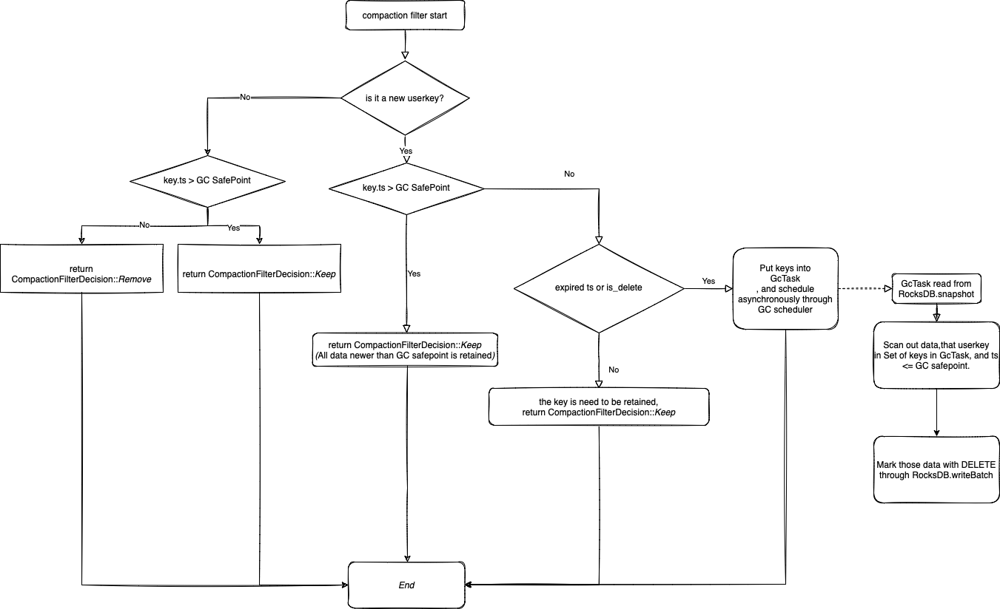

# RFC: TiKV RawKV MVCC GC


## Summary
Move TiKV MVCC GC worker from TiDB into a group of independent GC worker component and implement a new GC process in TiKV for RawKV.

## Motivation
1. GC worker is an important component for TiKV that deletes outdated MVCC data so as to not explode the storage. But currently, the GC worker is implemented in TiDB, which makes TiKV not usable without TiDB.And current GC process is just for transaction of TiDB,it's not usable for RawKV.  
2. Standardize the API used to set and obtain GC status in PD to improve the developer's experience.

We change RawKV encoding to MVCC, so the GC is necessary.
No GC for TxnKV scenario when TiDB is not deployed.
The GC safe point & Txn safe point is easy to be misunderstand.

## Background
According to the documentation for the current GC worker in a TiDB cluster, the GC process is as follows:

In TiDB GC worker leader:
1. Regularly calculates a new timestamp called "GC safe point"(The default interval is 10min), and push the safe point to PD.
2. Get the minimal Service safe point among all services from the response of step 1, which is GC safe point .
3. Txn GC process: resolve locks and record delete ranges information.
4. Save Txn safe point.
5. Upload GC safe point to PD.

In PD leader:
1. Receive update safe point requests from TiDB or other tools (e.g. CDC, BR).
2. Calculate the minimal timestamp = min(all service safe point, now - gc_life_time).

the GC safe point data in etcd of PD as follows:  
- safe point generated by TiDB:
     ```shell
  /gc/safe_point/service  
    ```
- service safe point generated by CDC,BR or Lighting:  
     ```shell
  /gc/safe_point/service/$serviceID
    ```

In every TiKV nodes：
1. Get GC safe point from PD regularly.
2. Deletion will be triggered in CompactionFilter and GcTask thread;
   
## New GC worker implementation
In a TiKV cluster without TiDB nodes , there are a few different points as follows:
1. We need to move GC worker into another component.
2. For [API V2](https://github.com/tikv/rfcs/blob/master/text/0069-api-v2.md) , it need gc the earlier version in default cf. But Txn GC worker process will be triggered by WriteCompactionFilter of write cf.
3. RawKV encoded code is different with Txn data in TiDB.

So we designed a new GC architecture and process for TiKV cluster.It will be extended on the original interface to support the RawKV MVCC GC. For the original TiDB scenario, the old GC implementation can be used first.

## Detailed design
For support RawKV GC in TiKV cluster deploy without TiDB nodes.
1. Add a new component instead of GC worker in TiDB nodes.
   - Why we choose to create a new component:
     - IF we add GC Worker in PD: It will cause the problem of client-go circular dependency.
     - IF we add GC Worker in TiKV: Because the logic required by GC worker is well implemented in client-go, but it is missing in client-rust, adding the implementation of GC worker in TiKV will increase more development work.
  
      So after discussion, we decided to add a new role for GC Worker.
     - It's mainly to regularly calculates a new timestamp called "GC safe point", and push the safe point to PD.
     - It is implemented in golang, which is convenient to call the interface of client-go.
     - The code of new GC worker, will be added into [tikv/migration](https://github.com/tikv/migration)
     - the GC Worker configuration in config/gc_worker_conf.toml file.
     - The default interval for generating GC safepoint is still '10m0s'.
     - And TiKV will get the GC safe point from PD. GC safe point = min(all service safe point, gc worker safe point).

   
2. Changes on PD:
   1. A new concept is 'service group':  
        - Due to TiDB, TxnKV and RawKV are allowed to coexist. Because the data of the three scenarios are independent, Because the data of the three scenarios are independent, separate safepoints are used in the GC, which helps to reduce the interference between businesses and speed up the GC.
        - If multi tenancy is supported in the future, 'service group' can also support it.
        - Need to design new interfaces for update service safepoint with 'service group'.
        - How to allocate $service_group_id ?
   2. design the etcd path to save service safepoint of service group:  
        - the safepoint data path in etcd of PD,will be changed. The new safe point path in etcd as follows:
        - gc_worker safe point
         ```shell
         /gc_servicegroup/gc_safepoint/$service_group_id
         ```
         - CDC,BR service safepoint
         ```shell
         /gc_servicegroup/service_safepoint/$service_group_id/$service_id
         ```
   3. design interface to standardize the interface:  
         the interface as follows:  
         1. Gc worker will call pbclient.UpdateGCSafePointByServiceGroup to update the gc worker safepoint as follows:  
            1. interface :  
               ```proto
                   rpc UpdateGCSafePointByServiceGroup(UpdateGCSafePointByServiceGroupRequest) returns (UpdateGCSafePointByServiceGroupResponse) {}
               ```
       
            2. PB messages:
               ```proto
                    message UpdateGCSafePointByServiceGroupRequest {
                        RequestHeader header = 1;
                        bytes service_group_id = 2;
                        uint64 safe_point = 3;
                        int64 revision = 4;
                    }

                    message UpdateGCSafePointByServiceGroupResponse {
                        ResponseHeader header = 1;
                        uint64 new_safe_point = 2;
                        bool valid_revision = 3;
                    }
               ```
         2. used to get all GC safepoint for TiKV:
            1. interface:
               ```proto  
                   rpc GetAllServiceGroupGCSafePoints(GetAllServiceGroupGCSafePointRequest) returns (GetAllServiceGroupGCSafePointsResponse) {}
               ```
            2. PB messages:
               ```proto
                    message GetAllServiceGroupGCSafePointsRequest {
                        RequestHeader header = 1;
                    }

                    message GetAllServiceGroupGCSafePointsResponse {
                        ResponseHeader header = 1;
                        repeated ServiceGroupSafePoint service_group_safe_point = 2;
                    }
               ```
         3. Used to update service safepoint for CDC/BR/Lightning:
            1. interface:
               ```proto  
                   rpc UpdateServiceSafePointByServiceGroup(UpdateServiceSafePointByServiceGroupRequest) returns (UpdateServiceSafePointByServiceGroupResponse) {}
               ```
            2. PB messages:
               ```proto
                    message UpdateServiceSafePointByServiceGroupRequest {
                        RequestHeader header = 1;
                        bytes service_group_id = 2;
                        bytes service_id = 3;
                        int64 TTL = 4;
                        uint64 safe_point = 5;
                    }

                    message UpdateServiceSafePointByServiceGroupResponse {
                        ResponseHeader header = 1;
                        uint64 gc_safe_point = 2;
                        uint64 old_safe_point = 3;
                        uint64 new_safe_point = 4;
                    }
               ```
         4. GC Worker call pdclient.GetMinServiceSafePointByServiceGroup to get min(all service safepoint):
            1. interface:
               ```proto
                  rpc GetMinServiceSafePointByServiceGroup(GetMinServiceSafePointByServiceGroupRequest) returns (GetMinServiceSafePointByServiceGroupResponse) {}
               ```
            2. PB messages:
               ```proto
                    message GetMinServiceSafePointByServiceGroupRequest {
                        RequestHeader header = 1;
                        bytes service_group_id = 2;
                    }

                    message GetMinServiceSafePointByServiceGroupResponse {
                        ResponseHeader header = 1;
                        uint64 safe_point = 2;
                        int64 revision = 3;
                    }
               ```
         5. GC Worker call pdclient.GetAllServiceGroups to get all service group id:
            1. interface:
               ```proto
                   rpc GetAllServiceGroups(GetAllServiceGroupsRequest) returns (GetAllServiceGroupsResponse) {}
               ```
            2. PB messages:
               ```proto
                    message GetAllServiceGroupsRequest {
                        RequestHeader header = 1;
                    }

                    message GetAllServiceGroupsResponse {
                        ResponseHeader header = 1;
                        repeated bytes service_group_id = 2;
                    }
               ```
3.Changes on TiKV：
- Get GC safe point from PD by GetAllServiceGroupGCSafePoints interface.
- For API V2, we need add new CompactionFilter which is named RawCompactionFilter, and add a new GCTask type implementation. 
- GC conditions in RawCompactionFilter is:  (ts < GCSafePoint) && ( ttl-expired || deleted-mark || not the newest version ).  
   - If the newest version is earlier than GC safe point and it's delete marked or expired ttl,those keys and earlier versions of the same userkey will be sent to a gc scheduler thread to gc asynchronous.
      


## Reference
https://docs.google.com/document/d/1jA3lK9QbYlwsvn67wGsSuusD1Dzx7ANq_vya384RBIg/edit#heading=h.rr3hcmc7ejb8  
https://docs.pingcap.com/tidb/stable/garbage-collection-overview
