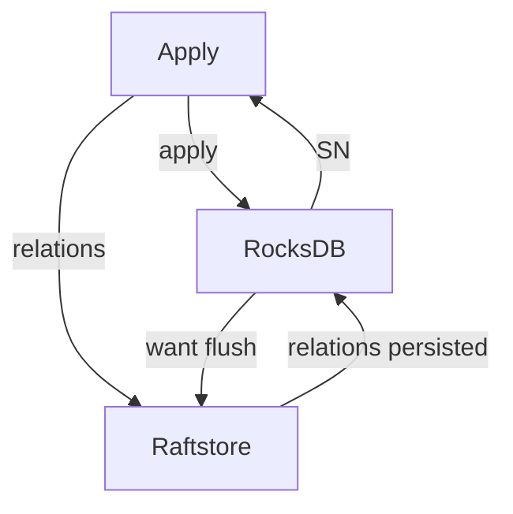

# Remove KV WAL

- RFC PR: https://github.com/tikv/rfcs/pull/94
- Tracking Issue: https://github.com/tikv/repo/issues/0000

## Summary

Disable KV WAL completely and move all states from KV DB to raft engine.

## Motivation

We already have all the raft logs required for recovery, it's a waste to write everything to WAL again. Although we are using cache write almost the whole time, but if a page is marked to flush, it can still trigger random latency. And if we want to use multiple rocksdb instances in one node, writing WAL can introduce a lot of random writes.

## Detailed design

This RFC assumes you have know how RocksDB works and recovers from restarting.

### Relation between sequence number and (region ID, apply index)

In RocksDB, WAL plays the role of recording both data and order. MANIFEST plays the role of recording persistent data. Now that WAL is removed, we need a new component to replace its role. Raft logs already have all the necessary data and partial order within the same peer, and the order across peers is traced by region version. So all we need to do is record the exact index KV DB belongs to.

One choice is enabling atomic flush and using raft CF to record the index, but it can bring too many small compactions. It can get worse when there are many rocksdb instances and flush is invoked frequently.

Another choice is storing the apply index in properties. However, on one hand, it’s not guaranteed that every time a flush will generate at least a table file. On the other hand, if all data are deleted, all files can be removed. So properties are unreliable (and verbose).

The RFC proposes to build a relation between sequence number (SN) and (region ID, apply index), so apply index can be queried by querying each CF’s latest persisted SN.

To build relations between SN and apply index, we need to know what SN is assigned to each write. RocksDB doesn’t have a public API to provide the information. Fortunately, exposing it is just a work of several lines.

To persist the relations, we need to send them back to the raftstore thread, along with `ApplyRes`. Noticing SN is strictly monotonically increased just like log index, we can store the relations just like raft entries.

Because we need to use the relation to recover writes, so before a rocksdb flush finishes, we need to ensure the corresponding relation is persisted. When using separate RocksDB for each region, this is simple as we only care about one region at one flush. So just waiting for the SN to persist is enough. When sharing RocksDB for all regions, we need to ensure SN is persisted for all affected regions.

Because the `ApplyRes` are processed in random order, it's possible that when SN is received by one region, there is still a smaller SN to another region on the flight. To know whether all previous SNs have been received, let’s introduce a global counter C. Before writing to RocksDB, a thread should fetch and add 1 to C, supposing it’s StartC. After the write is finished, it should fetch C, supposing it’s EndC. Both StartC and EndC should be included in `ApplyRes`. If all StartC <= EndC have been received by raftstore, then there must be no smaller SN on the flight. Prove can be checked in the appendix.

### Reduce relation count

KV RocksDB write rates can be more than 10kops, saving all relations can be a huge cost. The point of relation is to record the order of writes and get a suitable replay start point. It doesn’t require all relations to serve the goal.

To get a suitable replay start point, only the maximum flushed SN needs to be considered. And only frozen memtables will be flushed, so every time a memtable is frozen, we can hint raftstore to the maximum SN this memtables contains. And before flushing the memtable, we wait for the SN relation to be persisted. There are existing hooks, EventListener, allowing us to make the modifications.

For all other relations, they can be merged together and only keep the largest SN and largest apply index for each region ID.

### How to recover from relation

After TiKV is restarted, it should check the maximum SN number for each CF, and choose the minimum SN as the replay start point. Similar to RocksDB, writes can be ignored partially if they contain the data to a CF with larger SN.

Recovery should always recover the region with the smallest version. If the recovery changes the version, it should pause the current region and choose the new smallest version again. Region with the same version can be recovered with arbitrary order. The consideration is that version is the sync point between regions, operations such as split, merge, to smaller regions must happen earlier when their range overlap.

Before the replay is finished, TiKV should not provide service just like RocksDB. At the end of the recovery, TiKV should flush all data to level0 to free logs and avoid future replay cost. To shorten recovery time, TiKV may flush all RocksDB before gracefully shutdown.

Note, the replay is just redo any modifications that have happened in the apply thread with the similar order, so it should be correct as long as all necessary logs are not deleted despite there being any admin commands. One corner case is the modifications not happening in the apply thread: ingesting SSTs and compaction filter GC. For ingesting SSTs, it’s safe because it will flush memtable if there is any overlap. So overlapped CFs must have the latest SN persisted, and recovery should not introduce any conflict changes. For compaction filter GC, it may leave some garbage in default CF. It can be fixed by processing the deletions like normal requests, for example, using a fake peer without replicating.

### GC relation and raft logs

Similar to RocksDB, after flushed, only relations after min(max(SN) for each CF) need to be kept.

Only logs not tracked by apply index in existing relation can be deleted. For destroyed peers, if the region version doesn’t change since the flushed SN, there is no need to replay the raft log and all logs can be deleted. If the region version changes, raft logs should not be deleted even if the peer is destroyed. Technically, a peer only accepts a snapshot when it’s in the peer list, and a peer will destroy itself either before or right at the conf remove index. So even if a new peer is created with the same region ID, the required logs for recovery should not be affected.

### Migrate states

After removing WAL, the states written to KV DB are unreliable, which can make significant operations like applying snapshots corrupted, leading to high uncertainty and complexity. 

On the other hand, we already have the relation to track the apply progress, it’s meaningless to still write an apply state to rocksdb. So I propose to just drop the raft CF and move all states to the raft engine in this RFC. Unlike KV DB, changes to raft states should not be written to the raft engine immediately, otherwise replaying the raft log will go wrong due to epoch changes or range changes. Instead, state changes should be kept with the relation and be persisted to the raft engine only then the corresponding relation is deleted. Though, the change should take effect immediately in memory. Because the apply state will not be persisted directly, so the applying snapshot state should be recorded as a new key.

Coprocessor cache depends on apply index to detect data version, so when taking a RocksDB snapshot for read, index should be read **before** the snapshot is created. And apply index should be updated **after** writing data and **before** invoking callbacks. Snapshot may contain more data than the apply index indicates, but it should be OK as it’s just the same as `ReadIndex` requests.

### Compatibility

#### Upgrade and downgrade

First upgrade needs to move all states from KV RocksDB to the raft engine and drop the raft CF. Downgrade should finish recovery first and then start state migration in the reverse order.

A schema version is introduced to the raft engine to indicate whether WAL is enabled or not so it can be controlled by configuration.

## Alternatives

### Use atomic flush

Atomic flushes may introduce more compaction especially after introducing dynamic regions according to my tests.

### Change format of SST to record apply state

It may not be backward compatible, and also requires flush before significant admin command.

This RFC doesn’t require flushes nor changing any format of file to provide the same recovery guarantee as using WAL. It also reduces keys that need to be written to KV RocksDB, which should improve performance especially when the apply threads are loaded. It’s also backward compatible and easy to work with TiFlash. And it becomes a standalone feature that doesn’t depend on any architecture.

## Unresolved questions

## Appendix

### Relations sync in sharing mode

Supposing an `ApplyRes` with SN as s0, StartC as c0, and EndC as c1 is received. The `ApplyRes` is written in the group g0. If there is an `ApplyRes` with smaller SN as s1, StartC as c2, and EndC as c3 on the flight, then it must be written by a group not after g0 due to SN being allocated in sequential order. Because c1 is fetched after g0 has finished, and c2 is fetched not earlier than g0 is finished, so c2 <= c1. It conflicts with the condition that all StartC <= EndC have been received.

