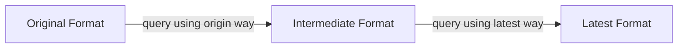

# Introduce latest cf

- RFC PR: https://github.com/tikv/rfcs/pull/95
- Tracking Issue: https://github.com/tikv/repo/issues/0000

## Summary

Add a cf (column family in RocksDB) named "latest" to store the latest version of keys in MVCC.

## Motivation

As we all know, currently TiKV stores all its data in RocksDB. It creates a cf (column family) named "write" to store all the available versions. The key format looks like following:

```
| key | version |
```

. Version is a 64 bits number and encoded in desc order (larger goes first).

When reading a key with version v0, TiKV is expected to return the largest version v1 that v1 <= v0. Because TiKV has no idea what version is available, so it has to create an iterator and use version v0 to encode a seek key. If any key is hit, then the key should be the requested key.

The procedure is straightforward but expensive. Creating an iterator in RocksDB is not free. Even for point get, an iterator is still necessary. And seek operation is also expensive, almost as expendsive as creating iterator. To avoid seeking too many times, we introduce `near_seek` to TiKV in the early days, which tries `next` several times before fallback to `seek`.

As explained, the reason why seek is necessary is because TiKV has no idea what versions are available. Otherwise it can just use `get` to query the specific key, which is a lot cheaper.

## Detailed design

TiKV doesn't need to know all existing versions of keys. In fact, most of the time, v0 is larger than any existing versions of keys in TiKV if there is more read than write. So it should be enough to just let TiKV knows the latest version of all keys.

The RFC propose to add a new cf named "latest". When a key is inserted using transaction API, it should update latest cf using the original key without any encoding or version. The value should be similar with the one that is used for updating write cf in the past, but including the corresponding version. If the key exists in the latest cf, then its value should be read and write to write cf using the old format along side with the latest cf update.

For example, supposing there is no key in latest cf. Inserting k1 with version v0 and value foo will insert one key:
- to latest cf, k1 -> (foo, v0 and other meta)

Inserting k1 again with version v1 and value bar will insert two keys:
- to write cf, k1|v0 -> (foo and other meta)
- to latest cf, k1 -> (bar, v1 and other meta)

So all keys in latest cf represent the latest version of all keys.

When all the versions of a key are gced, then it should also delete the key in latest cf only when it matches the last gc key version.

When a key is queried, it should query latest cf using `get` first. If nothing is found or the version is larger than requested, it should query the write cf as fallback. In most case, only one `get` is performed.

When a range scan is triggered, it should scan the latest cf directly. If a larger version is met, it should fallback to seek write cf for that specific key instead. Because only the latest versions are stored in latest cf, so the keys needs to be scanned will be way fewer than the write cf. And in most cases, only one `seek` is performed, and all other operations are `next`.

All of the fallback queries should be performed lazily.

The improvment should be very significant when update keys frequently.

### Compatibility

Because all keys are written to latest cf first, so it will not be compatible with existing write cf as at least one key is missing. To make the them switch easier, Let's introduce a intermediate format that latest value is written to lastest cf and write cf at the same time. Every range that is expecting to upgrade to latest format, it should upgrade to intermediate format first.



Because write cf may not contain the latest change, latest cf should be always queried in all TiKV internal services like GC.

Public APIs should tell TiKV whether latest cf should be used, so that upgrading between format can be seamless to TiKV. Client should ensure only when it updates the range to at least intermediate format will it ask TiKV to query using latest cf.

Take TiDB as an example, it can add a new storage format at table level. Any new table should use the latest format. For existing tables, origin format should be used. However, it can add a new DDL job for table to upgrade the storage format to intermediate format. And only trigger TiKV to use latest cf when the target table is fully upgraded to the intermediate format.

As a new cf is added, it needs to be also included in the raft snapshot between replicas.

### Why use a new cf?

1. The key format is different, using different cf is more efficient.
2. Changing existing cf can bring more compatibility issues than introducing a new one.

## Drawbacks

It introduces a write amplification appearantly. That is also the reason why the access pattern needs to be controlled by client. Client should enable latest cf only when it knows a range of keys are updated very often and can be benificial from the change.

On the other hand, the additional write is just a key in a different cf and a value that is probably not larger than 255 bytes, the overhead may not be very signifiant. More experiments are needed.

## Alternatives

unistore separates the latest version and other versions by adjust file format. So when flushing or compacting, it will make latest versions key be the first part, and the rest in the second part. This approach doesn't have write overhead, but is not backward compatible in TiKV.

Another proposal has also been discussed in the past that instead of adding latest cf, adding a history cf to store old versions. All keys are written to write cf first, and then using compaction filter to move all versions except the latest to history cf. This approach delay the additional writes to background job, so may have less impact on the foreground writes. But it has following shortcomings:
- compaction filter is not reliable. The timing it's triggered can be tricky. We have observed issue that introduced by compaction not in time. tikv/tikv#12729.
- compaction filter only works on SST files, versions in memory are still mixed.
- point get still requires seek unless we switch to user timestamp completely, which is not used in production yet.
- If we remove KV WAL completely, writing in compaction can be expensive as it needs to be either ingested as new SST or triggers flush, otherwise restarting TiKV may lose data.

## Unresolved questions
