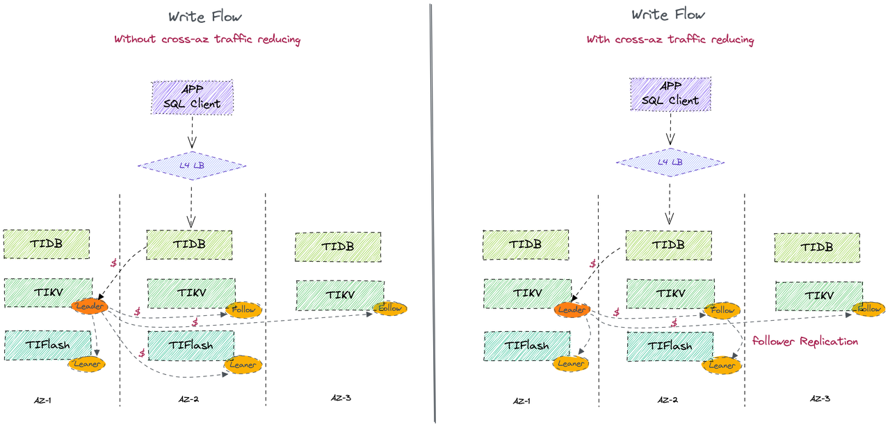
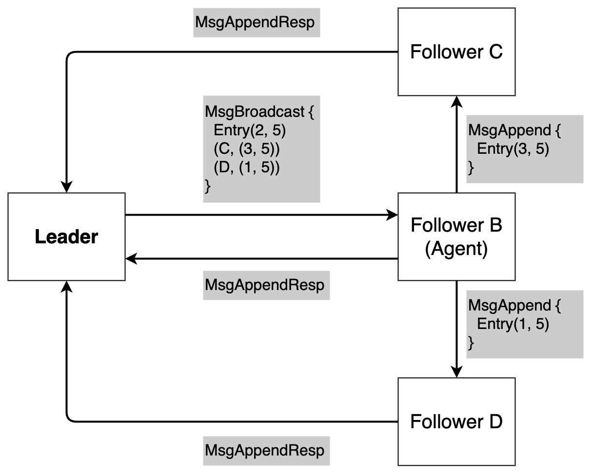

# Follower Replication for Write-Flow

<!-- - RFC PR: https://github.com/tikv/rfcs/pull/0000
- Tracking Issue: https://github.com/tikv/repo/issues/0000 -->

## Summary

This RFC introduces a new mechanism in Raft algorithm which allows a follower to replicate log entries or snapshots to other followers and learners. This feature is mainly aimed to reduce cross-AZ (short for Availability Zones) traffic in data synchronization between TiKV instances and TiFlash instances via Raft consensus algorithm.

## Motivation

TiDB is usually deployed across 3 AZs for fault tolerance and high availability. At least 1 instance of PD, TiDB and TiKV will be deployed in each of the 3 AZs. Besides, TiFlash instances will be deployed in different AZs as needed.
However, the cost of cross-AZ data transfer is expensive in AWS and so on. The cost of TiDB cloud deployment will decrease if we can reduce the cross-AZ traffic.

In the classical Raft protocol, a follower or learner can only receive new raft log entries and snapshots from the leader. It inevitably leads to a large amount of cross-AZ traffic, because the leader has to replicate data to every follower and learner even in different AZ.
With follower replication, the leader only needs to replicate data one follwer in each AZ, and this follower will replicate data to other followers and learners in the same AZ, which avoids a lot of corss-AZ traffic.

Follower replication can reduce the cross-AZ traffic mainly in scenarios:

- The leader of TiKV instances do not need to replicate data to the TiFlash instances in different AZ. The leader only replicates data to followers, and for each AZ one certain follwer will replicate new log entries or snapshots to learners. In particular, TiFlash instances have less the requirement of real-time than TiKV instances.
- When adding a learner, we can generate snapshot from the follower in the same AZ and send it to the learner.

## Detailed design

According to the property of Raft, we know that a write is committed when the leader has replicated log entries over a quorum of servers. Since there exists several followers which have the up-to-date log entries, learners do not have to obtain data from the leader. The learners can obtain data from a certain follower which has up-to-date log entries in the same AZ. This follower acts as the agent of the leader, and helps the leader replicate data to other followers and learners in its AZ.

We should follow a principle when we revise Raft algorithm. Only the leader knows the latest and global information of the whole cluster and the progress of data replication, so we need minimize the interaction between the certain follower (agent) and learners. In other words, the agent only acts as a provider of log entries or snapshot, and a proxy between leader and other followers and learners. The progress of data replication should only be maintained by leader.

### Group broadcast schema

We design a group broadcast schema which is proposed by this [rfc](https://github.com/tikv/rfcs/blob/362865abe36b5771d525310b449c07a57da7ef85/text/2019-11-13-follower-replication.md).

The main idea is that the leader only sends `MsgBroadcast` to the agent of a certain AZ. `MsgBroadcast` contains log entries that the leader replicates to the agent, and several ranges of log that the leader replicates to other followers and learners. 
Once the agent receives `MsgBroadcast`, it appends log entries in the message and assembles `MsgAppend` according to the ranges in `MsgBroadcast` with its own log. Then the agent sends `MsgAppend` to other followers/learners in the same AZ. Thus, the leader can avoid sending `MsgAppend` across AZs. 

## Drawbacks

Why should we not do this?

## Alternatives

- Why is this design the best in the space of possible designs?
- What other designs have been considered and what is the rationale for not
  choosing them?
- What is the impact of not doing this?

## Unresolved questions

What parts of the design are still to be determined?
