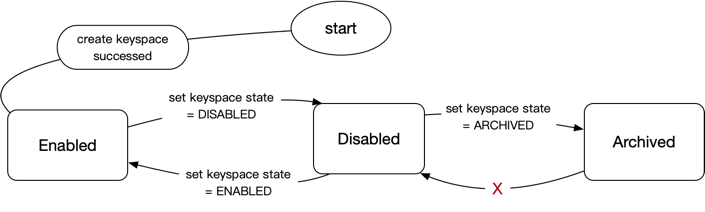

# Title

Keyspace encode and metadata management

## Summary

We hope to store data of multiple applications in a TiKV cluster. 
A common solution is to add a prefix in front of the key to distinguish the data of multiple applications. 
So we introduce a new concept 'Keyspace' to describe the logical of the isolation with different business scenarios in a TiKV cluster.

## Motivation

We need support multiple applications store data in a TiKV cluster to cut the cost. Keyspace is what must be done to realize logical isolation.

## Detailed design

### Key Encode

#### Key mode
If ```Keyspace``` is enabled, the key will be starting with `keymode`, it stored in the first byte of the key:
1. `m` or `t`: It's represent TiDB key.
2. `x`: It represent TxnKV key.
3. `r`: It represent RawKV key.

#### Keyspace ID
After first byte, it take 3 bytes to store `keyspaceID`, the default keyspaceID is `[0, 0, 0]`.
The max keyspace id is 16777216;

#### Client view

To enhance readability, client is initialized with a keyspace name instead of `keyspaceID`. 
When it first connects to the TiKV system, it will set keyspace id in connection or get keyspaceID by keyspace name from PD. 
PD need check for the existence of the keyspace name and either return keyspaceID to client or return `keyspace not found` error if it does not exist.
The client connection can only operate on one key spaces, but normally one application will have one key space.

### Metadata design

#### Metadata store
Keyspace metadata need store in etcd of PD.
Specific metadata information is as follows:

```protobuf
message KeyspaceMeta {
    uint32 id = 1;
    string name = 2;
    KeyspaceState state = 3;
    int64 created_at = 4;
    int64 state_changed_at = 5;
    map<string, string> config = 7;
}

enum KeyspaceState {
    ENABLED = 0;
    DISABLED = 1;
    ARCHIVED = 2;
}
```

keysapce state machine: 




There is few etcd path to store keyspace metadata:
```shell
// Store KeyspaceMeta protobuf in etcd
/keyspaces/meta/{keyspace_id}

// Store the mapping from name to id in etcd
/keyspaces/id/{keyspace_name}

// Store keyspace alloc_id info in etcd 
/keyspaces/alloc_id

```

#### Metadata managment
Add keyspace managment capability in PD. It contains several basic capabilities:
1. Allocate keyspace id by keyspace name;
2. Create a new keyspace by keyspace meta;
3. Update keyspace meta and configuration;
4. Manage keyspace state machine;
5. Get keyspace metadata from PD;

#### More resource divided by keyspace

1. The gc safepoint,service safepoint,txn safepoint store in etcd of PD, it's need to divide into different etcd path by keyspace.
2. Add a GC worker processor to update safepoint by keyspace


