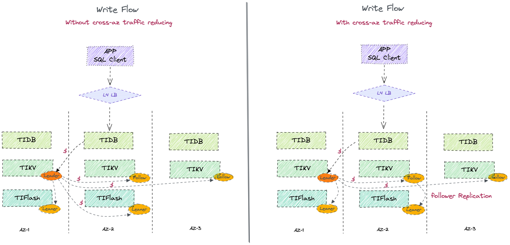
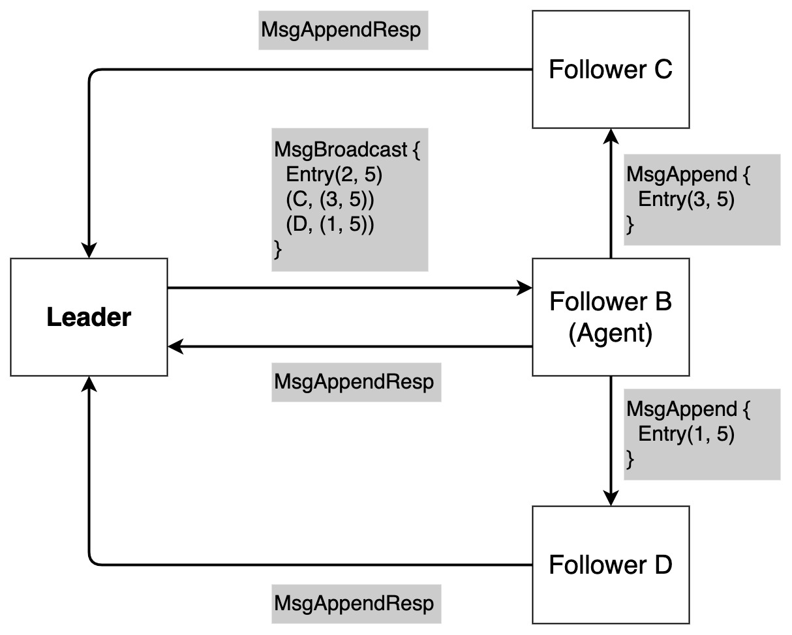

# Follower Replication for Write-Flow

<!-- - RFC PR: https://github.com/tikv/rfcs/pull/0000
- Tracking Issue: https://github.com/tikv/repo/issues/0000 -->

## Summary

This RFC introduces a new mechanism in Raft algorithm which allows a follower to replicate log entries or snapshots to other followers and learners. This feature is mainly aimed to reduce cross-AZ (short for Availability Zones) traffic in data synchronization between TiKV instances and TiFlash instances via Raft consensus algorithm.

## Motivation

TiDB is usually deployed across 3 AZs for fault tolerance and high availability. At least 1 instance of PD, TiDB and TiKV will be deployed in each of the 3 AZs. Besides, TiFlash instances will be deployed in different AZs as needed.
However, the cost of cross-AZ data transfer is expensive in AWS and so on. The cost of TiDB cloud deployment will decrease if we can reduce the cross-AZ traffic.

In the classical Raft protocol, a follower or learner can only receive new raft log entries and snapshots from the leader. It inevitably leads to a large amount of cross-AZ traffic, because the leader has to replicate data to every follower and learner even in different AZ.
With follower replication, the leader only needs to replicate data one follwer in each AZ, and this follower will replicate data to other followers and learners in the same AZ, which avoids a lot of corss-AZ traffic.



Follower replication can reduce the cross-AZ traffic mainly in scenarios:

- The leader of TiKV instances do not need to replicate data to the TiFlash instances in different AZ. The leader only replicates data to followers, and for each AZ one certain follwer will replicate new log entries or snapshots to learners. In particular, TiFlash instances have less the requirement of real-time than TiKV instances.
- When adding a learner, we can generate snapshot from the follower in the same AZ and send it to the learner.

## Detailed design

According to the property of Raft, we know that a write is committed when the leader has replicated log entries over a quorum of servers. Since there exists several followers which have the up-to-date log entries, learners do not have to obtain data from the leader. The learners can obtain data from a certain follower which has up-to-date log entries in the same AZ. This follower acts as the agent of the leader, and helps the leader replicate data to other followers and learners in its AZ.

We should follow a principle when we revise Raft algorithm. Only the leader knows the latest and global information of the whole cluster and the progress of data replication, so we need minimize the interaction between the certain follower (agent) and learners. In other words, the agent only acts as a provider of log entries or snapshot, and a proxy between leader and other followers and learners. The progress of data replication should only be maintained by leader.

### Main idea

We design a group broadcast schema which is proposed by this [rfc](https://github.com/tikv/rfcs/blob/362865abe36b5771d525310b449c07a57da7ef85/text/2019-11-13-follower-replication.md).

The main idea is that the leader only sends `MsgBroadcast` to the agent of a certain AZ. `MsgBroadcast` contains log entries that the leader replicates to the agent, and several ranges of log that the leader replicates to other followers and learners.
Once the agent receives `MsgBroadcast`, it appends log entries in the message and assembles `MsgAppend` according to the ranges in `MsgBroadcast` with its own log. Then the agent sends `MsgAppend` to other followers/learners in the same AZ. Thus, the leader can avoid sending `MsgAppend` across AZs.



### Preparation

Every peer must have a field indicating which AZ it belongs to. This field does not have to be persistent. As mentioned in the comment, TiKV has the knowledge which AZ the store locates. We need to design the interface so that `RawNode` in raft-rs can get the AZ information in TiKV. Maybe we can initialize Peer with AZ information, and then Peer initializes the `RawNode`.

The leader collects the AZ information of peers via `MsgHeartbeat`. Peers reply heartbeat with their label of AZ. So the leader can have a global information of peers' AZ. This solution needs to add an extra field in Message. Another solution is that PD collects AZ information of peers, and use `RaftCommand` to tell the leader. Because AZ information is nearly unchanged, the leader do not need to collect AZ information in each `MsgHeartbeat`.

If the leader does not know the current AZ of each peer, follower replication will be downgraded to leader replication.

### Raft Replication Process


Step 1:

When `bcast_append` is called by the leader , the leader starts to prepare group broadcast instead of calling `send_append` for each peer in normal mode.  Peers are grouped by their AZ labels, and the leader will assemble `MsgBroadcast` for each group.

We add forwards field in `struct Message`. This field tells the agent those peers it should broadcast in `MsgBroadcast`, and the range of log entries it should send to each peer. We can see `MsgBroadcast` as a combination of several `MsgAppend`. We reuse the most fields of `MsgAppend` e.g. from, term, commit, commit_term. And `Forward` records fields that cannot be reused i.e. the range of entries and to.

```"Rust"
pub struct Message {
    // message fields
    pub msg_type: MessageType,
    pub to: u64,
    pub from: u64,
    pub term: u64,
    pub log_term: u64,
    pub index: u64,
    pub entries: ::protobuf::RepeatedField<Entry>,
    pub commit: u64,
    pub commit_term: u64,
    // newly added field
    pub forwards: ::protobuf::RepeatedField<Forward>,
    ...
}

pub struct Forward {
    // message fields
    pub to: u64,
    pub low u64,
    pub high u64,
}
```

The leader fills the fields of `Message` as `MsgAppend` for the agent. The `low` in `Forward` is the `next_idx` of Peer's `Progress`, and the `high` is the last_index of leader's log.

The leader should guarantee that the range of [low, high] exists in the agent's log after new entries are appended successfully.
If append of new entries fails, broadcasts to learners will be aborted. Because the agent cannot ensure that its log is consistent with leader's now.

---

Step 2-a:

The agent handles the fields of `MsgBroadcast` except field forwards. It is just like what a follower does when it handles `MsgAppend`.

- Check term. Check whether log_term and index match with local raft log. If the check fails, the agent replies reject to leader, and stops broadcasting.
- Append new entries and update the state.
- Reply append success to leader.

---

Step 2-b:

Since the agent has appended log entries from the leader successfully, the agent ought to have the up-to-date log. For each Forward, the agent assembles a new `MsgAppend` and sends it to the peer.

- The agent reuses term, from, and commit, commit_term field in the `MsgBroadcast`.
- The field entries in MsgAppend is a slice of [low, high] of the agent's local log. The range of entries is extracted from Forward.
- Finally, the agent sets log_term and index according to the entry at low - 1.
  
Note that, step 2-b begins after the agent append new entries to its log in `MsgBroadcast` successfully. Because the log entry range in Forward may cover the log entries in `MsgBroadcast`. The agent needs to confirm that it has a same view of raft log with the leader. The leader sets the range of Forward with the assumption that entries in `MsgBroadcast` can be appended successfully. But we do not need to persist these log entries, putting them in Unstable is enough.

However, step 2-b does not need to start after step 2-a is done. The agent can send `MsgAppend` to peers and reply `MsgAppendResp` to the leader concurrently.
The agent is not fixed. A follower becomes agent when it receives a `MsgBroadcast` from the leader, and the follower will not be an agent any more when it has finished broadcasting messages to learners. It is legal that there exists more than one agent in an AZ.

---

Step 3:

When the peer receives `MsgAppend` from the agent, it simply handles as if the message was sent by leader. We continue to use `fn step_follower`.

Note that the agent is not fixed. A follower becomes the agent when it receives a `MsgBroadcast` from the leader, and the follower will not be an agent any more when it has finished broadcasting messages to learners. It is legal that there exists more than one agent in an AZ.

---

Example:


- **Event e1**: The leader sends `MsgBroadcast` to the agent.

  ```"Json"
  Message: {
      msg_type: MsgBroadcast,
      to: B,
      from: A,
      term: 3,
      log_term: 3,
      index: 5,
      entries: [y <- 7, x <- 5, x <- 4],
      commit: 6,
      commit_term:3,
      forwards: [
          {
              to: C,
              low: 7,
              high: 8,
          },
          {
              to: D,
              low: 8,
              high: 8,
          },
      ],
  }
  ```

- **Event e2**: The agent handles the append part of `MsgBroadcast`. Update its state and responds to leader.
- **Event e3**: The agent assembles two `MsgAppend` and sends them to corresponding learners.

  ```"Json"
  Message: { //send to learner1
      msg_type: MsgAppend,
      to: C,
      from: A,
      term: 3,
      log_term: 3,
      index: 6,
      entries: [x <- 5, x <- 4],
      commit: 6,
      commit_term:3,
  }
  Message: { //send to learner2
      msg_type: MsgAppend,
      to: D,
      from: A,
      term: 3,
      log_term: 3,
      index: 7,
      entries: [x <- 4],
      commit: 6,
      commit_term:3,
  }
  ```

- **Event e4/e5**: Learners handles `MsgAppend` sent by the agent and responds.

  

### Agent selection

How does the leader select the agent? I think the leader should follow these rules:

- The agent is an active follower. It means that the follower responds messages from the leader recently.
- The agent has as up-to-date log entries as possible. Thus the leader can ensure that the ranges of log entries in MsgBroadcast exist on the agent.

### Failure cases

#### 1. Agent is crashed or partitioned

If the agent does not reply to the heartbeat and `MsgBroadcast` from the leader for a period of time, there are 3 situations.

- The agent is down before receiving `MsgBroadcast`.
- The agent is down after receiving `MsgBroadcast` and before broadcasting to peers.
- The agent is down after broadcasting to peers.

The leader will trigger a timeout if it does not receive `MsgAppendResp` from the agent. Then the leader starts to select another follower as the agent in the AZ. Though it may lead to sending duplicated `MsgAppend` to peers, it does not affect the correctness.

Only the leader knows which peer is the agent but the peer does not have an agent field in its state. So we do not need to consider the recovery mechanism of agent.

---

#### 2. Leader is partitioned

If network is partitioned, the stale leader may still try to replicate log entries. However, those entries cannot be committed, and they will be overwritten when the partition recovers.

Moreover, the stale leader will becomes a follower if a peer in the group sends `MsgAppendResp` with higher term.

## Drawbacks

- The agent may have a "single point of failure" problem. If the agent is crashed, the leader cannot replicate data to other peers successfully, even those peers are active.
- The latency of follower replication is larger than leader replication. Because the agent sends `MsgAppend` to peers only after it has appended entries in `MsgBroadcast` successfully.

## Alternatives

### Forward schema


The leader does not need to attach log entries to `MsgAppend` if these entries have been replicated to some followers in the target AZ. The leader only sends a message without log entries but the range of log entries to a follower who has enough latest data. This follower fills the message with its own log entries and forwards it to the target peer in the same AZ.

We can see this schema as a special group broadcast. `MsgBroadcast` has an empty entries and only one `Forward`. When `send_append` is called to replicate data to a single peer, we can use "forward schema".

This schema is less efficient than group broadcast. It is suitable for replicating data to a single peer.

### Pull schema


The leader sends a message that does not contain log entries but only contains the information where the peer can obtain these log entries. After the peer receives the message, it will fetch log entries from a follower in its AZ via RPC and append to its raft log.

Pull mode decouples interaction between leader and agent. There are only RPCs between leader and peers, and between peers and agent. The update of replication progress and fetching of log entries is decoupled, so it is easy to implement.

The drawback is that pull mode needs an extra RPC to obtain log entries from the follower which causes more latency.

## Unresolved questions

- Snapshot also can be sent by follower replication. This is more suitable with the forward mode. The leader asks the agent to generate snapshot and then send to a lagging follower/learner.
- Follower replication in region split/merge and conf change scenario is not defined. In these situation, it would better to disable follower replication and go back to leader replication.