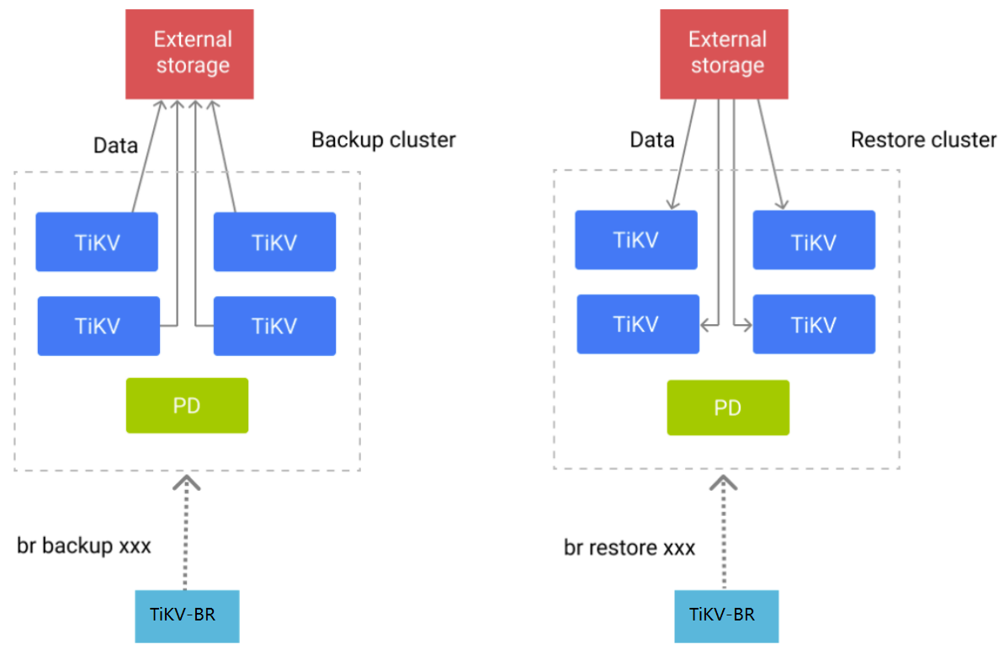

# RawKV Backup & Restore

- RFC PR: https://github.com/tikv/rfcs/pull/0000
- Tracking Issue: https://github.com/tikv/tikv/issues/11965

## Summary

This proposal introduces the technical design of **RawKV Backup & Restore** (abbr. **RawKV BR**).

## Motivation

Customers are deploying TiKV clusters as non-transactional key-value (**RawKV**) storage for application router or other scenarios. With **RawKV** being more and more widely adopted, [Backup & Restore] becomes a necessary feature to let users backup/restore all raw key-value entries from/to TiKV cluster.

In this proposal we introduce **TiKV-BR**, a new component for **RawKV BR**, which backup raw key-value entries from one TiKV cluster, and restore the backup files to another TiKV cluster.

## Detailed design

### Backup

The main process of the backup is as following:  
1. TiKV-BR client launches the backup process with user's command with given range and storage.
2. TiKV-BR client gets all stored from pd and send [`BackupRequest`] to every TiKV store.
3. TiKV nodes receive the `BackupRequest` and scan all regions whose range has intersection with the backup range and whose leader is the current store.
4. TiKV nodes write the scanned raw key-value entries to storage in RocksDB SST format.
5. TiKV nodes send [`BackupResponse`] to TiKV-BR client.
5. TiKV-BR client writes [`BackupMeta`] to storage.

From above process, we can see that the backup process is distributed and paralleled. This can speedup the backup with increment of TiKV nodes and regions. In a large scale TiKV cluster, the backup bottleneck usually be the network bandwidth or the storage iops. However, backup scan consumes much CPU, which may affect the performance of the frontend. User can specify the `ratelimit` to limit the backup speed to decrease the performance impact on the frontend.  

RawKV Backup supports [`api-version`] conversion from V1 to V2 with config `--dst-api-version=V2`. Then restore the backup files to API V2 `TiKV` cluster. This is mainly used to upgrade from API V1 cluster to API V2 cluster. In this scenario, TiKV nodes do the conversion during scan and there's no need to do rewrite during restoration.  

RawKV backup returns the `backup-ts` in [API V2] cluster, which can be used as `start-ts` of `TiKV-CDC` when creating replication tasks.  

### Restoration

The main process of Restoration is as following:  
1. TiKV-BR client launched the restoration process with user's command with given range and storage.
2. TiKV-BR client requests TiKV cluster switch to `Import` mode.
3. TiKV-BR client reads the [`BackupMeta`] from storage and get the SST files whose range has intersection with the backup range.
4. TiKV-BR client sends [SplitRangeRequest] to TiKV store to pre-split regions with the SST files's range.
5. TiKV-BR client sends [DownloadRequest] to the TiKV stores which the SST file's range belongs to. TiKV nodes download SST files from storage.
6. TiKV-BR client sends [IngestRequest] to every affected region's leader node to ingest SST files to RocksDB with raft procedure.

In `Import` mode, following changes will occur:
- Let `PD` reduces region schedule frequency to speedup restoration.
- TiKV stores change `RocksDB`'s configuration, for example, increase the `level0_stop_writes_trigger` and `level0_slowdown_writes_trigger`, decrease background compaction tasks, which can speedup ingest process.

With the `SplitRegion` step, we can balance the data between TiKV stores.  

The main bottleneck of restoration is the `Download` step, usually caused by network bandwidth or the storage iops in large scale TiKV cluster. Besides, `Download` may consume disk IOPS and has significant impact on frontend performance if disk IOPS is limited. User can specify the `ratelimit` to limit the download speed to decrease the performance impact on frontend.  

``

### External Storage

From the above description, we can see that the storage is important as all `TiKV` nodes and `TiKV-BR` both use the storage to do read and write. It's recommended to save the backup files to  Amazon S3 or other shared storage, for example mounting a NFS on all `TiKV-BR` and `TiKV` nodes.

### Data Verification

`TiKV-BR` checksum between `TiKV` cluster and backup files after backup or restoration finishes with the config `--checksum=true`. Checksum is using the [checksum] interface in TiKV [client-go], which sends checksum request to all TiKV regions to calculate the checksum of all **VALID** data. Then compare the checksum value of backup files which is calculated during the backup process.

Please note that if data is stored in TiKV with [TTL], and expiration happens during backup or restore, the persisted checksum in backup files must be different from the checksum of TiKV cluster. So checksum should **NOT** be enabled in this scenario. To verify the correctness of backup and restoration in this scenario, you can perform a full comparison for all existing non-expired data between backup cluster and restore cluster by using [scan] interface.

## Drawbacks

1. Backup and restoration both have performance impact on frontend performance, `ratelimit` can be specified to reduce the performance impact. According to the benchmark, the performance impact can reach 20% at maximum.
2. If the user is writing or updating data or data's TTL is expired during backup/restoration, checksum may not work as expected.

## Alternatives

*TBD*.

## Unresolved questions

*TBD*.

[`BackupRequest`]: https://github.com/pingcap/kvproto/blob/3debb6820e46da7a8f310e3f081222183cdd8030/proto/brpb.proto#L170
[`BackupResponse`]: https://github.com/pingcap/kvproto/blob/3debb6820e46da7a8f310e3f081222183cdd8030/proto/brpb.proto#L349
[`BackupMeta`]: https://github.com/pingcap/kvproto/blob/3debb6820e46da7a8f310e3f081222183cdd8030/proto/brpb.proto#L19
[`api-version`]: https://docs.pingcap.com/tidb/dev/tikv-configuration-file#api-version-new-in-v610
[API V2]: https://docs.pingcap.com/tidb/dev/tikv-configuration-file#api-version-new-in-v610
[SplitRangeRequest]: https://github.com/pingcap/kvproto/blob/3debb6820e46da7a8f310e3f081222183cdd8030/proto/kvrpcpb.proto#L672
[DownloadRequest]: https://github.com/pingcap/kvproto/blob/3debb6820e46da7a8f310e3f081222183cdd8030/proto/import_sstpb.proto#L145
[IngestRequest]: https://github.com/pingcap/kvproto/blob/3debb6820e46da7a8f310e3f081222183cdd8030/proto/import_sstpb.proto#L120
[checksum]: https://github.com/tikv/client-go/blob/e72337b647afbd1212f99b298c39955949021fb0/rawkv/rawkv.go#L578
[client-go]: https://github.com/tikv/client-go
[TTL]: https://docs.pingcap.com/tidb/stable/tikv-configuration-file#enable-ttl
[scan]: https://github.com/tikv/client-go/blob/e72337b647afbd1212f99b298c39955949021fb0/rawkv/rawkv.go#L486
