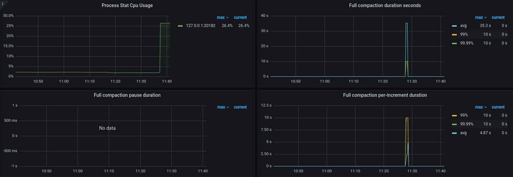

# Periodic Full Compaction

Author: [Alex Feinberg](https://github.com/afeinberg)

Reviewers: [Connor](https://github.com/Connor1996),
[Tony](https://github.com/tonyxuqqi), [Andy](https://github.com/v01dstar),
others

## Introduction

**Periodic full compaction** is a scheduled task that starts at specified times
of the day on each TiKV node and compacts the column families of all regions *at
all levels including the bottommost (L6)*. In order to reduce to impact running
such a heavy-weight task would have on the cluster's ability to serve traffic,
full compaction is incremental: before the next range (presently a region) is
compacted, we check if the load is below a certain threshold; if the threshold
is exceeded, we pause the task until the load is again below a certain
threshold.

## Motivation

Presently, we have no way to periodically execute a RocksDB compaction across
all levels. This has a number of implications: compaction filters (used to
remove tombstones) only run when the bottom-most (L6) compaction is executed; a
system with a high number of deletes that experiences a heavy read-only (but
little or no writes) might thus have accumulated tombstones markers that are not
deleted.

Using `tikv-ctl compact-cluster` is not suitable for this goal: while it executes
a full compaction, it may impact online user traffic which makes it non-viable
for production usage without downtime. Periodic full compaction provides a way to
achieve the same goal in a more controllable way.

## Detailed design

### Periodic scheduling

#### Configuration

To enable periodic full compaction, specify the hours during which we wish to
schedule full compaction to run in tikv's configuration and a maximum CPU
utilization threshold. CPU utilization is calculated by using process stats in
`/proc` over a 10-minute window. (See *Conditions for full compaction to run*
below.)

>
> `tikv.toml` setting to run compaction at 03:00 and 23:00
> (3am and 11pm respectively) in the tikv nodes' local timezone if CPU
> usage is below 90%:
>
> ```toml
>[raftstore]
>periodic-full-compact-start-max-cpu = 0.9
>periodic-full-compact-start-times = ["03:00", "23:00"]
>```

### Executing a `PeriodicFullCompact` task

>`compact.rs`:
>
>```rust
>pub enum Task {
>   PeriodicFullCompact {
>       ranges: Vec<(Key, Key)>,
>       compact_load_controller: FullCompactController,
>   },
>```

#### Choosing ranges

We use ranges defined by the start and end keys of all of the store's regions as
increments:

> See `StoreFsmDelegate::regions_for_full_compact` in `store.rs`:
>
>```rust
> /// Use ranges assigned to each region as increments for full compaction.
> fn ranges_for_full_compact(&self) -> Vec<(Vec<u8>, Vec<u8>)> {
>```

#### Controlling full compaction

>`compact.rs`:
>
>```rust
>pub struct FullCompactController {
>    /// Initial delay between retries for ``FullCompactController::pause``.
>    pub initial_pause_duration_secs: u64,
>    /// Max delay between retries.
>    pub max_pause_duration_secs: u64,
>    /// Predicate function to evaluate that indicates if we can proceed with
>    /// full compaction.
>    pub incremental_compaction_pred: CompactPredicateFn,
>}
>```

##### Conditions for full compaction to run

###### Compact predicate function (`CompactPredicateFn`)

>
> `CompactPredicateFn` is defined in `compact.rs` as an `Fn()` that returns true
> if it is safe to start compaction or compact the next range in `ranges.`
>
>```rust
>type CompactPredicateFn = Box<dyn Fn() -> bool + Send + Sync>;
>```
>

###### Using `CompactPredicateFn`

We evaluate the compaction predicate function in the following cases:

1. Before starting a full compaction task.

   See `StoreFsmDelegate::on_full_compact_tick` in `store.rs`, where we return
   early if the predicate returns false.

   ```rust
   // Do not start if the load is high.
   if !compact_predicate_fn() {
       return;
   }
   ```

2. After finishing an incremental full compaction for a range, if more ranges remain.

   See `CompactRunner::full_compact` in `compact.rs`, where we pause (see
   *Pausing* below) if the predicate returns false:

   ```rust
   if let Some(next_range) = ranges.front() {
        if !(compact_controller.incremental_compaction_pred)() {
            // ...
            compact_controller.pause().await?;
   ```

###### Load-based `CompactPredicateFn` implementation

> This is returned by ```StoreFsmDelegate::is_low_load_for_full_compact``` in
> `store.rs` which checks that the raftstore is > busy and checks if the CPU
> usage within over the last 10 minute window is within the threshold specified
> by `periodic-full-compact-start-max-cpu`.
>
> ```rust
> fn is_low_load_for_full_compact(&self) -> impl Fn() -> bool {
>```

##### Pausing

Full compaction tasks are intended to be long-running and may spend up to 15
minutes at a time waiting for `CompactPredicateFn` to evaluate to true. As in
other places in tikv when we need pause or sleep, we call
```GLOBAL_TIMER_HANDLE.delay``` in an async context.

> `compact.rs`
>
>```rust
>impl FullCompactController {
>     pub async fn pause(&self) -> Result<(), Error> {
>        let mut duration_secs = self.initial_pause_duration_secs;
>        loop {
>            box_try!(
>                GLOBAL_TIMER_HANDLE
>                    .delay(std::time::Instant::now() + Duration::from_secs(duration_secs))
>                    .compat()
>                    .await
>            );
>            if (self.incremental_compaction_pred)() {
>                break;
>            };
>           duration_secs = self
>                        .max_pause_duration_secs
>                        .max(duration_secs * 2);
>       }
>       Ok(())
>   }
>```

##### Using background worker to execute compaction

Since `FullCompactController::pause` is asynchronous (see *Pausing* above),
`PeriodicFullCompact` tasks are scheduled using the background worker pool. This
means that other cleanup and compaction tasks can while full compaction is
paused.

> `store.rs`
>
>```rust
>impl RaftBatchSystem {
>    pub fn spawn(
>        &mut self,
>        // ...
>        background_worker: Worker,
>        // ...
>    ) -> Result<()> {
>        // ...
>        let bg_remote = background_worker.remote();
>        // ...
>        let compact_runner = CompactRunner::new(engines.kv.clone(), bg_remote);
>        // ...
>```
>
> Using `Remote::spawn` to asynchronously execute full compaction in
> `yatp_pool::FuturePool`.
>
>```rust
>impl Runnable for CompactRunner {
>    fn run(&mut self, task: Task) {
>          match task {
>            Task::PeriodicFullCompact {
>                ranges,
>                compact_load_controller,
>            } => {
>        // ...
>                let engine = self.engine.clone();
>                self.remote.spawn(async move { // NOTE the use of `self.remote`
>                    if let Err(e) = Self::full_compact(engine, ranges, compact_load_controller).await {
>       // ...
>```

Note that `CompactRunner::full_compact` is an `async fn`, yet it invokes
RocksDB's manual compaction API which blocks the current thread: this is
supported by `FuturePool` and happens in other places in our code.

### Full compaction of a range

We use `CompactExt::compact_range` to perform the compaction of each region,
which calls `compact_range_cf` on all the column families. Note that
`exclusive_manual` is `false` and `subcompactions` is `1` - meaning all
sub-compactions are executed on one RocksDb thread - to limit resource usage.

> From `full_compact` in `compact.rs`:
>
>```rust
>    box_try!(engine.compact_range(
>                range.0, range.1,
>                false,   // non-exclusive
>                1,       // number of threads threads
>            ));
>```
>
> From `CompactExt` in `components/engine_traits/src/compact.rs`:
>
>```rust
> fn compact_range(
>    &self,
>    start_key: Option<&[u8]>,
>    end_key: Option<&[u8]>,
>    exclusive_manual: bool,
>    max_subcompactions: u32, // Controls the number of engine worker threads.
>   ) -> Result<()> {
>   for cf in self.cf_names() {
>       self.compact_range_cf(cf, start_key, end_key, exclusive_manual, max_subcompactions)?;
>   }
>```
>
> The `RocksEngine` implementation of `compact_range_cf`. See [Manual
> Compaction](https://github.com/facebook/rocksdb/wiki/Manual-Compaction) in
> RocksDb documentation for more info.
>
> ```rust
> let mut compact_opts = CompactOptions::new();
> compact_opts.set_exclusive_manual_compaction(exclusive_manual);
> compact_opts.set_max_subcompactions(max_subcompactions as i32);
> db.compact_range_cf_opt(handle, &compact_opts, start_key, end_key);
>```

### Implementation

 | Sub-task | Status |
 | - | - |
 | Periodic schedule full compaction |**Merged** [tikv/tikv#12729](https://github.com/tikv/tikv/pull/15853)|
 | Incrementalism, pausing full | **Merged**  [tikv/tikv#15995](https://github.com/tikv/tikv/pull/15995)|

#### Alternatives considered

##### Compacting by file or level instead of a range

*Not applicable*: doing so would not guarantee that the compaction filters are able to run.

###### Using a rate limiter to control load during full compaction

*Not applicable*: compaction happens in increments of regions (`512MB` at a
time), which would not work with the current token-bucket-based rate limiter
APIs.

##### Using metrics other than CPU load

*Future work*. This is feasible but would need additional implementation and
tuning load. See `io_load.rs`

### Metrics

| Metric | Description |
|--------|-------------|
| `tikv_storage_full_compact_duration_seconds` | Bucketed histogram of periodic full compaction run duration |
| `tikv_storage_full_compact_increment_duration_seconds` | Bucketed histogram of full compaction *increments* |
| `tikv_storage_full_compact_pause_duration_seconds` | Bucketed histogram of full compaction pauses |
| `tikv_storage_process_stat_cpu_usage` | CPU useage over a 10 minute window |

## Demonstration

### Setup

#### Configure periodic full compaction

```toml
[raftstore]
periodic-full-compact-start-max-cpu = 0.33
periodic-full-compact-start-times = ["11:00", "22:00", "23:00"]
```

> **Note:** set `periodic-full-compact-start-max-cpu` to observe pauses.

#### Test periodic full compaction

##### Populate a table

``` sql
create database compact_test;
-- Query OK, 0 rows affected (0.10 sec)=
use compact_test;
-- Database changed
create table t1(f1 integer primary key auto_increment, f2 integer);
-- Query OK, 0 rows affected (0.09 sec)
insert into t1(f2) values(1),(2),(3);
-- Query OK, 3 rows affected (0.01 sec)
-- 3  Duplicates: 0  Warnings: 0

-- repeat below command N times
insert into t1(f2) select f1+f2 from t1;
-- Query OK, 3 rows affected (0.00 sec)
-- Records: 3  Duplicates: 0  Warnings: 0
-- ...
--
-- Query OK, 6291456 rows affected (36.25 sec)
-- Records: 6291456  Duplicates: 0  Warnings: 0
```

##### Generate deletes

```sql
delete from t1 where f1 in (select f1 from t1 where mod(f2,3) = 0);
--- Query OK, 6428311 rows affected (32.15 sec)
```

##### Observe metrics and logs

```log
[2024/01/10 11:27:07.280 -08:00] [INFO] [compact.rs:236] ["full compaction started"] [thread_id=0x5]
[2024/01/10 11:27:45.910 -08:00] [INFO] [compact.rs:291] ["full compaction finished"] [time_takes=38.630410698s] [thread_id=0x5]
```


> **Note that** in the screenshot above, CPU usage is below 33% so that full
> compaction ran without a pause.

## Future work

### Smarter load criteria

* Incorporate other load statistics besides the CPU such as disk or network I/O.

### Smarter range selection

Possibly options:

* Do not compact an entire region at all once
* Compact the ranges with most versions first

### Stopping compaction

* Add a mechanism to monitor which full compactions are in progress.
* Manually pausing: allow all or some manual compaction tasks to be paused for a
  specified amount of time.
* Manually stopping: allow setting a flag for an individual full compaction task
  that would terminate the task as soon as possible instead of starting the next
  increment.

### Manual invocation

* Support manually starting a full compaction for the entire store. Can be done
  via the CLI.
* Support manually compacting all or some regions of a given table. Would need
  to be integrated into TiDB syntax.
