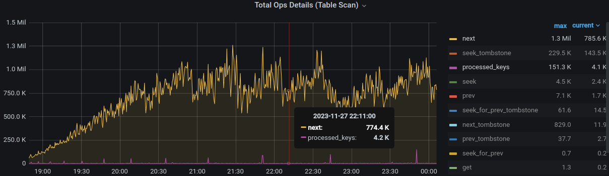
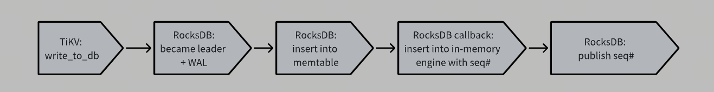

# RFC: In-memory Engine

- RFC PR: https://github.com/tikv/rfcs/pull/111
- Tracking Issue: https://github.com/tikv/tikv/issues/16141

## Motivation

When dealing with a large volume of update SQLs and coprocessor requests that read this frequently updated data, read performance tends to degrade over time. This is primarily due to the accumulation of duplicate MVCC versions and deleted user keys that need to be bypassed, resulting in an increasing amount of unproductive work to read a valid key. 

The current GC mechanism can mitigate this issue, but it's not instant.

Figure 1 shows one of the metrics of this type of workload. Read amplification increases as time passed and eventually converged due to GC.


*Figure 1: the multiplier between next and processed_keys reflects how many next will be called to read a valid key.*

To optimize/enhance this type of workload, we propose an in-memory engine, which offers several benefits:
- Reduction in iteration overhead:
  - The process of iterating through RocksDB SST involves a significant amount of overhead. For instance, seek involves finding an index block from the meta block, searching for a specific data block from the index block, locating an appropriate restart point from the data block, and finally performing a linear scan from the restart point.
  - Utilizing a skiplist or a similar data structure as the underlying storage engine can achieve a log(n) read performance expectation, thereby reducing both latency and read pool CPU usage.
- Decrease in MVCC versions:
  - We can agressively reduce the GC duration in the in-memory engine so that we can quickly clean up the duplicated MVCC versions and MVCC delete user keys to reduce read amplification. If the data we want is GCed in the engine, we can go through the rocksdb engine.
- Reduction in IO:
  - No IO is needed for regions cached in memory

## Overview of in-memory engine

The in-memory engine serves as a `range cache`, storing the range of hot regions in the leaders' store. If cached, incoming writes that are written to RocksDB are also written to the in-memory engine, leading to a mirrored data set in the cached regions with RocksDB. 

Here, we use `range` rather than `region`, because we want to minimize the direct modifications on raftstore. Using range can decouple the in-memory engine with split/merge, and we only need to check if the range of the region in the request is **contained by a cached range** in the in-memory engine.

A load/evict unit manages the memory, deciding which ranges should be evicted when the memory used by the in-memory engine reaches a certain limit, and determining which ranges should be loaded when there is spare memory capacity.

The range in a load task is from region, and sometime later, the region may be split. So we may evict a range that is **proper subset** of one range in the in-memory engine. That's fine, we just split the range. 

For example, the range [k1, k10] is loaded. After some time, the region of the range is split into [k1, k3], [k3, k7], and [k7, k10], and we want to evict [k1, k3]. Then, in in-memory engine, we first split [k1, k10] to [k1, k3] and [k3, k10], then evict [k1, k3] where [k3, k10] is still providing service.

The **safe point lifetime** differs between the in-memory engine and RocksDB, **often being much shorter** in the in-memory engine. This means that the in-memory engine may filter out some keys that still exist in RocksDB, thereby improving read performance as **fewer duplicated keys** will be read. **If there's a need to read keys that may have been filtered by the in-memory engine (as indicated by read_ts and safe_point of the cached region), we resort to using a RocksDB snapshot instead.**

## Detailed design
To integrate it with TiKV, we propose a Hybrid Engine composing of disk engine (RocksDB) and in-memory engine:

```rust
pub struct HybridEngine<EK, EC>
where
    EK: KvEngine,
    EC: RangeCacheEngine,
{
    disk_engine: EK,
    range_cache_engine: EC,
}

// RangeCacheEngine needs to write data (impl WriteBatchExt) and scan data (snapshot and impl Iterable)
pub trait RangeCacheEngine:
    WriteBatchExt + Iterable + ...
{
    type Snapshot: Snapshot;
    
    fn snapshot(&self, region_id: u64, read_ts: u64, seq_num: u64) -> Self::Snapshot;
    ...
}

impl KvEngine for HybridEngine {
    ...
}

impl RangeCacheEngine for RangeCacheMemoryEngine {
    ...
}
```
*Here, we define `RangeCacheEngine` to be a trait where `RangeCacheMemoryEngine`(the in-memory engine) is just one implementation of it.*

`HybridEngine` implements `KvEngine`, so the majority of the works of this project is to implement relevant methods required by `KvEngine`.

It makes less direct modifications on `raftstore` as much as possible, as `HybridEngine` is just a specific genric type of `RaftKv` just like below:

```rust
pub struct RaftKv<E, S>
where
    E: KvEngine,
    S: RaftStoreRouter<E> + LocalReadRouter<E> + 'static,
{
    engine: E,
    ...
}


let raft_kv = RaftKv::<HybridEngine<RocksEngine, RegionCacheMemoryEngine>, _>::new(..)

```

## RegionCacheMemoryEngine
RegionCacheMemoryEngine (the in-memory engine) is a specific struct implementing RegionCacheEngine:

**Now, we denote RegionCacheMemoryEngine as the in-memory engine.**

```rust
// The code is a simplified version, not the eventual code.
pub struct RangeCacheMemoryEngine {
    core: Arc<Mutex<RangeCacheMemoryEngineCore>>,
}

pub struct RangeCacheMemoryEngineCore {
    engine: SkiplistEngine,
    range_manager: RangeManager,
}

pub struct SkiplistEngine {
    data: [Arc<Skiplist>; 3],
}
```

We use skiplist as the underlying storage engine and all ranges share the same skiplist for each column family. 

## Data format
To maintain the same behavior with rocksdb, we also append sequence number for keys written in `RegionCacheMemoryEngine`.

## Snapshot
**For in-memory engine snapshot:**  
To ensure data consistency, we have `RangeManager` which maintains a SnapshotList for each range. Snapshots should be requested with range and read_ts as parameters, allowing the `RangeManager` record and track. This prevents GC from filtering keys that are currently being read.

**For hybrid engine:**  
Both the snapshot of the in-memory engine and RocksDB should be acquired. The sequence number of the RocksDB snapshot is also used by in-memory engine which for **atomic write** which is in **Write flow** part.

## Write flow
The write flow is similar to the current write flow. `HybridEngine` and `RegionCacheMemoryEngine` implement `WriteBatchExt` so that `HybridEngine` combines the `WriteBatchExt` of `RegionCacheMemoryEngine` and `RocksDB` to provide a method for batching data that will be consumed by both of them.

The response of the write request will only be sent back to the client once the data has been written into both the disk engine and the memory engine.

### Mechanism to guarantee write atomicity:
We must ensure the write of `RocksDB` and `RegionCacheMemoryEngine` is atomic otherwise there could be a gap where they have different view of data.

RocksDB offers a callback mechanism after the write batch has been inserted into the memtable but before the sequence number is published.

In this callback, we can insert the data of the batch into `SkiplistEngine` using the sequence number given back by the callback. However, although the insert of the `SkiplistEngine` has been finished, we cannot read these data until the **sequence number has been published by the RocksDB**. This is guaranteed by that we always acquire a RocksDB snapshot regardless of which snapshots (`RegionCacheMemoryEngine` or `RocksDB`) we may use, and the sequence number in the RocksDB snapshot is used to exclude data that is not visible in the `RegionCacheMemoryEngine`.




## Read flow
```
pub struct HybridEngineSnapshot<EK, EC>
where
    EK: KvEngine,
    EC: RangeCacheEngine,
{
    disk_snap: EK::Snapshot,
    range_cache_snap: Option<EC::Snapshot>,
}
```

For a coprocessor request, the general process is that the snapshot is created first, then an iterator is created by the snapshot which is used to read data.

HybridEngineSnapshot includes both disk engine snapshot and range cache engine snapshot. It creates iterator from range_cache_snap if nont None.

Reasons that memory_snap is None:  
1. the range is not cached
2. read_ts is less than the safe_point of the relevant range

## Garbage collection

The in-memory engine allows for more aggressive advancement of the GC safe point. If data is filtered by GC, it can be read through the disk engine.

We register a tick, periodically generating a new safe point based on the in-memory engine safe point life time (we can config it), and send the safe point to an exclusive gc worker. The worker uses the safe point to perform GC work for each cached range. For a given range, the safe point will be used to do min with the minimum snapshot_ts, and use the result ts to do the actual GC works if it is larger than the safe point updated last time.

The gc logic is roughly the same with raftstore except for handling MVCC delete. Let's first introduce the gc logic in raftstore:

There are two phases in the current GC mechanism:
1. Write CF Compaction Filter: This decides whether to filter keys whose `commit_ts` is larger than `safe_point`. For user keys with some MVCC versions, the first user key (MVCC put/delete) with `commit_ts` below `safe_point` will be **kept**, and all earlier versions of this user key will be filtered.  
The reason why we need the second phase is that we keep the MVCC delete of the user key if it's the first version below the `safe_point`, which are accumulated to make read performance very poor. We can not filter these MVCC deletes during this phase as the compaction filter does not have global view so it doesn't know whether filtering it will make an older version in another SST file appear.
2. For MVCC delete keys metioned above, if the SST file are at bottom level and , we may send these keys to a GC worker, acquire a rocksdb snapshot, and gc these keys. For this time, the first user key of MVCC delete with commit_ts less than safe_point will be deleteted by using rocksdb `delete`, which will be eventually removed physically in the future in a compaction. As this time we have the global view of the database, we can do this safely.

Back to our in-memory engine senario, as the skiplist of each cached range has all data, we can delete the MVCC delete user keys mentioned above directly. 

The **delete order** matters here. The first MVCC delete user keys below safe point should not be removed until all order versions are deleted as there may be some conrrurrent reading.

### Read performance enhancement demonstration

Only keys with `commit_ts` less than `safe_point` may be filtered out. Therefore, setting a significantly shorter `safe_point` life time in the in-memory engine can markedly enhance read performance.

Another crucial factor, perhaps even more important for enhancing read performance, is that the first MVCC delete with a `commit_ts` less than `safe_point` can be directly removed. In raftstore, this MVCC delete can only be deleted at the second phase. And it is deleted by RocksDB in the second phase, it is marked as a **tombstone**, meaning it **remains visible** until it is removed in a subsequent bottom-level compaction. **The time gap between it is scheduled to the second phase and physically deleted by some compaction can be quite lengthy**.

Consider the following scenario:
We have a sequence of keys [k1, k2, ..., k10000, k10001, ...]. 
The values of k1 and k10001 are MVCC put, while k2 to k10000 are MVCC delete or RocksDB tombstones with `commit_ts` less than `safe_point`. To read the first two keys, we would need to read through 10001 keys.

However, with the GC mechanism in the in-memory engine, once they are garbage collected, the sequence becomes [k1, k10001, ...], meaning we only need to read two keys. 

## Ranges to evict/load

Evict when top N regions changes
1.  Add an API to RegionInfoAccessors to find top N regions, based on data in heartbeats and a specified strategy. Initially the strategy is based on query pattern (reads / second over the time window.) This can also be supplemented by looking at the ratio of MVCC versions to real data.
2. Add another tick to RaftStore, timed for TOP_N_REGION_STATS_WINDOW. On each such tick, compare top N regions at the start of the window, with those at the end of the window. 
3.  Evict the ranges of the regions that are present at the start, but absent at the end (unless those regions are already absent from RegionCacheEngineCore as result of a split.) Load regions that are absent at the start, but present at the end.

## Load

Regarding load, we first get the rocksdb snapshot, then load the data of the range in the snapshot into RangeCacheMemoryEngine. 

But at this time, it is very likely that the apply thread is also writing data to the range. In order to ensure the integrity of the data, we need to obtain the snapshot in the apply thread, and at the same time, cache all subsequente writes for this range.

When all the data in snapshot has been writen into the engine, we consume the cached writes. After all cached writes are consumed, the range can be visible.

Summarize the process:
1. Acquire a snapshot from apply thread. 
2. Then, just in the apply thread, cache all the following write batch for the range.
3. At a background worker, load all data from the snapshot acquired before into RangeCacheMemoryEngine.
4. Once the snapshot loading is finished, consume all cached writes in RangeCacheMemoryEngine of the range and make range visible when the consume finished.

(Note, all range meta changing are protected by a mutex so as long as the range finishes the snapshot loading and there's no cached writes for the range, it has the complete data view for the range and can provide service for the following requets)

## Eviction

When the range is evicted, it is not readalbe in RangeCacheMemoryEngine. However, due to some onging snapshots for the range, we cannot delete the data of the range immeidately. The `RangeManager` is responsible for tracking ongoing snapshots for each range, and when all snapshots of the evicted range are dropped, we can safely delete the data.

## Ingest SST

SST ingestions are rare, often happens in data prepare phase and followers applying raft snapshots. So we just evict the range when sst ingestion occurs.

## Split

RangeCacheMemoryEngine is ignorance of region split.

For a read request with given range, it deos not need an exact matched range in the RangeCacheMemoryEngine, but just one that contains the range of the request. So, no matter how many splits happend within a given range, all ranges of the child regions can read data in RangeCacheMemoryEngine.

## Merge
As merge does not involve hot regions, we can directly evict the range of the region.

## Memory Control

As the data delete after range eviction is not immediate, we need two limit for memory control: soft limit, and hard limit.

When the memory usage reaches to soft limit, we still grant memory acquirement but begin to choose ranges to evict. However, when it reaches to hard limit, we reject the request and evict the range of the request. So, ideally, we maintain the memory usage below the soft limit.

## Skiplist

We choose the skiplist as the underlying data storage engine. After some investigations, we choose crossbeam skiplist with some modifications to make it usable in this project as well as some wraps to prodivde sequence number suffix.

## Correctness

We should guarantee the data read by RocksDB snapshot is the same with in-memory engine snapshot to ensure correctness.

In-memory engine provides a snapshot view of the database, which means 1. the data will not be filtered by GC worker if it is visible by the snapshot, and 2. the data will not be removed after eviction until the relevant snapshot is empty.

For a given range, as the data writen to RocksDB is also written to in-memory engine and the write of in-memory engine and RocksDB is atomic, so the two types of snapshot should have the same dataset if garbage collection is not involved. 

When garbage collection is involved:
- We use RocksDB snapshot if the `read_ts` is less than the `safe_point` of the given range, so no correctness concern in this case.
- When the read_ts is above the `safe_point` of the range:
  - For data with commit_ts larger than `safe_point`, they are the same with what in RocksDB, so no correctness concern in this case.
  - For data with commit_ts less than or equal to `safe_point` in in-memory engine:
    - If the newest version below `safe_point` is `mvcc put`, it will not be filtered out, so in-memory snapshot can read it. All older versions are not supposed to be read at first place. 
    - If the newest version below `safe_point` is `mvcc delete`, it may be read or not depending on whether the garbage collection worker has already deleted it or not. The delete order described in Garbage collection guarantees no order versions appaer so we can at most read a mvcc delete or nothing which is semantically the same with the current.