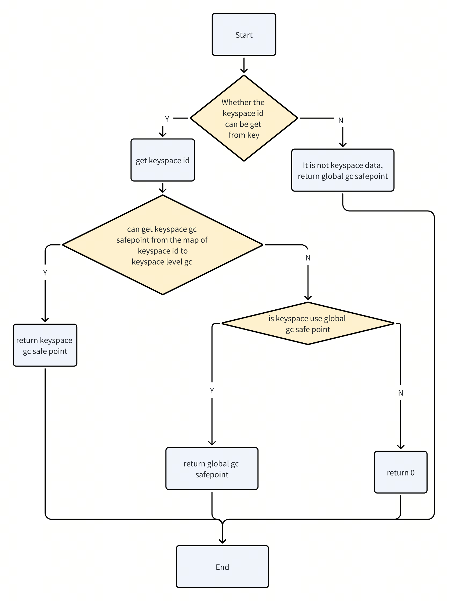
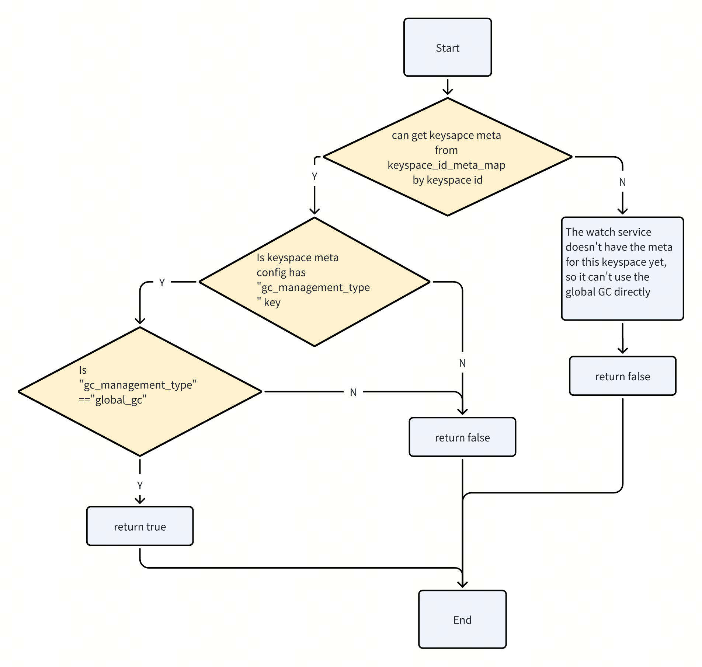

# Keyspace level GC

## Summary

- RFC PR:
- Tracking Issue: 

TiKV support keyspace level gc.

## Motivation

Previously, TiDB has supported the deployment of multiple TiDB clusters with different keyspaces on a single PD TiKV cluster.

We've implemented multiple TiDB clusters, with one global TiDB GC worker (A TiDB server without Keyspace configuration) to calculate the global GC safe point and resolve locks, While each keyspace's TiDB has their own GC Worker, keyspace GC Worker use the global GC safe point to do deleteRange in the sepical keyspace ranges.

But old implementation causes the calculation of the global gc to depend on the oldest safe point and min start ts of all keyspaces and TiDB cluster without keyspace configured.

So we propose the implementation of keyspace level gc:

TiDB PR https://github.com/pingcap/tidb/pull/51300 implements: 
Isolation of GC safe point calculations between keyspaces (the concept is 'keyspace level GC'). 
When the Keyspace GC safe point calculation of Keyspace with keyspace level gc is slow, 
it will not affect other keyspaces GC safe point calculation.
Keyspaces can be created by setting gc_management_type = keyspace_level_gc to enable keyspace level GC,
then this keyspace can calculate GC safe point by itself.

TiKV PR https://github.com/tikv/tikv/pull/16808 implemented on TiKV side: 
In GC process, it parses the keyspace id from the data key, 
combines the keyspace meta config and the keyspace level GC safe point corresponding to the keyspace id to determine
the GC safe point value of the data key and execute the GC logic.

## Concepts of GC management type:
1. Global GC:
    - Represents the previous default GC logic; there is a TiDB calculate the global GC safe point for the whole cluster.
    - The default GC management type for keyspace is Global GC,
2. Keyspace level GC:
    - Indicates that the keyspace will advance its own gc safe point.
    - It is possible and only possible to set gc_management_type = keyspace_level_gc when PD creates keyspaces.
    - The keyspace which already set gc_management_type = keyspace_level_gc, 'gc_management_type' it can not be updated to "global_gc".
    - Keyspace GC-related data: min start ts, GC safe point,service safe point of keyspace have their own etcd path with keyspace prefix in PD. 
    - Therefore, the keysapce can calculate the GC by itself.

## Implementation in TiKV
1. Get keyspace meta and keyspace level GC safe point:
    - New KeyspaceMetaWatchService : Watch keyspace meta etcd path to get the keyspace meta and put it in cache keyspace_id_meta_map<u32, keyspacepb::KeyspaceMeta>.
    - New KeyspaceLevelGCWatchService : Watch the etcd path of the keyspace GC safe point to get the GC safe point with keyspace level GC enabled, put it in cache keyspace_level_gc_map<u32, u64>.

2. How to get GC safe point by mvcc key in Compaction Filter:

3. How to determine if a keyspace uses a global gc safe point:

4. Use GC safe point to optimize trigger timing and assert judgment
   1. Skip GC when GC safe point is 0 in create_compaction_filter.
   2. check_need_gc function return false in create_compaction_filter.
   3. assert( safe_point > 0 ) when new compaction filter.

5. Other non-GC logic that uses GC safe point does not currently have to support keyspace level GC.
   1. check region consistency command: 
      1. It needs check GC safe point on followers to ensure that the data to be checked on the follower is not GC. 
      2. It doesn't support which keyspace with keyspace level gc enabled yet, if user request check consistency for the keyspace range, the user will get a "not supported" message.
   2. GC safe point used in raftstore to trigger compaction when no valid split key can be found. It was introduced in PR https://github.com/tikv/tikv/pull/15284
      1. It just uses GC safe point to determine when to trigger compaction. The main PR of the Keyspace level gc will not fit this logic. It will be considered for submitting another PR for support after the keyspace level gc core PR is merged.