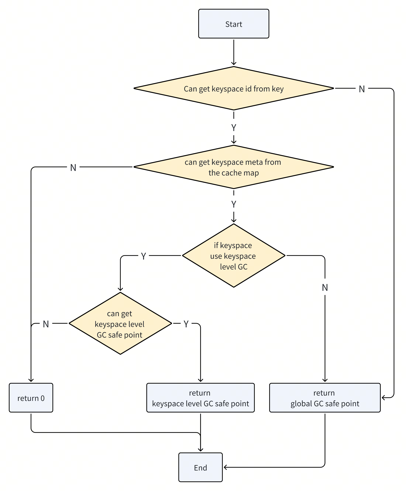
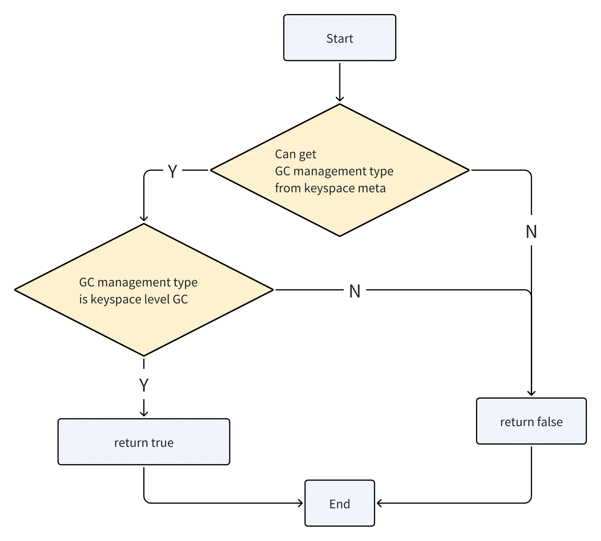

# Keyspace level GC

- RFC PR: https://github.com/tikv/rfcs/pull/113
- Tracking Issue: https://github.com/tikv/tikv/issues/16896

## Summary

TiKV support [keyspace][1] level GC (garbage collection).

## Concepts of GC management type

1. Global GC:
   - Represents the previous default GC logic; there is a TiDB calculate the global GC safe point for the whole cluster.
   - The default GC management type for keyspace is Global GC.
2. Keyspace level GC:
   - Indicates that the keyspace will advance its own GC safe point.
   - Keyspace GC-related data: min start ts, GC safe point, service safe point, stored in own etcd path of each keyspace in PD.

## Motivation

In order to support multi-tenant deployment of TiDB in a shared TiKV cluster, TiDB now supports keyspace feature. A global TiDB GC worker (A TiDB server without Keyspace configuration) shared by all TiDB is in charge of calculating the global GC safe point and resolving locks, while each keyspace's TiDB has their own GC Worker. The GC Worker of each keyspace use the global GC safe point to do "delete-range" in its keyspace ranges.

But in this implementation the calculation of the global GC safe point depends on the oldest safe point and min start ts of tidb clusters with no keyspace set and all clusters with keyspace set. When any safe point and min start ts are blocked, GC of tidb clusters with no keyspace set and all clusters with keyspace will be blocked.

So we propose the **Keyspace Level GC**:

TiDB side:
Isolate of GC safe point calculations between keyspaces (the concept is 'keyspace level GC').
It will not affect other keyspaces GC safe point calculation.
Keyspaces can be created by setting gc_management_type = keyspace_level_gc to enable keyspace level GC, then this keyspace can calculate GC safe point by itself.

TiKV side:
In GC process, it parses the keyspace id from the data key, use the keyspace meta config and the keyspace level GC safe point corresponding to the keyspace id to determine the GC safe point value of the data key and execute the GC logic.

## Implementation in TiKV

1. Get [keyspace meta](https://github.com/pingcap/kvproto/blob/d9297553c9009f569eaf4350f68a908f7811ee55/proto/keyspacepb.proto#L26C1-L33C2) and keyspace level GC safe point from PD:
    - Create a keyspace meta watch service: Watch keyspace meta etcd path to get the keyspace meta and put it in the mapping from keyspace id to keyspace meta.
    - Create a keyspace level gc watch service : Watch the etcd path of the keyspace GC safe point to get the GC safe point with keyspace level GC enabled, put it in the mapping from keyspace id to keyspace level gc.

2. How to get GC safe point by mvcc key in Compaction Filter:
 

1. How to determine if a keyspace uses a keyspace level GC safe point:
 

1. Use GC safe point to optimize trigger timing and assert judgment:
   1. In the global GC, it will skip GC when GC safe point is `0` in `create_compaction_filter`.
      After supporting keyspace level GC, GC is skipped if global GC safe point is 0 or if no keyspace level GC is initialized.
   2. In the global GC, `check_need_gc` function return false in `create_compaction_filter.`
      After supporting keyspace level GC, if `props.min_ts` > global GC safe point and `props.min_ts` > all keyspace level GC safe point will return false.
   3. In the global GC, assert( safe_point > 0 ) when new compaction filter.
      After supporting keyspace level GC, the assert condition is whether global GC safe point > 0 or any keyspace level GC safe point has been initialized.

2. Support using keyspace level GC for data import and export:
   1. When using BR, CDC, Lightning, Dumpling to import or export keyspace data, you need to update the service safe point for the specified keyspace. When the task starts, it needs to get keyspace meta first to determine whehter global or keyspace GC is using, then execute the GC relevant logic on the corresponding GC safe point and service safe point.
## Upgrade from `global GC` to `keyspace level GC`
It will be introduced in another RFC.

## Global Backup
Specify ts to restore data for non-keyspaces and all keyspaces in the entire cluster.It will be introduced in another RFC.

[1]: https://github.com/tikv/rfcs/blob/master/text/0069-api-v2.md#new-key-value-codec
