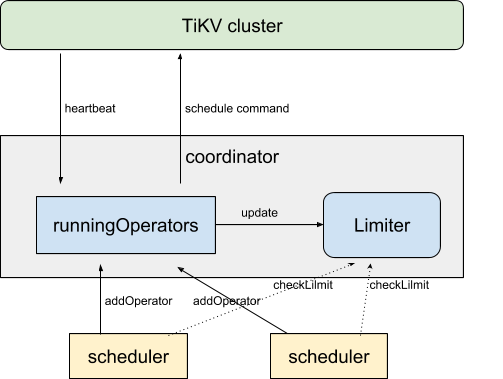
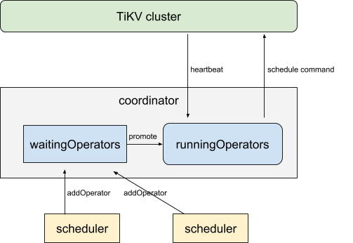

# Summary

This RFC proposes a new scheme to limit concurrent executing schedule operators. Compared to old implementation, it is more intuitive, easy to configure, and has better adaptability.

# Motivation

In order to prevent PD from generating a large number of schedule operators in a short period of time and affecting the performance of the tikv cluster, and to avoid the problem of over-balance, currently PD uses a limitation based scheme.

Specifically, PD uses 4 different limit configurations to control the number of concurrently running operators:

* leader-schedule-limit

    Controls the number of operators scheduling region leaders at the same time

* region-schedule-limit

    Controls the number of operators scheduling region peers at the same time

* replica-schedule-limit

    Controls the number of operators scheduling region replicas at the same time

* merge-schedule-limit

    Controls the number of region merge operators at the same time

The mechanism of scheduling limiter is shown in the figure. All running operators are maintained as a map in the coordinator, and the Limiter is updated synchronously when running operators change. Different schedulers will check whether running operators have exceeded the limit before generating operators. The operators generated by schedulers will be added to the _runningOperators_ map via addOperator method.

This scheme is not good in these aspects:
* Various limit configurations are confusing, tricky to use correctly
* Fixed limit configuration does not apply to clusters of different sizes
* The preemption strategy between different schedulers is not fair enough
* Scheduling is often concentrated on a small number of tikv-servers, which leads to slow scheduling sometimes and may affect the latency of tikv (we do consider snapshot count, but this statistic is reported after tikv receives the scheduling request)
* Rely on schedulers correctly checking limit to ensure the limit configuration has not been violated -- hotbed of bugs. See [#1193](https://github.com/pingcap/pd/pull/1193) [#1155](https://github.com/pingcap/pd/pull/1155)

# Detailed design

## Introducing waitingOperators queue

As shown in the figure, the biggest change is the introduction of the _waitingOperators_ in the coordinator. The schedule operators generated by schedulers are not directly put into the _runningOperators_, but are queued first in _waitingOperators_. The coordinator is responsible for continuously promoting operators in _waitingOperators_ queue to _runningOperators_ according to a certain rule and configuration.

## Evaluating operator affect

Schedule operators consist of operator steps. The effect of an operator on the cluster can be calculated as the sum of the effects of all steps. There are several types of operator steps:

* TransferLeader
* AddPeer
* AddLearner
* PromoteLearner
* RemovePeer
* MergeRegion
* SplitRegion

Obviously, these steps only affect a subset of all tikv-servers -- not the entire cluster. For example, _TransferLeader_ can only affect the original and the new leader of the region. _AddLearner_ can affect the store to add the learner and the leader of the region.

Of course, the overhead of different types of operator are different. We can assign different cost values to them based on experience. For example, we can arbitrarily set the cost of _TransferLeader_ to 1, the cost of _RemovePeer_ to 2, and the cost of _AddLearner_ to 5 (leader) and 8 (new peer).

## How to promote waiting operators

Given a MaxScheduleCost configuration (say 20), when the coordinator promotes an operator, it need to guarantee that if we add all the schedule cost in the _runningOperators_, the total cost of any store will not exceed the configured value.

If the first operator in the waiting queue makes a store overload, it will wait until the conflicting operator finishes or times out before it can be moved to  _runningOperators_.

In order to improve efficiency of executing, when a non-first operator does not conflict with any operator in front of it, it can be moved to _runningOperators_ too.

## How to ensure fair competition between different schedulers

This is actually quite straightforward. We only need to limit the number of generated operators by each scheduler in the _waitingOperators_ queue. For example, up to 3 operators from a same scheduler.

Only when an old operator is moved into the _runningOperators_, the corresponding scheduler will have the opportunity to insert more operators into _waitingOperators_. This strategy not only ensures fairness between different schedulers, but also encourages schedulers to generate non-conflicting operators, thus reducing the impact on cluster performance.

As before, if different schedulers generate operators of a same region, the later one is rejected directly. Dropping the later operator when it is about to promote is also an option. 

## Configuration and customization

There is only 1 important configuration for basic usage:

* MaxScheduleCost

    The maximum summary of cost of running operators for each store. 

We can also allow to customize following configurations to better fit special needs. (Tests are needed to decide if each of them is worth being made configurable)

* StoreMaxScheduleCost

    Similar to _MaxScheduleCost_, but for a specific store. If could be useful when performance of tikv-servers are different.

* OperatorStepCost
    
    We will assign cost values based on experience. They may need adjustment in production.

* MaxWaitingOperator

    The maximum count of waiting operators of each scheduler.

* SchedulerMaxWaitingOperator

    Similar to _MaxWaitingOperator_, but for a specific scheduler. We can use it to control priority of different schedulers.

# Drawbacks

The migration from the old way to the new scheme has a certain cost, involving the update of the deployment script and compatibility with the old cluster configuration in the future.

# Alternatives

It has been considered that the schedulers use a cooperative rather than a competitive scheme to generate operators. However, this approach is more dependent on the better quality of implementation of all the schedulers, and the schedulers need to perceive each other, which will increase the coupling degree of the system.

# Unresolved questions

The arbitrarily determined step cost may not correctly reflect the scheduling overhead, we need to test to verify that it is appropriate.
