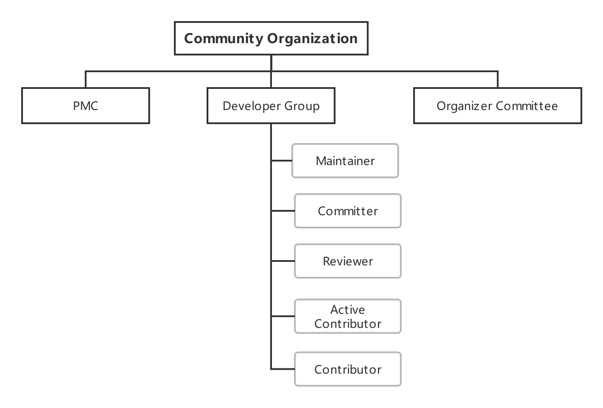
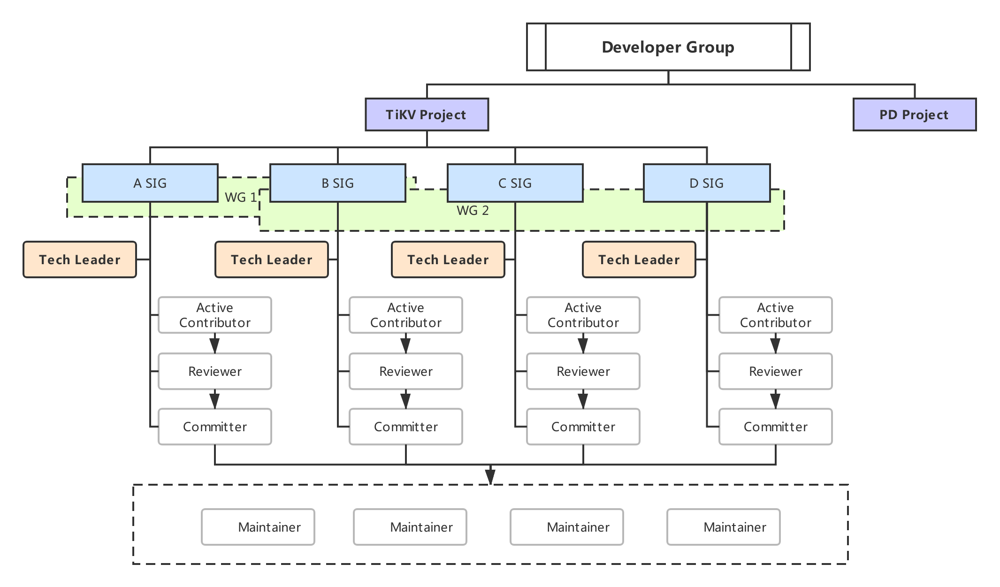

# TiKV Community Re-organization and SIG Launching

## Summary

This RFC proposes an upgraded organization structure for the TiKV community, with more community roles and community organizations introduced to better stimulate the vitality of the community and maintain a positive and healthy community environment. This RFC also proposes the constitution and the operation the Special Interest Group (SIG).

## Motivation

Years of development has seen the TiKV project gradually grow into maturity. However, since TIKV joined CNCF, we have realized there are shortcomings of the current community structure that prevent TiKV community from developing stably. After a series of reflections and summaries, we decided to upgrade and adjust the current community organization structure, with more community roles and community organizations introduced to better stimulate the vitality of the community and maintain a positive and healthy community environment.

## Detailed designs

There are two parts for the designs. Part 1 focuses on the organization changes from the perspective of the community organization; part 2 focuses on SIG operations and constitutions.

### Upgraded community structure

#### New roles introduced

The above picture reflects the first change in this community structure upgrade - the roles of Reviewer and Active Contributor will be introduced to the developer Group. The current Developer Group includes the following:

- **Maintainer**: a planner and designer of the project; capable of merging master branches; appointed by existing Maintainers from Committers.
- **Committer**: nominated by Maintainers or PMC as a contributor with outstanding contribution to TiKV; must have implemented at least one feature or fixed a major bug independently.
- **Reviewer**: an advanced contributor with the approval right for code reviews; can participate in the design of subsequent projects.
- **Active Contributor**: an active contributor to the community voted by at least two reviewers. merged at least 8 PRs
- **Contributor**: a community contributor that has at least one PR (Pull Request) merged to any repository under the TiKV organization.

Besides the Developer Group, the community also includes the following two organizations:

- Organizer Committee of the project consists of organizers in charge of event or activity operation that promotes the project. Specifically, the members are the leaders of user groups or community event organizers across regions.
- Project Management Committee (PMC) functions as the core management team of the project; decides the roadmap and makes major decisions related to the community.

#### Special Interest Group

The above diagram shows the overall structure of the developer community and reflecting the second change in this community architecture upgrade - the introduction of the Special Interest Group (SIG).

An SIG mainly leads the development and maintenance of a TiKV module and is responsible for the quality of the module's code. Active Contributors that meet the requirements will be invited to an SIG. Developers in the SIG will receive continuous guidance from Tech Leads while they optimize and improve the module, and meanwhile, exercise their technical skills. Community developers can gradually grow from the initial Active Contributor to the community-recognized Reviewer, Committer, and even Maintainer through SIGs. In general, each SIG will organize meetings periodically to discuss about the recent progress and the problems encountered. All meeting discussions are open to the community, so that interested community members can participate.

In addition, this picture also reflects the relationship between community roles and SIGs.

- Active Contributor
    + Must be a Contributor with at least 8 PRs merged to the master branch within 1 year.
    + To join an SIG, a Contributor needs to contribute more than 8 PRs to the module that the SIG is responsible for within 1 year, so that he/she can be invited to join the SIG for targeted learning and contributions.

- Reviewer
    + Must belong to a SIG; has the obligation to review PRs.
  + Generated from Active Contributors. When an Active Contributor has significant contributions to the module and is nominated by 2 or more Committers, he/she will be invited to be a Reviewer of the module.
    + Has valid sign-off (approval with Looks Good To Me, or LGTM) for code reviews of the module

- Tech Lead
    + The organizer of the SIG; responsible for the day-to-day operations including organizing meetings, answering questions, etc.
    + Tech Leads are responsible for the management and growth of the SIG. For now, the role is taken by PingCAP members, but is hopefully extended to community developers in the future.

The constitution and operation of SIGs will be detailed in later sections.

#### Working Group

The third change is the introduction of the Working Group (WG) in the developer community structure. A WG is formed by community developers who gather together to accomplish a specific goal with PingCAP members. To achieve the goal, some WGs may span over multiple SIGs, and some WGs may only focus on something specific in a specific SIG.

Each WG has its life cycle. Once the goal is completed, the group will be disbanded. The only goal of WG operations and management is to ensure that the goals set by the group are completed at the right time. In general, the working group hold periodic meetings to summarize the current project progress and determine the plans for next steps.

### SIG Constitution and Operation

SIGs mainly aggregate a group of Active Contributors, and conducts in-depth research & contributions to one or more TiKV modules, and is promoted to Reviewer, Committer within the SIG.

#### SIG role and organizational governance

The SIG follows the role definitions in the Community structure. The SIG is subject to the following rules:

- Before starting a SIG, the constitution will be established in advance. The detailed steps of creating the constitution can be found on the corresponding document.
- Except for holidays, the regular meeting is organized at least once every two weeks.
- The assignable tasks will be graded by difficulty levels and claimed by SIG members.

#### SIG Roles

- **Active Contributors**

    - Active contributors will be invited to the SIG
    - Keep active inof at least one module in the SIG
    - Continue to contribute in at least one module
    - Can participate in the proposal and discussion in the SIG

- **Reviewer**

    Please refer to the definition of Reviewer
- **Committer**

    Please refer to the definition of Committer

- **Tech Lead**

    - 2 or 3 Tech Leads in an SIG are required
    - Responsible for training members of the SIG
    - Organize discussions and make decisions of proposal generated within the SIG
    - Responsible for the SIG's activity and output
    - Lead the SIG to generate more Reviewer and Commiter
    - Follow up progress and assign task in SIG
    - Need to participate in regular meetings
    - Make roadmap for the SIG
    - Weekly progress meeting requires at least one Tech Lead to participate in the discussion online

#### Member promotion mechanism

Members of the SIG can be promoted to a higher role, and the rules are set by the specific SIG. Each promotion is nominated by two members of a higher level role or above.

#### Member exit mechanism

After a period of inactivity, the SIG member will temporarily exit the SIG. The exit mechanism is set by each SIG.

#### Create the SIG constitution

1. Copy the SIG Constitution template
2. Modify the content in the template that needs to be defined for the specific SIG
3. Initiate a proposal to community committee with the SIG Constitution
4. The new SIG will be announced by the community committee after approval.

#### SIG lifecycle

- **Create**

    - All SIG Technical Leads, and other roles need to be at least Active Contributors in the Community structure
    - Follow the steps above to create an SIG constitution
    - Create a public and private Slack Channel in tikv-wg.slack.com to discuss the SIG operation related matters
    - Create a Zoom room for regular meetings, as well as other online discussions
    - Announce the establishment of a new SIG in the TiKV community

- **Dismiss**

Sometimes an SIG may need to be dismissed or merged. The SIG's dissolution rules should be defined by the specific SIG.

## Conclusions and future work

In general, this community structure upgrade has the following improvements:

- Introduced the community roles of Active Contributor and Reviewer.
- Introduced Special Interest Group (SIG).
- Introduced Working Group (WG).

In terms of community operations, we will continue our efforts in the following aspects:

- Improve the mentoring mechanism for community members to advance, so that community members can grow from Contributor to Committer or Maintainer with clear paths to follow.
- Make community operations more systematic.
- Make community classmates feel more belonging and strengthen communications with members from other communities.

In the future, we will successively open more SIGs and WGs. More database-related materials will be continuously distributed in SIGs to help members gradually participate in the development of TiKV.