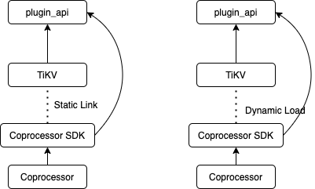

# Coprocessor Plugin

## Summary

Add a general and plugable coprocessor framework for RawKV mode.

## Motivation

TiKV is the storage component in the TiDB ecosystem, however, the distribution computation principle suggests that computation should be as close to the data source as possible. Therefore, TiKV has embedded a subset of the TiDB executor framework to push down some computation tasks when applicable.

But TiKV's capability should be far beyond that, as many distributed components can be built on top of TiKV, such as cache, full text search engine, gragh database and NoSQL database. And same as TiDB, these product will also like to push down specific computation to TiKV, which requires the coprocessor to be customizable, aka plugable.

## Detailed design

### Dynamic vs statically

Generally, there are two strategies to build a plugin framework: dynamically and statically, which means to load the plugin on startup or to embed in the binary on compilation.



They have both pros and cons:

| Static | Dynamic |
| -- | -- |
| ◯ High performance | X Relatively slower |
| ◯ Easy to deploy | X Complexify the deploy process |
| X Build the entire TiKV | ◯ Easy to build |
| X Build very slow | ◯ Build fast |
| X Hard to debug | ◯ Easy to debug |

Ideally, we'd like to develop a plugin in dynamic mode, and eventually, to distribute the statically linked one in release. So there is an interesting research area that designing a plugin framework that can write the plugin once, and compile to the dynamic one and the static one with duplicate code. Anyway, this is an ambitious target but sort of out of scope, so we may explore the possibility when marching on.

So initially, in this RFC, we'll only focus on the dynamic plugin framework that works in RawKV mode.

### Web Assembly

Web Assembly is chosen to host the dynamic plugin. There was alternatives like dynamic lib, lua and bpf. So in this section, I'll explain the tradeoff between them and why WASM is the most appropriate choice for TiKV:

- Dynamic Library

    Previously, a proof-of-concept plugin experiment [[repo]](https://github.com/andylokandy/plugin) is done. As a result, we found that Rust's unstable ABI is a risk in safety. It's hard to guarantee that the TiKV and the plugin has absolutely the same ABI version, and is also hard to debug such a plugin.

- Lua

    TOO SLOW

- eBPF

    Berkeley Packet Filter has been experimented in Hackthon. It requires the plugin to be written in C, which is not capable to migrate `tidb_query` eventually. And also, eBPF is not turning-complete, which is unacceptable.

- WASM

    Web Assembly has also been experimented in Hackthon. As the result, it made the performance score around 50% to 80% to the statically linked one. Good work for `Wasmer`! Besides, WASM can be written in many languages and has great safety guarantee.

    The Rust binding for WASM plugin should be first-class supported.

### Keyspace

Keyspace[[RFC]](https://github.com/tikv/rfcs/pull/39)[[The most updated design doc]](https://docs.google.com/document/d/1x17-urAqToDo8TVXJroEHtc76fdssFaoANjSaNDhjKg/edit) is an incoming feature of TiKV that is highly related to coprocessor plugin. Keyspace determines whether a range of key should only be used in transaction mode or in RawKV mode. Since coprocessor works in either RawKV mode or txn mode, surely coprocessor plugin framework should aware of Keyspace. The details is TBD.

### Multi-plugin

Currently TiKV has only one coprocessor `tidb_query`. However, without further work on statically linked plugin and txn mode support, we can't strip it from official release. So, multiple coprocessor has to be supported. Basically, we may need to add a `gPRC` rpc for coprocessor v2 request, in which coprocessor name and version is given, so that TiKV will be able to dispatch the request to the proper coprocessor, as well as to reject the request on version mismatch.

### API design

To reduce the learning overhead, it'll be better that the API of the coprocessor plugin get closer to the client. Thus, it'll looks like the `RawClient` in the [Rust Client](https://github.com/tikv/client-rust) with extra txn-like methods e.g. `commit` and `lock`.

```rust
pub type Key = Vec<u8>;
pub type Value = Vec<u8>;

#[derive(Debug)]
pub struct Region {
    id: u64,
    start_key: Key,
    end_key: Key,
    region_epoch: RegionEpoch,
}

#[derive(Debug)]
pub struct RegionEpoch {
    pub conf_ver: u64,
    pub version: u64,
}

#[derive(Debug)]
pub enum Error {
    KeyNotInRegion { key: Key, region: Region },
    Deadlock { key: Key },
    // More
}

pub type Result<T> = std::result::Result<T, Error>;

#[async_trait]
pub trait RawTransaction: Send {
    /// Acquire memory lock for a key. All other trivial rpc requests or coprocessor
    /// lock acquire to the same key will be blocked by this lock. This lock will be
    /// released when the transaction is committed or dropped.
    async fn lock(&self, key: Key) -> Result<()>;

    async fn get(&self, key: Key) -> Result<Option<Value>>;
    async fn scan(&self, key_range: Range<Key>) -> Vec<Value>;

    async fn put(&mut self, key: Key, value: Value) -> Result<()>;
    async fn delete(&mut self, key: Key) -> Result<()>;
    async fn delete_range(&mut self, key_range: Range<Key>) -> Result<()>;

    /// Returns when Raft message applied successfully.
    async fn commit(self) -> Result<()>;
}

pub trait Coprocessor: Send + Sync {
    fn on_raw_coprocessor_request(
        &self,
        region: Region,
        request: Vec<u8>,
        transaction: Box<RawTransaction>,
    ) -> Result<Vec<u8>>;
```

## Future work

### Official coprocessor

Provide an official coprocessor plugin which defines common primitives like `bool`, `f32`, `UTF8String`, `Array<T>` along with codec for them, moreover, implements simple scanning expressions or even aggregations.

Two reasons for that:

1. To provide an example showing how to build a coprocessor plugin for TiKV and guaranteed to be always up-to-date.

2. To comfort simple use cases to TiKV, so as to avoid forcing the users to develop a new plugin at the beginning.

### Transaction mode

Transaction mode is way more complicated than the RawKV mode. The current picture of txn plugin is an 'interactive' component with the client, which means, the client and the coprocessor will talk to each others during the request being processed. This is especially for resolving locks and coordinating the transaction among multiple coprocessors in multiple TiKV nodes.

### Static plugin

Discussed in the section above.

### Migrate `tidb_query`

When static plugin and txn plugin is implemented, we can move the coprocessor specific to TiDB out of TiKV, and the repository of TiDB might be a good new home.
