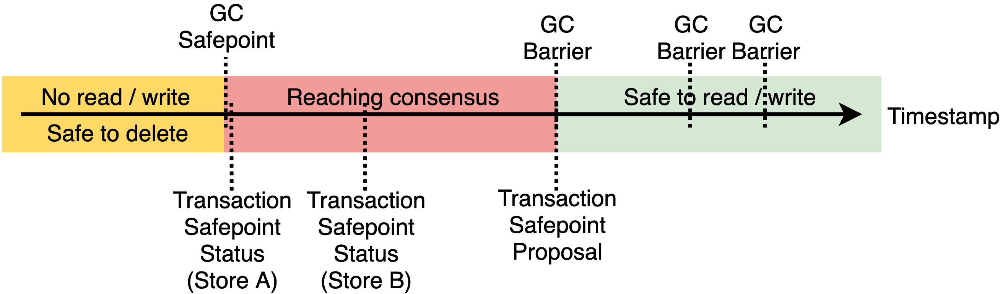

# Builtin GC worker

## Summary

Move TiKV MVCC GC worker from TiDB into PD and make it general for use without TiDB.

## Motivation

GC worker is an important component for TiKV that deletes outdated MVCC data so as to not explode the storage. But currently, the GC worker is implemented in TiDB, which makes TiKV not usable without TiDB.

## Background

According to the [documentation](https://docs.pingcap.com/tidb/stable/garbage-collection-overview) for the **current** GC worker, the GC worker processes the following steps in a GC cycle:

1. Calculate the minimal timestamp among all living SQL sessions, earlier than which are safe to GC, called `Session Safepoint`. Then calculate the `Service Safepoint` for id `gc_worker` by `min(Session Safepoint, now - gc_life_time)`.
2. [Push](https://github.com/pingcap/kvproto/blob/8ecb5e46d7f5f7952a1a8d262b54f61dc8de1ef3/proto/pdpb.proto#L73) the `gc_worker Service Safepoint` to PD. At the meanwhile, other tools (e.g. CDC, BR) has also pushed their `Service Safepoint` for minimal snapshot timestamp requirement.
3. Get the minimal `Service Safepoint` among all services from the response of step 2, which is `GC Safepoint`.
4. Resolve all locks whose timestamp is earlier than the `GC Safepoint`.
5. [Push](https://github.com/pingcap/kvproto/blob/8ecb5e46d7f5f7952a1a8d262b54f61dc8de1ef3/proto/pdpb.proto#L71) the `GC Safepoint` to PD.

After the `GCSafepoint` being uploaded, TiKV will pull it from PD by interval, then TiKV will automatically delete all records earlier than `GCSafepoint`.

Yet another tricky part is that TiDB has a shortcut to GC a range of keys after `DROP TABLE` or `DROP INDEX`, etc: parallel with step 3 and step 4, TiDB will directly invoke `UnsafeDeleteRange` to TiKV which will delete the range of key-values regardless of locks or timestamp. To make it safe, TiDB will guarantee that the deleted range will never be used again.

## Detailed design

Three new concepts will be introduced by this proposal:

1. `GC Barrier`

    PD guarantees it will be valid for a snapshot with timestamp later than any `GC Barrier` to read and write . TiKV users (e.g. TiDB / CDC / Client) can put GC Barriers into PD so as to make sure the data they are using will not be GC.

2. `Transaction Safepoint`

    TiKV and TiFlash guarantee that no read or write will happen on the snapshot earlier than `Transaction Safepoint`. PD calculates `Transaction Safepoint` by `min(GC Barriers, now - gc_life_time)` and proposes it to TiKV and TiFlash via the `StoreHeartbeatResponse`. Therefore, TiKV and TiFlash will reject all requests with timestamp earlier than the `Transaction Safepoint`. In the next following `StoreHeartbeatRequest` TiKV and TiFlash will report their latest `Transaction Safepoint` to PD.

    Note that `Transaction Safepoint` on TiKV, TiFlash and PD must be non-decreasing.

3. `GC Safepoint`

    PD calculates `GC Safepoint` by `min(Transaction Safepoint Status) - 1`, resolves locks earlier than `GC Safepoint`, then synchronizes it to TiKV and TiFlash via `StoreHeartbeatResponse`. And finally, TiKV and TiFlash are safe to delete MVCC data earlier than `GC Safepoint`.



According to the design above, several fields will be added to `pdpb.proto`:

```diff
  // `pdpb.proto

  message StoreHeartbeatRequest {
      RequestHeader header = 1;
      StoreStats stats = 2;
  }

  message StoreStats {
  …
+     uint64 txn_safepoint = 15;
+     uint64 gc_safepoint = 16;
  }

  message PutStoreResponse {
      ResponseHeader header = 1;
      replication_modepb.ReplicationStatus replication_status = 2;
+     uint64 txn_safepoint = 3;
+     uint64 gc_safepoint = 4;
  }

  message StoreHeartbeatResponse {
     ResponseHeader header = 1;
     replication_modepb.ReplicationStatus replication_status = 2;
     string cluster_version = 3;
+    uint64 txn_safepoint = 4;
+    uint64 gc_safepoint = 5;
  }
```

Aslo, RPC `SetGCBarrier` and `GetGCStatus` will be added:

```diff
  // `pdpb.proto

  service PD {
  ...
+    rpc SetGCBarrier(SetGCBarrierRequest) returns (SetGCBarrierResponse) {}
+    rpc GetGCStatus(GetGCStatusRequest) returns (GetGCStatusResponse) {}
  }

+ message GCBarrier {
+    bytes id = 1;
+    // Set to 0 to delete existing barrier
+    uint64 ttl = 2;
+    uint64 timestamp = 3;
+ }

+ message SetGCBarrierRequest {
+    RequestHeader header = 1;
+    GCBarrier gc_barrier = 2;
+ }

+ message SetGCBarrierResponse {
+    ResponseHeader header = 1;
+ }

+ message GetGCStatusRequest {
+    RequestHeader header = 1;
+ }

+ message GetGCStatusResponse {
+    ResponseHeader header = 1;
+    repeated GCBarriers gc_barriers = 2;
+    uint64 txn_safepoint = 3;
+    uint64 gc_safepoint = 4;
+ }
```

### Backward compatibility

#### Rolling update

During the rolling update, the GC worker will not function and the new TiDB will not try to be elected as a GC leader. Once the rolling update is completed, the GC worker in PD will start to work.

The RPC `GetGCSafePoint` and `UpdateServiceGCSafePoint`, which are used by the GC model before this proposal should still work for keep compatible with tools and they should be just a thin wrapper on top of the new `GetGCStatus` and `SetGCBarrier`.

`UpdateGCSafePoint` should only work before rolling update completes, once the rolling update finishes, PD will reject requests to this RPC.

#### TiDB unsafe delete range

In the model described above, we didn't specify when TiDB should unsafe delete range. Because the step of resolving lock is controled by PD and unsafe delete range is only allowed after `GC Safepoint` is pushed ahead of the timestamp of `DROP TABLE`, TiDB has to passively listen to the `GC Safepoint` (fetch by interval), and perform unsafe delete range when appropriate.

## Reference

<https://docs.google.com/document/d/1jA3lK9QbYlwsvn67wGsSuusD1Dzx7ANq_vya384RBIg/edit#heading=h.rr3hcmc7ejb8>

<https://docs.pingcap.com/tidb/stable/garbage-collection-overview>
