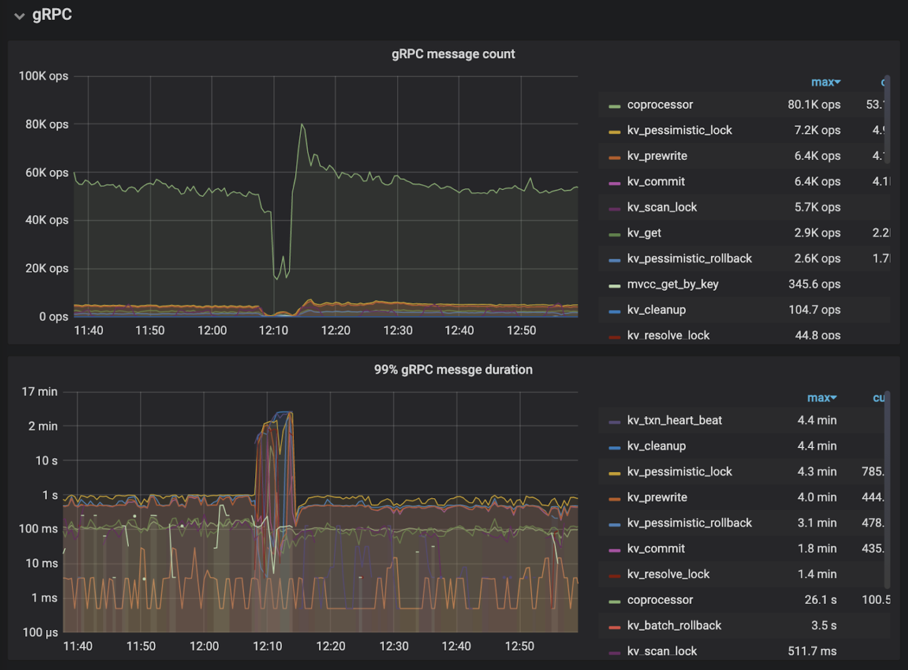
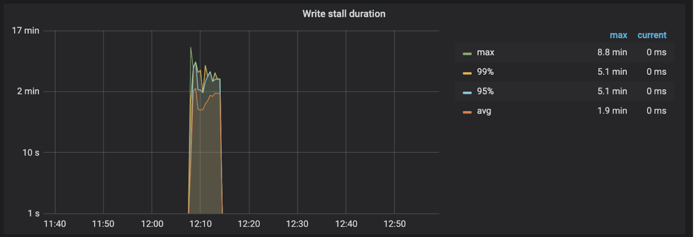
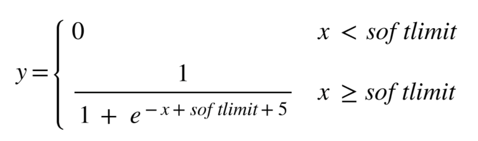
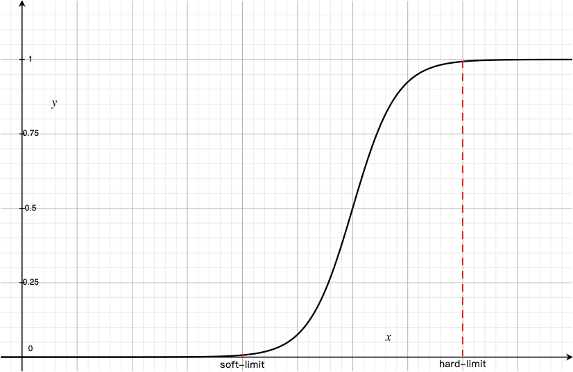
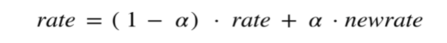

# Substitute rocksdb write stall

## Motivation

It is easily for TiKV to encounter the case that QPS changes dramatically due to KvDB's write stall when the disk press is high. Users suffers a lot from it, and ask for our help to solve it. Judging from the past situation, the write stall mostly are caused by too many pending compaction bytes.

To alleviate it, we need to turn off the write stall mechanism of RocksDB, and add a limiter in the very beginning of TiKV to throttle write flow more smoothly. We can tolerate long-time higher request duration, while latency spike is not what we want.

## Background

### What is RocksDB write stall

Once write stall occurs, it actually means the speed of compaction of flush can not catch up with write rate. And if one CF is write stall state, the write rate of all CFs are limited to `delayed_write_rate` which is calculated dynamically by RocksDB.

Here is the write stall condition:

- Too many memtables: reach `max_write_buffer_trigger`, then slow down
- Too many SSTs:
  - reach `level0_slowdown_writes_trigger`, then slow down
  - reach `level0_stop_writes_trigger`, then stop
- Too many pending compaction bytes:
  - reach `soft_pending_compaction_bytes`, then slow down
  - reach `hard_pending_compaction_bytes`, then stop.

When write stall happens, the max speed of write rate `max_delayed_write_rate` is limited to the speed of compaction `rate_bytes_per_sec`. If `rate_bytes_per_sec` is not set, `16MB/s` will be set for `max_delayed_write_rate` by default. In write stall state, the foreground write sleep for a while which is calculated by the limiter based on `delayed_write_rate`, and blocks all following writes.

Every time new SST files are generated, meaning the factors of write stall condition may change, it will rejudge whether it is write stall state. If it is still in write stall, the `delayed_write_rate` is adjusted following the rules:
- set to 0.6x of current `delayed_write_rate` if any of them meets
  - still in write stop state
  - L0 is the last two files from stopping
  - If the distance to pending compaction bytes hard limit is less than 1/4 of the gap between soft and hard bytes limit 
- set to 0.8x of current `delayed_write_rate` if pending compaction bytes keep increasing
- set to 1.2x of current `delayed_write_rate` if pending compaction bytes is decreasing

Once it recovers from the write stall state, the `delay_write_rate` is set to 1.4x of current value which will be used when the next time write stall happens.

### Write stall in other systems

[Pebble](https://github.com/cockroachdb/pebble/blob/master/docs/rocksdb.md#write-throttling) removes write stall mechanism totally. They say adding artificial delays doesn't do anything to improve latencies in an open loop model, which is the model more likely to resemble real world use cases. Artificial delays increase write latencies without a clear benefit. Writes stalls in an open loop system would indicate that writes are generated faster than the system could possibly handle, which adding artificial delays won't solve.

## Analysis

- The `max_delayed_write_rate` is limited to `16MB/s` by default which doesn't take real disk ability into account. It may underestimate the disk's throughout that 16MB/s is too small at once, causing a very large jitter on the write duration.
- Too many memtables, L0 files and pending compaction bytes affect read amplification, whereas write stall occurs when write pressure dominates. So in face, we don't have to drastically decrease the write rate when those conditions are met like RocksDB does, but can consume these excessive value slowly, as long as we can suppress the trend of growth.

## Design

In general, it is to disable the current write stall mechanism of RaftDB and KvDB itself, and add the flow control forward to the scheduler layer with a newly added limiter to control the write requests of Region leaders. There are two ways of controlling write requests, one is returns `ServerIsBusy` error directly, the other is throttling the write requests with some delay. The delay duration is calculated using token bucket algorithm, and the throttled request are placed in the waiting queue of the latch and block subsequent writes until the delay time has passed. In the front, there is a reservoir(that is, current scheduler pending-written-bytes 100MB). If the reservoir is full, `ServerIsBusy` error will also be returned.

In addition, considering that TiDB retries with backoff for `ServerIsBusy` error, the backoff time will be longer after multiple times of retry. After recovering from the write stall state, there may be not fill TiKV at full speed in time, so it needs to quickly feedback to TiDB at this time, so that those requests can be retried immediately.

The specific flow control is still based on the previous indicators of RocksDB, but the algorithm for the delayed write rate is not the same which is described later. Apart from that, other situations should also be considered:
- Disk usage, reject all write requests when the disk is almost full
- Memory usage, regarding the case where there is no write stall but the request accumulates on the apply worker side due to high write latency and eventually leads to OOM. We'll introduce memory quota mechanism then, and it can be used to feedback limiter to do flow control.

As for the write traffic from the follower, it is not considered to be limited for now:
- A slow follower shouldn't block the process of the whole Raft group, otherwise the write rate is determined by the slowest one.
- In most cases, it should be sufficient to only limit the leader traffic on one store. If there is a store only having follower traffic without any leader traffic, hotspot scheduler should ensure the read and write traffic and the number of hotspot leader in each store is close, so the traffic should eventually be evened. 
- If there is a specific scnario, let's handle it then. For now the write traffic of follower is not the first consideration.

## Algorithm

### RaftDB

RaftDB completely disables the write stall mechanism, because RaftDB is mainly for writing, and reading is relatively rare (most of them are directly read in the cache), so the higher read amplification does not affect anything. At the same time, it's planned to use RaftEngine to replace RaftDB, so there is no special design for RaftDB.

### KvDB

KvDB disables the write stall corresponding to L0 files and memtables, and sets the threshold of pending compaction bytes to a very high value, e.g. 1000GB as a fallback, given that follower traffic is not controlled. 

KvDB will treat L0 files/memtables and pending compaction bytes in different ways:

#### Pending compaction bytes

Pending compaction bytes is an estimated value, which is very inaccurate. Therefore, we won't calculate the write rate based on it, but determine the request discard rate based on the growth and decline trend. With given discard rate, requests are chosen randomly to return `ServerIsBusy` error directly to let TiDB try again later.

Here we directly discard the requests instead of of letting them delay in TiKV for a while, because the pending compaction bytes is already accumulated at high level when the threshold is reached, and a short delay doesn't make any effort.

Our purpose is mainly to eliminate the trend of increasing pending compaction bytes. We don't consider too much about the speed of falling back to threshold, as long as it can eventually meet this. 

So the main consideration is that the change rate of write rate should be smooth to prevent large latency jitters. Let the request discard be y, and pending compaction bytes be x. A continuous function can be used to map the pending compaction bytes to the discard rate. The [sigmoid](https://zh.wikipedia.org/wiki/S%E5%87%BD%E6%95%B0) function is selected here to smooth the changes from softlimit to hardlimit.

(Note: here we need to standardize x and softlimit from the domain [softlimit, hardlimit] to the domain [-5,5])

As you can see on the function image, starting from softlimit, we randomly discard requests. The discard rate is not very high at the beginning to make the limit not too obvious. The smooth transition from full speed will not cause severe latency jitter. When it comes to intermediate stage, it indicates that the previous rate cannot well control the trend of growth of pending compaction bytes, so the discard rate increases rapidly as pending compaction bytes rises. Finally, since the discard rate cannot exceed 1.0, the rate is tends to 100%.

But there is still a problem here. The changes of pending compaction bytes itself is not continuous, and it may also have drastic changes, leading to drastic changes in the discard rate. Therefore, [EMA(Exponential Moving Average)](https://zh.wikipedia.org/wiki/%E7%A7%BB%E5%8B%95%E5%B9%B3%E5%9D%87#%E6%8C%87%E6%95%B8%E7%A7%BB%E5%8B%95%E5%B9%B3%E5%9D%87) is introduced to smooth the change in discard rate.

The EMA is actually an infinite series, that is, no matter how old the data is, it will play a certain role in calculating the current EMA value, but the weight of the data that is too far away from the current is very low, so their effect can often be ignore. Among them 𝛂 represents the attenuation degree of the weight, and the value is between 0 and 1. The larger 𝛂 value, the faster the past observations will decay.

If the discard rate and pending compaction bytes reach a balanced state, it will make the pending compaction bytes unreduced forever. To solve that, the temporal factor should be introduced. The discard rate should be added with a value proportional to the duration keeping in write stall state to make sure that it will not enter a balanced state.

#### L0 files + memtables

The threshold of memtables and L0 files is small, not like compaction pending bytes, so they cannot be directly brought into function calculations, otherwise there will be a particularly large jump.

For them, just check them periodically. IF it exceeds the threshold, then flow control is performed in AIMD(Additive Increase Multiplicative Decrease) way like TCP congestion control. In other words, if the number of memtables and L0 files has an increasing trend, the write rate should be multiplied by a factor, e.g. 1.2; if there is a downward trend, then the write rate should decrease by a given step, e.g. 5MB/s. And similar to RocksDB's write stall, it also get the delay time and block all following write requests.

#### Memory quota

Similar to the case of handling pending compaction bytes

## Alternative

1. Disable write stall mechanism without any further throttling
2. Adjust the parameters of RocksDB to set a relatively high `max_delayed_write_rate`
