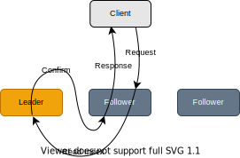
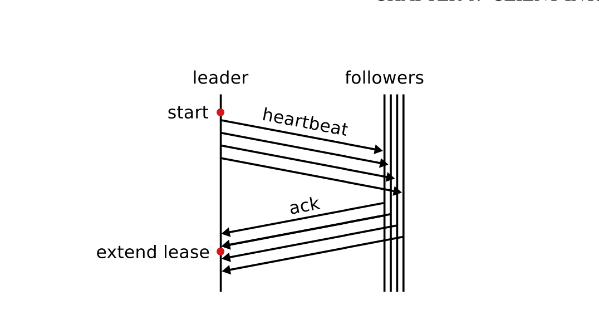
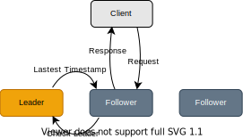
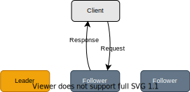

# RawKV Stale Read

## Summary

Allow eventually consistency on RawKV. This proposal is based on the https://github.com/andylokandy/rfcs/blob/staleread/text/0080-rawkv-stale-read.md. Thanks, @andylokandy's work!.

## Motivation

Eventually consistency is acceptable in some scenarios when using RawKV. In this case, RawKV is allowed to break linear consistency and therefore improve the cluster-wise throughput and latency.

TiKV currently supports **three** features to process read-only queries more efficiently. 

1. Follower read.

    Follower read allows reading from the followers. Without breaking the linear consistency guarantee, the follower will send a read-index request to the leader. The leader will not respond with the actual value, instead, send a round of heartbeats to confirm its leadership and calculate the largest commit index (read index) across the cluster for the follower. After the follower advances its apply index to the read index, it is safe to get data from the local storage and respond to it to the client. This feature helps distribute the read stress on the leader but still increases the read latency. 

    <p align="center">
        
    </p>

2. Lease.

    Lease use clocks instead of messages to handle read-only queries, the leader would use the normal heartbeat mechanism to maintain a lease (usually shorter than election timeout for the clock drift). This mechanism could improve the read latency dramatically. However, it still requires the client to read from the leader instead of other replicas. If the client and the leader are located in different regions, the read latency could be terribly high.

    <p align="center">
        
    </p>

3. Stale read for TxnKV only.

    Stale read on TxnKV allows to read outdated data from the replica other than the leader but still keeping snapshot isolation provided by TiKV transaction. Because the client tells the follower the timestamp of the stale snapshot it wants to read on (rather than read-the-latest), the follower can check if the data versions that are fresh enough via the `saft_ts` (the minimum timestamp of the on-the-fly transaction). Any read transaction with a smaller timestamp than `safe_ts` could be preserved the snapshot isolation.

    <p align="center">
        
    </p>

This RFC proposes stale read on RawKV which allows reading stale data from the not-leader replica with a lossy bound. Unlike the stale read on TxnKV, the stale read on RawKV breaks its original linear consistency guarantee -- downgrades to eventually consistency. TiKV only guarantees that the stale data read from followers are written before (read committed).

The follower will read the local storage with a `read_ts` that reuses the mechanism from the stale read of TxnKV. Surprisingly, the leader can also stale read, and in this case, the leader can read locally without a lease.

Note that the freshness of data may regress from the point of view of the client since the client may choose different followers to read from time to time.

<p align="center">
    
</p>


## Detailed Design

This RFC proposes stale read on RawKV which allows reading stale data from the not-leader replica with a lossy time-bound. Unlike the stale read on TxnKV, the stale read on RawKV breaks its original linear consistency guarantee -- downgrades to eventually consistency. TiKV only guarantees that the stale data read from followers are written before.

### TiKV

The replica should read the local storage with a `read_ts` that reuses the mechanism from the stale read of TxnKV. This requires the replica to check the `read_ts` against the `safe_ts` which is advaneced by `CheckLeader` message from the store of the leader. As long as the `safe_ts` is no less than `read_ts`, the replica is allowed to read the key from local storage.

### Client

The `read_ts` specified by the client could be acquired by the following ways:

1. Calculate a timestamp from the physical time from the local. The `read_ts` might suffer from the clock drift and exceed the max timestamp allocated from TSO. The client will fail to read any data even if that target replica is the leader since the `safe_ts` of the replica don't catch up with the `read_ts`. **Deploying NTP services** in the cluster might mitigate this issue.
   
2. Get the latest timestamp from TSO and rewind it. This might get a more accurate timestamp but requires an RPC before reading which will increase the latency of reading. Applying a local TSO cache might mitigate this issue but require more resources in the client.

The client should create a strategy to select the replica for the stale read. If we select the target replica randomly, some cross-region replicas might be selected. In this case, the stale read loses its advantage. The client should maintain probe statistics tracking the fastest replicas (by latency). The client will try those replicas one by one until it read the value successfully.

### Implementation details

1. (TBD) While TiKV is handling raw read-related requests, construct a `SnapContext` with the `read_ts` before acquiring a snapshot from `storage`.

```diff
fn future_raw_get(...) {
  // ...
  let snap_ctx = SnapContext {
      pb_ctx: &ctx,
+     start_ts: ...
      ..Default::default()
  };
}
```

2. (TBD) Client API interface; replica selection algorithm.

```java
ByteString rawGet(ByteString key, readTs: Timestamp)
```
