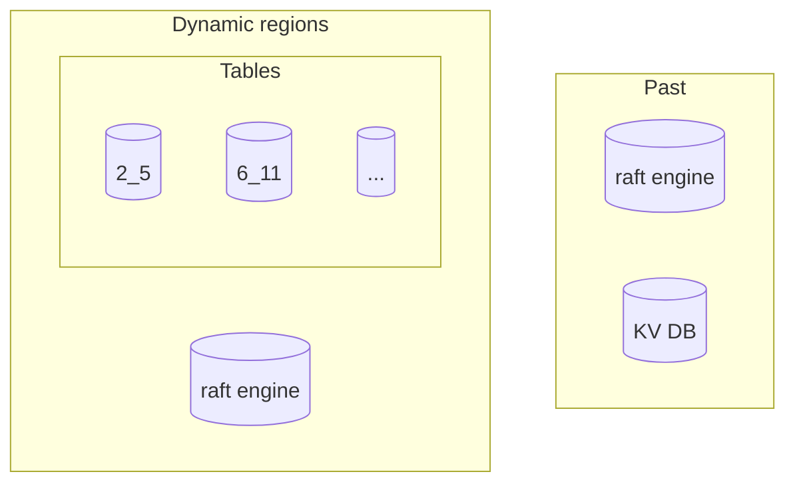
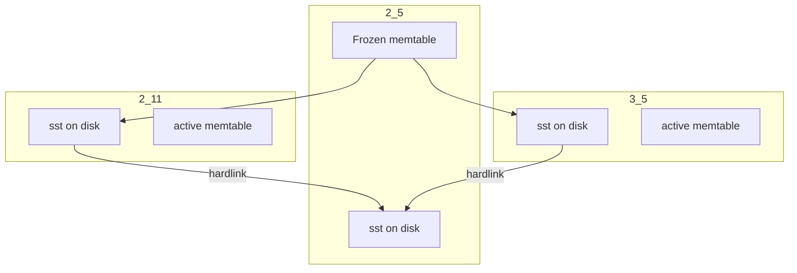
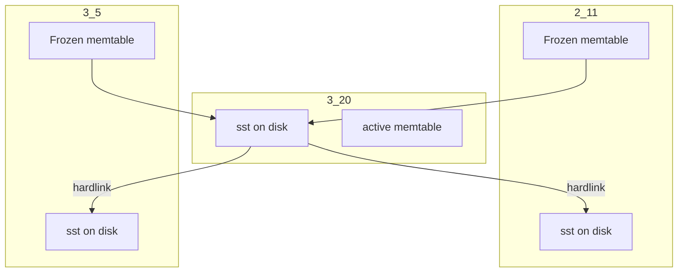

# Physical isolation between Region

- RFC PR: https://github.com/tikv/rfcs/pull/0000
- Tracking Issue: https://github.com/tikv/repo/issues/0000

## Summary

Make every region stores its own data in an isolated LSM tree, in our case RocksDB.

This is the second step to make TiKV to operate fast and at low cost for big cluster.

The first step can be found in [Dynamic size region][1].

Let's call the feature set dynamic size region and isolated rocksdb per region as dynamic region.

## Motivation

When the size of an instance becomes larger, it becomes less stable. It can bring following costs:
- Performance regression
    - Larger size means more SST files. Due to implementation of RocksDB, lock contention becomes a serious problem when there are many SST files.
    - Larger size means more unnecessary compaction. Data is written and read per region, so compaction across region is meaningless in our case.
- Slow scheduling and jitters
    - Scan and generate snapshot is costy.
    - Apply snapshot and delete peer needs to change the shape of LSM tree, which easily brings a lot of compactions.

Hence I propose to use a rocksdb for each region. Besides solving (easing) the above problems, using isolated rocksdb also makes further evolution easier and possible.

## Detailed design

Let's call an isolated rocksdb tablet. Now data is written into two storage raft engine and kv rocksdb. Tablets are used to replace kv rocksdb.

### Data layout

A directory “tablets” will be created inside the data directory to store the data of the tablet. The tablet will be named as ${region_id}_${tablet_index}. tablet_index is the raft log index that the tablet is corresponding to when being created. For example, when region 2 is created by split, its index is initialized to 5, so its name is 2_5. A replica of region 2 is catching up data by snapshot, and the snapshot index is 11, then after applying the snapshot, the tablet name becomes 2_11. Adding tablet_index is to allow quickly cleaning and applying of data. For example, there are still queries running on 2_5 while follower is about to apply a snapshot at index 11, the two directories can be kept and 2_5 can be deleted after all existing queries are finished.

The old data directory “kv” will be deleted and not written any more.

Tablets share env, blockcache, statics, rate limiters and compaction filters, so flow control, compaction concurrency and memory control are unified.

### Memtable management

Each tablet has its own memtable, which can run out of memory quickly, so we need to manage memtables carefully. There are two ways to manage memtables: 1. mix storage, all tablets will share the same memtable, and it will be split and saved to their owned directory during flush. 2. separate storage, and flush should be triggered in time to reach a memory threshold. The design choose latter for:
- It’s complicated to develop a mix storage, split in flush can produce many small files.
- Separate storage can isolate writes for foreground writes and
   - Because of isolation, there is no synchronization cost, so it’s faster in theory;
   - If it’s written by a single thread, RocksDB can utilize insert hint to reduce the cost of comparison.

Because bloom filters are allocated immediately by a factor of capacity when creating a memtable, if there are a lot of tablets, the memory consumption can be large even without any workload. In fact, configuration of v6.1 is set for mix storage, for separate storage, we can choose a smaller memtable size as it only contains data from one region, and the factor can also be reduced. We change it to 0.05 from 0.1 in the prototype.

By separating RocksDB instances, there are only apply state and region state in the raft cf of KV DB. Writing two states every time is inefficient and triggers unnecessary compaction. We will move these stats to raft engine after disabling KV WAL.

### Disable KV WAL

Every tablet writes its own WAL can bring random writes, so we better disable WAL. TiKV relies on WAL to guarantee atomicity, that is data before the apply index must be persistent and key operations should not be lost when crash. Disabling KV WAL is a complicated design, it will be proposed as a separate RFC.

Now that WAL is disabled, every state can be lost. The start process that scans region state from KV DB to initialize peers doesn’t work anymore. Instead, we need to migrate all store related states to the raft db, including region states. It’s possible to merge region state with existing states in raft db, but it can introduce unnecessary write amplification as region state rarely changes. And to find out the relations between peer and tablet, tablet index should also be persisted with region state.
- When a peer is created by heartbeat, tablet index is initialized as 0, the peer should be added to the region’s peer list and written into raft db.
- When applying a snapshot, update the tablet index to snapshot index, change the state to apply and region to the snapshot’s region. Only after the state is persisted, can the snapshot data be applied.
- In split, only after new regions’ tablet indexes are persisted in raft db, can it be considered finished.

Compared to v6.1, raftstore thread doesn’t need to write kv db or tablet any more. And whether a region is initialized doesn’t depend on peer list any more. These can reduce some known corner cases in v6.1.

### Replication

Replication works almost the same as v6.x that uses the raft algorithm to do log replications and snapshot replications.

The tablet itself is a complete snapshot of a region, so we don’t need to scan and generate anymore. To generate a snapshot, just use the checkpoint API from rocksdb. Because atomic flush is enabled, the checkpoint result is still complete and correct without flushing. Sending a snapshot needs a new protocol as we need to send a rocksdb instead of several SST files. In v6.x, snapshots are generated by scanning and writing, so all generated files are probably in system cache, there is no need to do flow control. But with this RFC, all files are just hardlinked, reading those files may introduce IO if they are generated by compactions a long time ago. Hence we need to do flow control with sending.

A more complicated way is to use incremental replication. Instead of checkpoint, use OpenAsSecondary API to trace the data. After sending all SST files, use TryCatchUpWithPrimary to trace new updates and send new SST files. After all updates are sent, send MANIFEST and other files.

Applying a snapshot is simple in dynamic regions. After persisting applying state and tablet index, all needs to do is just rename the snapshot to tablet name following the pattern mentioned above.

When destroying a replica, after persisting tombstone state and all background queries are finished, just remove the tablet directory. In the past, to check if all background queries are finished, we needed to check the global snapshot sequence number. In dynamic regions, only need to check whether the file lock is holded. If the file lock is freed, then all tablet handles are freed, hence the directory can be removed safely. If TiKV is restarted while waiting for lock, there can be leak. So it needs to check all unreferenced tablets when startup and delete them. A simple solution can be launching a background worker to do gc periodically.

Prototype shows, dynamic regions can scale in a 1TiB node in 4 hours and scale out in 7 hours. In v5.x, these operations need more than 16 hours and 2 days respectively.

### Split

To meet the requirements that every region uses its own tablet, when splitting a region, we also need to split its tablet. To make it easy, we introduce a new API for RocksDB: FreezeAndClone. The API will freeze the mutable memtable, and generate a new RocksDB in the given directory, which will include all SSTs and frozen memtables. The implementation can reuse checkpoint interfaces to reduce cost and complexity. When applying split, use the interface to create multiple clones in tablets following the naming convention mentioned above.

For example, if region 2 is split into region 2 and region 3 at index 11, then create tablets 2_11 and 3_5. Before split command is persisted in all new tablets, although new writes are written to new tablets, but tablet index in raft db of region 2 should still point to the old tablet and old tablet should be kept. After all tablets have persisted the split command, region 2 can point to the new tablet, and old tablet can be removed after all queries are finished.

FreezeAndClone can create multiple references to the same frozen memtables, which will cause duplicated flush. To avoid unnecessary IO, RocksDb needs to support flush filter, which will filter out all keys that are not in the current region and rebuild the bloom filter. Because split will create a new tablet, so flush filter will not corrupt existing rocksdb snapshot. After applying flush filter, every tablet will only write data in its own range, only little extra CPU cost, and no extra IO cost.

FreezeAndClone will hardlink all SST files in the original tablet, so every tablet has data that is not in its own range. After split, DeleteFilesInRange can be used to quickly free hard links. And then compaction filter + manual compaction can be used to do cleanup. Also because of new tablets, existing snapshots won’t be corrupted. The cleanup can be done in background slowly.

The maximum size of a tablet is supposed to be 10GiB, its file count can usually be 20 ~ 60. Hard link tens of files can only take hundreds of microseconds, which is smaller than a network roundtrip. A tablet only contains about 2 or 3 layers, cleanup may only need to rewrite about 2 or 3 files.

### Merge

The merge algorithm is almost the same as v6.1. To make it easy, we introduce a new interface: FreezeAndMerge. It will freeze the mutable memtables of the two tablet, and then merge their SST files by level and frozen memtables. After being merged, the new tablet need to adjust the Log Sequence Number (LSN) to the maximum number of two original tablets. To guarantee correctness, merge should be triggered only after clean up has finished in both two tablets, which should only contain the data within their region. This can be done by an additional check. For raft cf, there is no need to merge, only the target tablet’s version needs to be kept. After merge, there may be LSN regression in frozen memtables. This can only happen when two frozen memtables are from two tablets. As explained, the two memtables can’t overlap with each other, so LSN regression should not break correctness.

Similar to split, merge should also generate new tablet. The purpose is to make it convenient to handle abnormal cases like restarting. Only after the merge command is persisted, should the tablet index in raft db be updated and can source tablet be deleted.

### Read and write

Most of the read and write design is covered in [dynamic size region][1] RFC. Isolated rocksdb per region can make writes faster as no concurrent conflict and use of prefix hint. If single thread write becomes bottleneck, we can also use unordered apply. Unordered apply is a standalone optimization, I’m not going into details here.

Prototype shows the regression problem of v6.1 is solved in dynamic regions. Dynamic regions have steady throughputs in long running benchmarks like sysbench、tpcc、ycsb. And it also triggers less compactions. 

### Compatibility

#### Upgrade

The storage architecture is very different between v6.1 and dynamic regions. Changes of metadata can be updated every easily during rolling update, however migrating data is nearly impossible. There are two problems:
- Multiple regions share the same rocksdb in v5.x, split them into tablets takes too much time and can bring much additional writes;
- There are many small regions in v5.x, which can be more than 100k in a single instance. Upgrading them at once probably OOM.

To solve the problem, let’s introduce a migration stage. Before upgrading, PD should merge small regions into large one. When the region count is small enough, or the size of a region becomes large enough, PD triggers tablet split. After all regions store their data in tablets, the upgrade is finished. PD should provide a switch to users for pausing, resuming, checking the progress of upgrading and controlling its speed. Upgrading is enabled by default, and service should not be interrupted during that time.

A storage version property is added to peer metadata. When a region is picked by PD to start upgrading, it sends the command to the region leader. The leader replicates the command using Raft. Using raft is to ensure every peer will be upgraded in the end. When every peer applies the command, it should mark itself as upgrading and start upgrading in the background. During upgrading, use the checkpoint API to create a tablet without flush. Before pointing the region to the tablet, the region should pause reads until catching up all logs from tablet’s apply index to its current apply index. After upgrading is finished, followers should report their versions in heartbeat responses. Leader should record the information and report to the PD.

The progress between replicas may be different during upgrading. So it’s possible that the snapshot format is not compatible with the peer’s version. If an old peer receives a snapshot in new format, it uses the new format directly and considers upgrading is finished. If a new peer receives an old snapshot, then it creates a new tablet and ingests all SSTs into the tablet.

To make it easy, regions in the upgrading state should not be merged. Regions with different versions of engines should not be merged unless it’s tiflash.

Upgrading can be slow as there are many steps and QoS is in higher priority. It’s recommended to backup and restore the data to a new cluster to speed up upgrading. We also need to keep the codes for old architecture, though only critical bugs should be fixed.

### Extension and Related design

#### Cloud Native

In this design, a leader's tablet should contain exactly the same data as followers, that means followers’ tablets are the physical backup of the leader's tablet. So we can have a new way to update the tablets. A distributed environment is implemented for RocksDB, followers use `OpenAsSecondary` to subscribe the updates from leader. Raft logs are still replicated as usual and be truncated when the region state gets updated.

The good side followers don’t need to apply any logs or do any compaction, so ⅔ costs are reduced. The downsides are:
- Leader’s memtable can’t be replicated to Followers, it may take long time to recover during the election.
- Followers can only do stale read as memtables are always missed. The lag can be shortened by also replicating frozen memtables.
- It consumes more network bandwidth. Data across the datacenter needs extra cost on the Cloud.

#### Heterogeneous

Because every region has its own tablet, so we can use a more suitable engine for some region, or even gray releasing our new engine. By using the storage version introduced in upgrading compatibility, regions using different engines will not be merged.

## Drawbacks

This RFC may be easier to OOM compared to existing architecture.

[1]: https://github.com/tikv/rfcs/blob/master/text/0082-dynamic-size-region.md

## Unresolved questions
